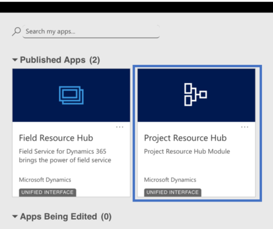
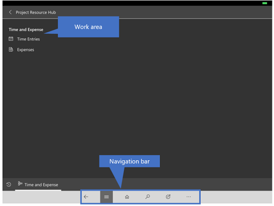
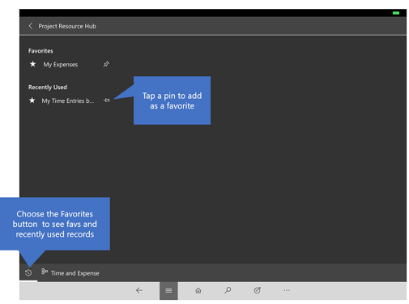

# User guide for Project Resource Hub

[!INCLUDE[cc-applies-to-psa-app-1x-2x](../includes/cc-applies-to-psa-app-1x-2x.md)]

With the Project Resource Hub app, you can enter time and expenses for the projects you’re working on the go. Stay on top of your time and expense entry to make sure:

- Your clients are billed properly
- You get credit for the work you’ve done

**Available anywhere, on any device**

There are two flavors of [!INCLUDE[pn_dyn_365_project_service_auto](../includes/pn-dyn-365-project-service-auto.md)]: 

- If you're using a desktop, you'll use the Project Service app. 

- If you’re in the field using a smartphone or tablet, you’ll use the Project Resource Hub app which is a subset of the Project Service  app. The Project Resource Hub app is built on the Unified Interface framework, which uses responsive web design principles to provide an optimal viewing and interaction experience for any screen size, device, or orientation. 

## Install the mobile app
Before you can start using the Project Resource Hub app, you need to install the mobile app on your device. 

[!INCLUDE[proc_more_information](../includes/proc-more-information.md)] [Install Dynamics 365 for phones and tablets](../mobile-app/install-dynamics-365-for-phones-and-tablets.md).

## Basic Navigation
1.	When you sign in on the mobile app, you’ll see the MyApps page with a list of the apps that you access to. 
2.	Select **Project Resource Hub**.

**The navigation bar**

Use the nav bar to get to your work area, create a new record, search, or do other tasks. To access more commands, tap 

**Favorites and recently used records**

The Favorites and Recently Used sections provide quick access to your records, views, and dashboards. 

- To access these sections, tap the **Menu**  button on the nav bar, and then tap the **Favorites and Recent**  button.

- To pin an item as a favorite, from the list of **Recently Used** items, tap the pin. This will pin and move the item to Favorites.

  
 
## Enter time
Enter your hours at least weekly—or at the frequency requested by your managers—to ensure your clients are invoiced and you’re credited correctly.

1. Tap the menu  button, and then tap **Time Entries**. This brings up your calendar.

2. To see your calendar for the previous or next week, tap the **Previous** or **Next** button. Tap **Today** to get back to the current week.

3. To enter your time, tap **New** on the command bar. 

4. Fill in the fields in the form and tap **Save**.

5. Continue entering time for the week. When you’re done and everything looks correct, tap **Submit**. A manager will review and approve your time entries.

## Enter expenses 
Enter your expenses at least weekly—or at the frequency requested by your managers—to ensure your clients are invoiced and you’re credited correctly.

1. Tap the menu  button, and then tap **Expenses**. This brings up your calendar.

2. You can switch to **Day**, **Week**, or **Month** view, or navigate to the previous or next time period. 

3. To enter your expense, tap **New** on the command bar. 

4. Fill in the fields in the form and tap **Save**.

5. Continue entering expenses for the week. When you’re done and everything looks correct, tap **Submit**. A manager will review and approve your expenses.

## General information on how to use the mobile app 
[!INCLUDE[proc_more_information](../includes/proc-more-information.md)] [Mobile Basics Guide](../mobile-app/dynamics-365-phones-tablets-users-guide.md).

### See Also  
 [Overview of Project Service](../project-service/overview.md)   
 [Time, Expense, and Collaboration Guide](../project-service/time-expense-collaboration-guide.md)   
 
