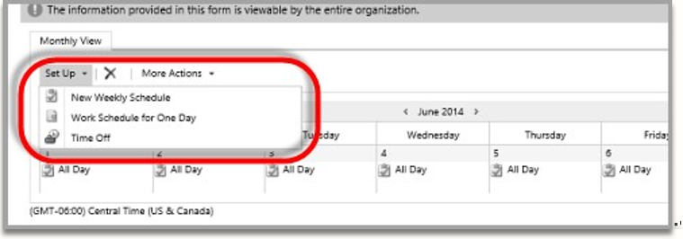

# Project settings

[!INCLUDE[cc-applies-to-psa-app-3.x](../includes/cc-applies-to-psa-app-3x.md)]

Use the following settings to access the project planning features.

## Work template

To create a project schedule, you create a project calendar template that defines the number of working hours per day and any business closures. To create a project calendar template, you associate a work template with the **Calendar template** field for the project. Follow these steps to create a work template.

1. In PSA, in the left navigation pane, click **Resources**. 
2. On the **Resources** list page, open a user record, and then select **Show Work Hours**.

  > [!NOTE]
  > Make sure that you allow pop-ups on the browser page. This lets you see the work hours set for the resource.
  
3. On the **Monthly View** tab, click **Set Up**. A list of three options appears: 

  - New Weekly Schedule
  - Work Schedule for One Day
  - Time Off

> 

4. Select **New Weekly Schedule**, and then set the options for this resource schedule. You can set a recurring weekly schedule, daily hour parameters, business closures, and more.
5. Set the date range, select **Save**, and then click **Close**. 
6. Go back to the **Resources** list page, and select the resource that you set the work hours for. 
7. Select **Set Calendar As** to set the work template. 
8. In the **Work Template** dialog box, enter a name for the work template, and then select **Apply**. 

You can now associate the work template with a project calendar template.

## Resource roles

The term *resource role* refers to the set of skills, competencies, and certifications that a person must have to perform a specific set of tasks on a project. PSA lets you cost and bill a resource's time based on the role that the resource is associated with. Every organization must set up these roles by using the left navigation on the **Project Service** menu.

Every organization must set up these roles on the **Active Resource Categories** page. To open this page, in the left navigation pane, select **Resource Roles**.

## Price lists

Price lists let you set cost and sales prices for resource roles, expense categories, products, and other elements in an organization. Before you set financial estimates for the work that must be delivered for a project, you should create a backing cost and sales price list. In the parameters section, you should also set up a default cost and sales price list that applies to all projects that are created in the organization. On the **Active Project Parameters** page, make sure that you set up a default cost and sales price list.
