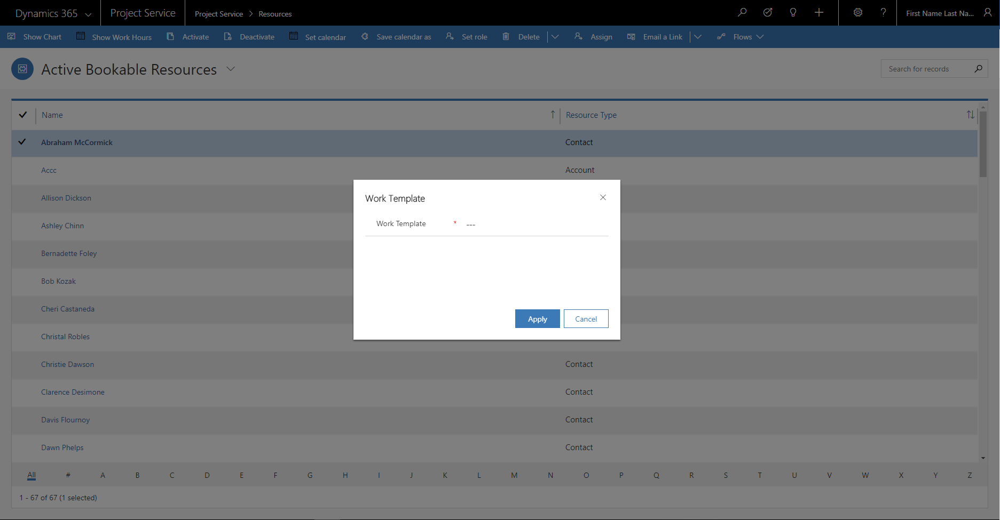
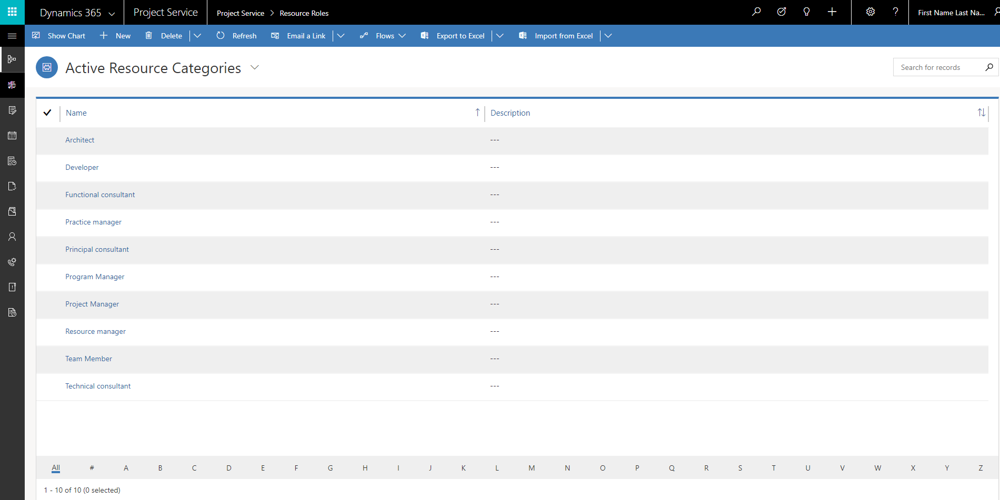

# Project settings

[!INCLUDE[cc-applies-to-psa-app-3.x](../includes/cc-applies-to-psa-app-3x.md)]

Use the following settings to access the project-planning features in Project Service (PSA).

## Work template

To create a project schedule, create a project calendar template that defines the number of working hours per day and any business closures. Do this by associating a work template to the calendar template field on the project. Complete the following steps to create a work template.

1. In PSA, on the left navigation pane, click **Resources**. 
2. On the **Resources** page, double-click to open a user record, and then click **Show Work Hours**.
  > [!NOTE]
  > Make sure that you allow pop-ups on the browser page. This lets you see the work hours set for the resource.
3. On the **Monthly View** tab, click **Set Up**. You’ll see a drop-down list with three options: 

  - **New Weekly Schedule**
  - **Work Schedule for One Day**
  - **Time Off**

> 

4. Click **New Weekly Schedule** and set options for this resource schedule. You can set a recurring weekly schedule, daily hour parameters, business closures, and date range.
5. Click **Save**, and then click **Close**. 
6. Go back to the **Resources** list page and select the resource for which the work hours were set. 
7. Click **Set Calendar As** to set the work template.  
8. On the **Work Template** dialog, specify a name for the work template and then click **Apply**.

> 

You can now associate the work template to a project calendar template.
 
## Resource roles

Resource role refers to a set of skills, competencies, and certifications that a person is required to have to perform a specific set of tasks on a project. PSA supports the costing and billing of resources' time based on the role that the resource is associated to. Every organization must setup these roles using the left navigation.

Every organization must set up these roles on the **Active Resource Categories** page. To open this page, in the left navigation on the **Project Service** menu, select **Resource Roles**.

> 

## Price lists

Price lists allow cost and sales prices to be set for resource roles, expense categories, products, and other elements in an organization. Create a backing cost price list and sales price list before setting financial estimates for the work to be delivered on a project. A default cost price list and sales price list should be set up in the parameters section that applies to all projects that are created in the organization. On the **Active Project Parameters** page, you should also set up a default cost price list and sales price list.
