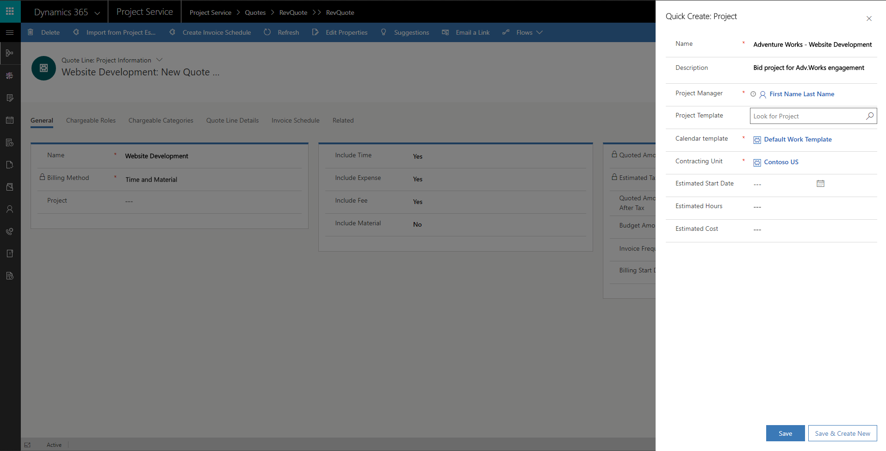

# Project templates 

[!INCLUDE[cc-applies-to-psa-app-3.x](../includes/cc-applies-to-psa-app-3x.md)]

A project template is a predefined framework that helps you quickly and easily start a project. You can use a predefined template to create a new project with a single click. As for projects, you must define the prerequisites for project templates. You must define a project calendar for each project template, and roles and price lists must be predefined in the organization, so that the components of the template have useful data.

A project template consists of three components: a schedule, project estimates, and project team members.

## Schedule

A schedule in a project template has the same set of elements as a schedule in a project. You can create a task hierarchy, associate roles with tasks, define schedule attributes, and set dependencies. A schedule in a project template also supports task modes for each task. Therefore, it supports the scheduling engine. You must associate a project calendar with the project. When you create a work schedule, there is no difference between a project template and a project.

## Project estimates

Project estimates in a project template work the same way as project estimates in a project. However, the cost and sales prices are pulled from the default cost and sales price lists that are defined in the parameters.

## Creating a project from a template
 
There are several ways to create a project from a project template:

- When you create a project from a quote, you can select a project template in the **Quick Create: Project** dialog box.

> 

- When you create a project by selecting **New Project**, the **Project** page appears before the record is saved. In the **Pick a Template** field, select one of the predefined project templates in the organization.
- Use **Create Project from a Template** on the **Template Entity** page.

## Copying components of template to project

When you copy the components of a project template to a project, a few overrides can occur, depending on the settings in the project.

### Copying the schedule

When you copy the schedule from a project template, if the project has a different project calendar than the template, work hours from the project's calendar are applied to the task schedule. In this way, the schedule is adjusted to match the backing project calendar. Similarly, the first task on the schedule takes the project's start date, and the schedule of the rest of the hierarchy is updated based on the duration and dependencies that are specified in the template. 

### Copying project estimates 

When you copy across project estimate lines, the price lists are updated. For the cost price list, these updates are based on the owning unit of the project. For the sales price list, they are based on the customer. For projects that are associated with a sales entity, the unit cost and sales prices are determined based on these price lists.

### Copying a project team

When a project team is copied from a project template to a project, the generic resources are copied, together with the skills and proficiencies that are defined in the template. Generic resource assignments are also maintained as they were in the project template. Named resources aren't supported in project templates.
