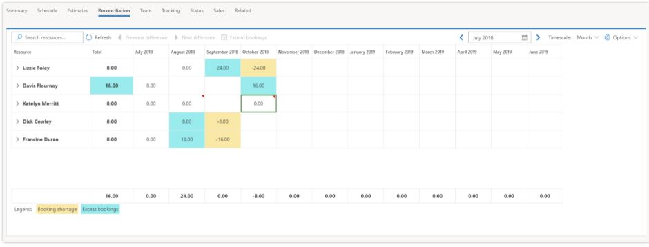
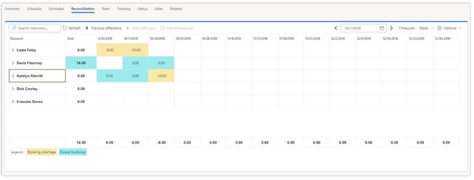
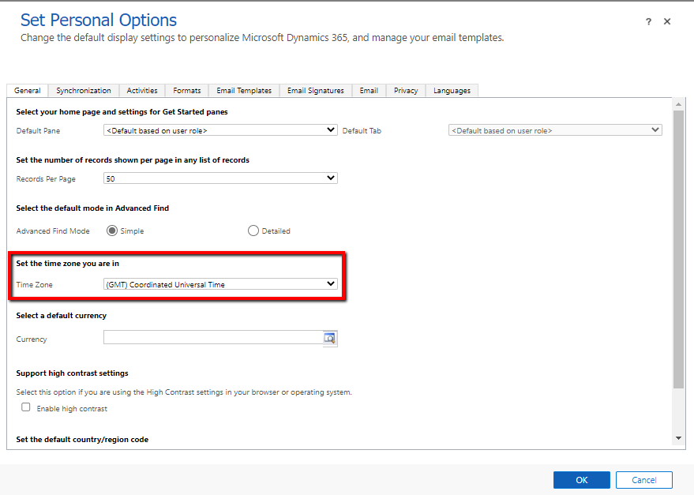
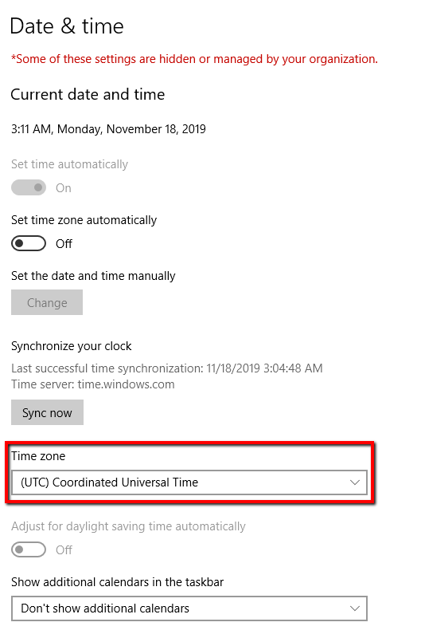
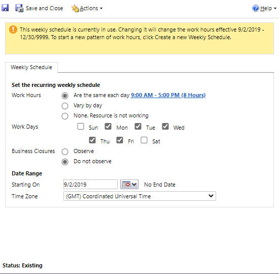
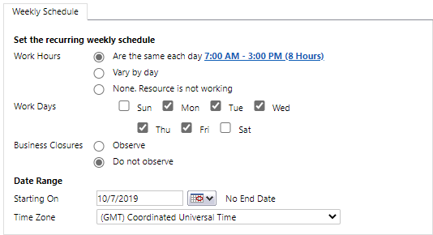
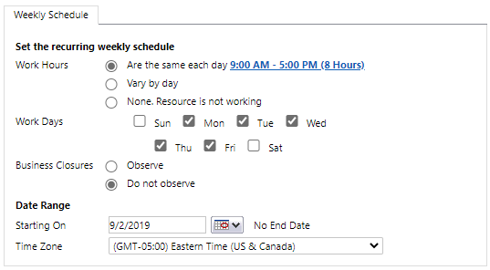
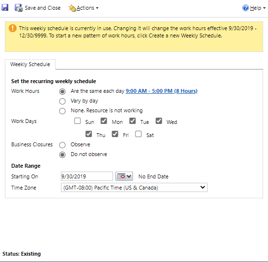

# Reconcile bookings and assignments

[!INCLUDE[cc-applies-to-psa-app-3.x](../includes/cc-applies-to-psa-app-3x.md)]

A project team member's project bookings and project task assignments are loosely coupled. Therefore, a resource can have task assignments that don't correspond to bookings and bookings that don't correspond to task assignments. Ideally, project bookings and assignments are aligned, so that resources have committed capacity to perform their task assignments. However, the reality is that bookings can occur based on availability, and task timings can change as the project continues through its lifecycle. Therefore, the loose coupling allows for flexibility.

Because of the loose coupling of project bookings and task assignments, a **Reconciliation** tab is included on the Project entity. This tab helps project managers reconcile team members' bookings and their assignments for their project team.

For each named team member, the **Reconciliation** tab shows bookings and assignments down to the individual task assignment. It shows hours in cells that can represent periods from months down to days.

In the **Timescale** field, you can select **Month**, **Week**, or **Day**. By default, **Week** is selected. However, you can change the default value by selecting the **Settings** button. When the **Reconciliation** tab is opened, it shows the current date, but you can use the calendar control to move forward or backward in time. When a project has a start date that is in the future, the tab shows that date when it's opened. The calendar control also has options that let you move to the project start and end dates.

You can use the expander controls on each resource to show the details of that resource's bookings. You can also expand each resource's assignments to the level of the individual task.

The bottom of the **Reconciliation** tab shows an overall net total for the project, and the tab also includes a total column. For each resource, the tab takes the difference between a team member's bookings on the project and rollup of that team member's task assignments. Ideally, the difference should be 0 (zero). In other words, there should be no difference between the resource's bookings and its task assignments. Any differences are indicated by color and shading to call out two conditions:

- **Booking shortage** – Booking shortages occur when a resource has more assignments than bookings. Because this capacity hasn't been reserved, a project manager can correct this condition by extending the resource's bookings to cover the shortage.
- **Excess bookings** – Excess bookings occur when a resource has been booked to the project but hasn't been assigned to tasks. This condition might be acceptable if, for example, the resource has been booked before task assignment occurs. However, in other cases, the resource might not be planned to be assigned. In these cases, the project manager should consider canceling the resource's bookings, so that the capacity can be used for another project.

> [!NOTE]
> The legend for these conditions might be hidden to leave more room for the grid. In this case, you can make the legend visible by selecting the **Settings** button.

In some cases, when the **Timescale** field is set to a level that is higher than **Day**, differences might be calculated as 0 (zero). For example, at the **Month** level, the net difference for a resource might be 0 (zero) to indicate that bookings equal assignments. However, if you look at the **Week** level, you might see that there are assignments of 0 (zero) hours and bookings of 40 hours in the first week of the month, and assignments of 40 hours and bookings of 0 (zero) hours in the second week of the month. Although the total bookings and assignments for the month are equal, they differ by week.

When you view higher time levels, the **Reconciliation** tab shows a cell indicator to notify you that there are differences at lower time levels. For example, in the following illustration, a cell indicator appears in the cell for the month of October 2018 for the resource that is named Katelyn Merritt. Therefore, you can see that, even though the resource's bookings and assignments are equal when they are aggregated at the **Month** level, they don't match at lower levels.

Double-click a cell to zoom in to the next lower level and view the difference. For example, if you double-click the October 2018 difference for Katelyn Merritt, you drill down to the **Week** level. You can then see that the resource has bookings of 16 hours but no assignments in the first two weeks of October, and 16 hours of assignments but no bookings in the third week of October.

You can right-click a cell to zoom out the next higher level. You can also turn off the cell indicator by selecting the **Settings** button. 

You can also use the **Previous** and **Next** buttons above the grid to move through any differences in your project. To use these buttons, you must first select a resource. Select **Next** to go to the next difference between bookings and assignments for that resource. Select **Previous** to go to the previous difference.

In situations where you have task assignments for a resource but no bookings, you can select the booking shortage and then select **Extend Booking**. You can then see the booking that is required in order to address the resource's shortage. You can also view the resource's bookings on the current project and other projects. Select **OK** to create the booking for the resource without regard to current availability. The project manager or resource manager can then use Schedule Board to manage situations where a resource has become overbooked beyond capacity because its bookings were extended.

##Managing with Time Zones##
To ensure accurate and predictable results when using Extend Bookings there are two key prerequisites that must be observed:  
1.	The user must configure their device's time zone to match the time zone defined in CRM personalization settings.   See example below with Windows 10:
 
 

 	 
 
2.	The Bookable Resource must have at least 1 minute of overlapping working time with the contours used to define the requested extension.   For the example we will review, the resources with the following working hours:

|Entity  |Calendar  |

|Project   |  |
|Resource A  |  |
|Resource B  |   |
|Resource C  |   |
|Resource D  |   |

 	 
 	 
 	 
 	 
When the user navigates to the reconciliation view, the resource assignments and the associated booking shortages will be displayed as follows:
 

After the Extend Bookings has been executed on each resource, since each resource’s working hours overlapped with the contours of the shortage, we were able to successfully extend bookings for each resource.
 

However, a closer look at the details of the bookings shows differences in the start time of the bookings.  The bookings will start no earlier than the start time of the assignment contour and no earlier than the available start time of the resource:
•	For Res A, since this resource has the same calendar as the project, the start time will be 9:00A.
•	For Res B, even though this resource starts to work at 7:00A, the bookings will begin at 9:00A as that is the earliest start time of the assignment contour.
•	For Res C and Res D, their bookings start no earlier than their respective available start times.
 
 

 
 

