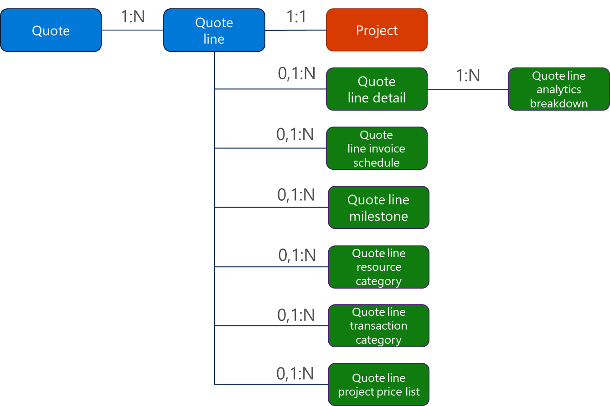
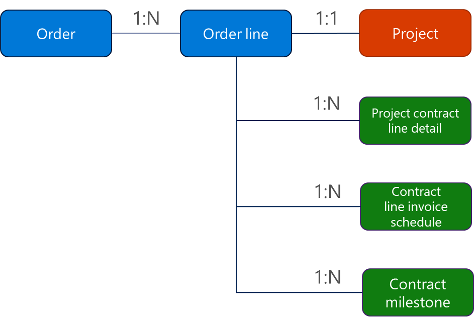
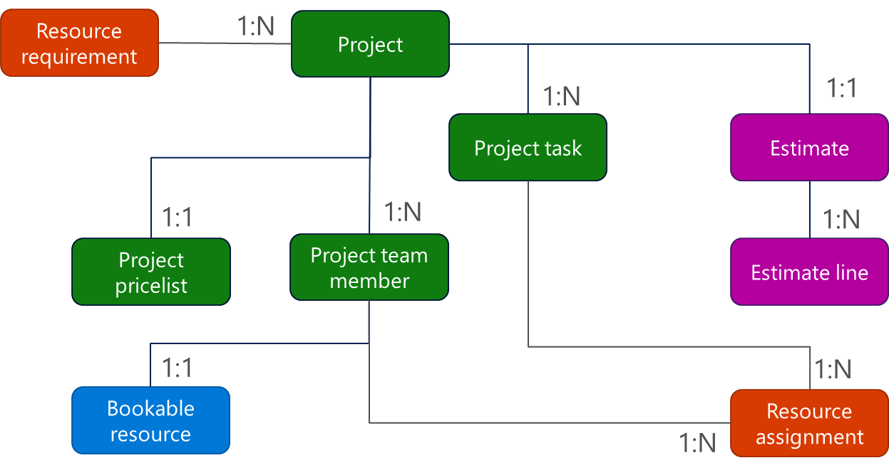
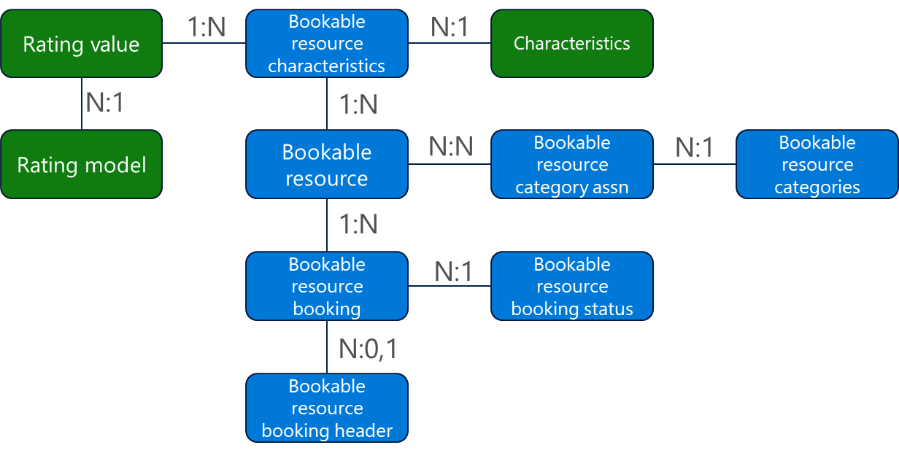
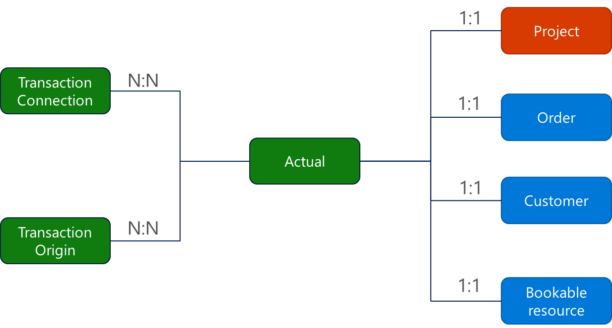

# Working with the Project Service data model

[!INCLUDE[cc-applies-to-psa-app-3.x](../includes/cc-applies-to-psa-app-3x.md)]

Project Service (PSA) extends Sales and other entities as well as introduces its own entities in the Common Data Service for Apps data model. This topic describes some of the entities you will encounter when you are working on common PSA reporting scenarios.

## Reporting on opportunities

PSA extends the Dynamics 365 for Sales **Opportunity** entity by adding fields that enable project-based scenarios. These fields are identified by their schema name prefixed with **msdyn\_**. One new field added to the **Opportunity** entity that is key to reporting on Project Service opportunities is **Order Type**. The **Order Type** value **Work Based** indicates that the opportunity is a PSA opportunity. Other fields added to the entity include **Contracting Organization**, which indicates the organization holding the opportunity, and **Account Manager**, which captures the name of the account manager responsible for the opportunity.

The **Opportunity Line** entity also includes fields related to Project Service. **Billing Method** indicates whether the opportunity line is to be billed on a time-and-materials or fixed-price basis, and **Project** indicates the name of the project backing the opportunity. Other fields you can report on capture costs and customer budget amounts for the line item.

## Reporting on quotes

Project Service extends the Dynamics 365 for Sales **Quote** entity by adding extra project-related fields. **Order Type** distinguishes PSA quotes from non-PSA quotes. The **Order Type** value **Work Wased** indicates that the quote is a PSA quote. Other fields that can be relevant to reporting on PSA quotes include amount fields, such as **Chargeable Costs**, **Non-chargeable Costs**, **Gross Margin**, **Estimates**, and **Budget**. Other useful fields show whether the quote is profitable, whether it will complete on schedule, and whether it meets the customer's budget expectation.

The Sales **Quote Line** entity is extended by PSA. One field that PSA adds is **Billing Method**, which indicates how the quote line would be billed (time and materials or fixed price). Other added fields capture the related project backing the quote line, invoicing, cost, and budget.

PSA adds other new quote-related entities to the Dynamics 365 data model. These include:

- **Quote Line Detail** - Contains the project estimate details of the quote line. It contains two records for each quote line. One record stores the cost and cost details of the quote line, and the other record stores the sales amount and sales details of the quote line.
- **Quote Line Invoice Schedule** - Contains the billing schedule for the quote line. This is generated based on the invoicing frequency assigned to the quote line.
- **Quote Line Milestone** - Contains the billing milestones for fixed-price quote lines.
- **Quote Line Analytics Breakdown** - Contains financial details of the quote line that can be useful in reporting quoted sales and estimated cost amounts by various dimensions.
- **Quote Line Project Price List**, **Quote Line Resource Category**, and **Quote Line Transaction Category** - These are other entities added to quotes by PSA.

> 

## Reporting on project contracts

PSA extends the Dynamics 365 for Sales **Order** entity to use when recording project contracts. The solution adds the key field, **Order Type**, which identifies the contract as a PSA contract rather than a Dynamics 365 for Sales order. The **Order Type** value **Work Based** indicates that the order is a PSA project contract. New fields added to the **Order** entity capture details on costs, PSA contract status, and the organization that owns the contract.

The **Sales Order Line** entity has also been extended. Other added fields capture the billing method (time and materials, fixed price), customer budget amounts, underlying project, and more.

There are also new entities designed for project contracts. These include:

- **Project Contract Line Detail** - This entity contains the line-level details that roll up to the contract line amount. 
- **Contract Line Invoice Schedule** - This entity contains the billing schedule generated from the invoice frequency assigned to the contract line.
- **Contract Milestone** - This entity contains the billing milestones for contract lines with a fixed-price billing term.
- **Project Contract Line Project Price List**, **Project Contract Line Resource Category**, and **Project Contract Line Transaction Category** - These are other entities added to contracts in the PSA solution.

> 

## Reporting on projects

The **Projects** entity and its related entities are exclusive to PSA. **Project** is the top-level entity used to capture the work and cost side of operations.

- **Project team member** - This entity contains details about the bookable resources assigned to the project. Those resources can be generic bookable resources, or they can be named bookable resources that are either entered by the project manager or generated from the project schedule.
- **Project Task** - This entity contains the tasks that make up the project plan or schedule.
- **Resource Assignment** - This entity contains the task assignment for the bookable resource.
- **Resource Requirement** - This entity contains the requirements for any generic resource team members.
- **Estimate** and **Estimate line** - These enities with a header/line relationship, contain expense estimates for the project. Task estimates are stored on the **Resource Estimate** entity.

> 

## Reporting on resources

Project resources use the **Bookable Resource** entities from Universal Resource Scheduling (URS) that are shared with other apps, such as Dynamics 365 for Field Service. Entities you might need to use when reporting on project resources are:

- **Bookable Resource** - This entity represents the user, contact, generic resource, account, group, or equipment that is used on the project team.
- **Bookable Resource Characteristics** - This entity includes the skills, certifications, or education of the resource. The characteristics can have rating values that are defined by the rating model.
- **Bookable Resource Category** - This entity represents the role of the bookable resource.
- **Bookable resource bookings** - This entity represents the time booked on projects for the resource. Each booking has a header entity and line entities, and each line has a status that represents the status of the booking.

> 

## Reporting on actual transactions

When you approve a timesheet or expense, or invoice a contract in PSA, the business transaction is captured in the **Actual** entity. This entity can serve as the basis for almost all financial-related reports in PSA. The **Actual** entity captures the cost and sales transactions for the business event. It also captures many relevant attributes.

The key thing to understand when working with the **Actual** entity is what transaction or transactions are recorded in the entity and when they are recorded. When working with a time entry, the typical flow is as follows (expense entries are similar):

1. When the time entry is saved, no records are created in the **Actual** entity.
2. When the time entry is submitted, no records are created in the **Actual** entity.
3. When the time entry is approved, one record and potentially a second record is created in the **Actual** entity. The first record stores the cost of the time entry. The second record stores the unbilled sales amount of the time entry. The second record is dependent on the project either having a customer, a quote, or a contract line assigned to it. 

    | Document date | Transaction type | Transaction class | Customer         | Contract   | Resource     | Resource role | Billing type | Quantity | Unit price | Amount |
    |---------------|------------------|-------------------|------------------|------------|--------------|---------------|--------------|----------|------------|--------|
    | 2/3/18        | Cost             | Time              | Alpine ski house | Alpine CRM | Ashley Chinn | Project Mgr   | Chargeable   | 8.0      | 50.00      | 400.00 |
    | 2/3/18        | Unbilled sales   | Time              | Alpine ski house | Alpine CRM | Ashley Chinn | Project Mgr   | Chargeable   | 8.0      | 100.00     | 800.00 |

>These are two separate but related records and are neither debits nor credits.

4.  Assuming the project has a contract associated with it, when the time entry is invoiced, two more records are created in the **Actual** entity. First, a negative amount for the unbilled sales record is created. This is essentially reversing the unbilled sale. Second, a transaction for the billed sale is created. Again, these are separate but related transactions, not debits and credits.

    | Document date | Transaction type | Transaction class | Customer         | Contract   | Resource     | Resource role | Billing type | Quantity | Unit price | Amount   |
    |---------------|------------------|-------------------|------------------|------------|--------------|---------------|--------------|----------|------------|----------|
    | 2/4/18        | Unbilled sales   | Time              | Alpine ski house | Alpine CRM | Ashley Chinn | Project Mgr   | Chargeable   | - 8.0    | 100.00     | - 800.00 |
    | 2/4/18        | Billed sales     | Time              | Alpine ski house | Alpine CRM | Ashley Chinn | Project Mgr   | Chargeable   | 8.0      | 100.00     | 800.00   |

The **Transaction Origin** entity records the origin of the **Actual** record and the **Transaction Connection** entity records the related records for the **Actual**. Additionally, the **Actual** record contains references to the project, project contract (order), bookable resource, and customer.

> 
