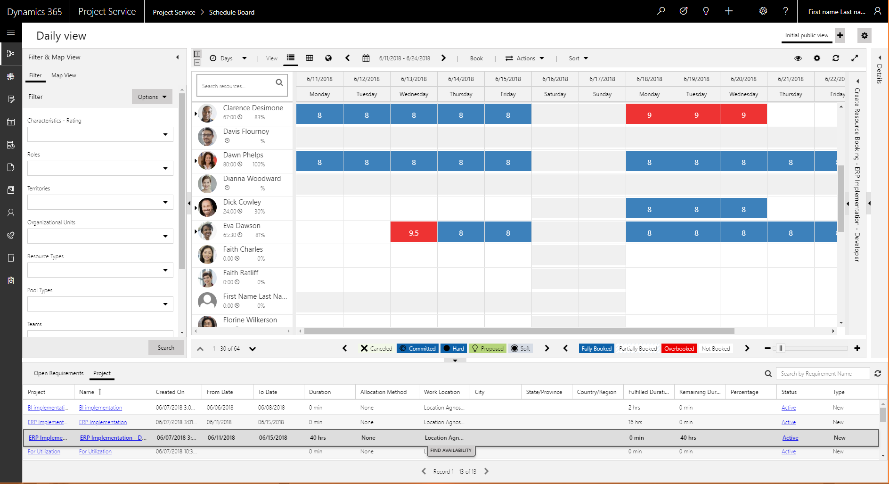
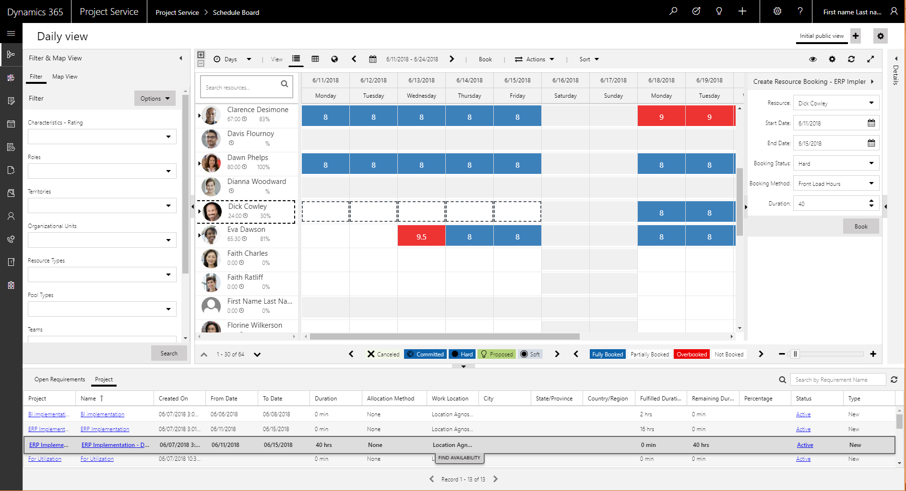
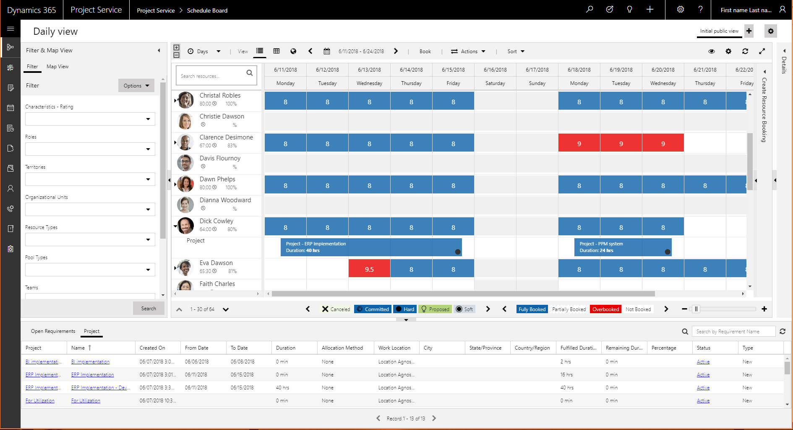

# Use the Schedule Board to book project resources

In addition to booking resources on a project from within a project, you can hard-book or soft-book resources from the Schedule Board.

Before you can book from the Schedule Board, you must create or generate resource requirements. Follow these steps to create resource requirements from the Schedule Board.

1. If the **Booking Requirements** pane at the bottom of the page is collapsed, select the expander control to expand it.
2. In the **Booking Requirements** pane, on the **Project** tab, select the requirement to book.

    

3. Select **Find Availability** to filter the bookable resources and view the available resources. 
4. Select one or more resources from the Schedule Board. 
5. In the **Create Resource Booking** pane on the right side of the page, enter the booking information, and then select **Book and exit**.

    

6. While the requirement is selected in the **Create Resource Booking** pane, select one or more cells of a resource to create the booking.

    

7. Select **Book**.

The requirement is fulfilled by using the selected resource. In the **Booking Requirements** pane, notice that the requirement has been updated, and the resource is shown as booked on the project.

