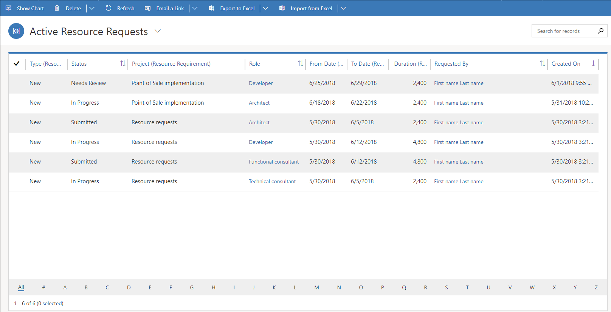
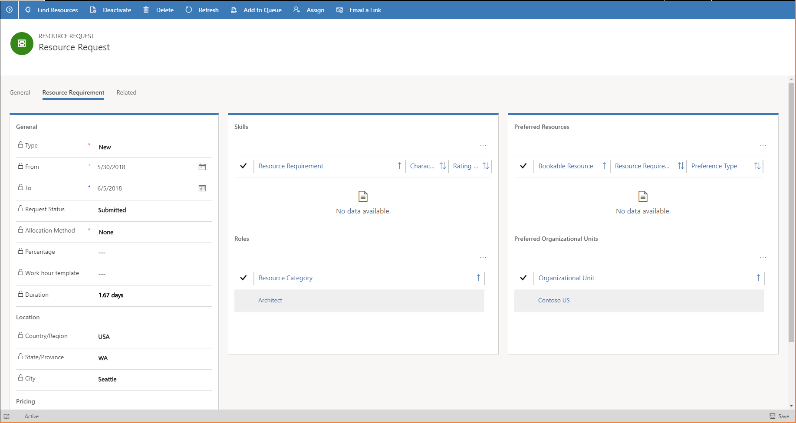
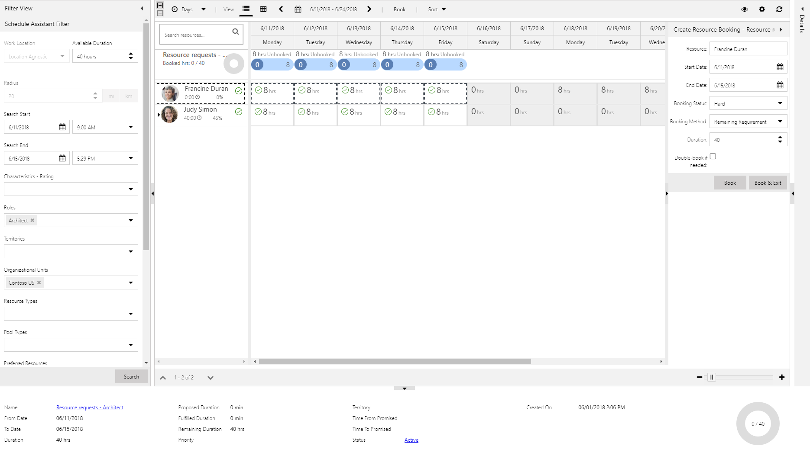

# Fulfilling resource requests

[!INCLUDE[cc-applies-to-psa-app-3.x](../includes/cc-applies-to-psa-app-3x.md)]

Resource requirements can be sent as resource requests to the resource manager who is responsible for fulfilling those requests.

Resource requests are shown as a list in the **Active Resource Requests** view.

> 

To fulfill a request, select it in the list, and then select **Find Resources**. Alternatively, double-click a row to open the request. You can then select the **Resource Requirement** tab to view the requirements for that request. To start to fulfill the request, select **Find Resources**.

> 

The Schedule Assistant appears and is filtered by the requirements. Select the resource, and then select **Book**.

> 

The generic team member is replaced with the hard-booked named resource on the project team and task assignments in the project schedule.
