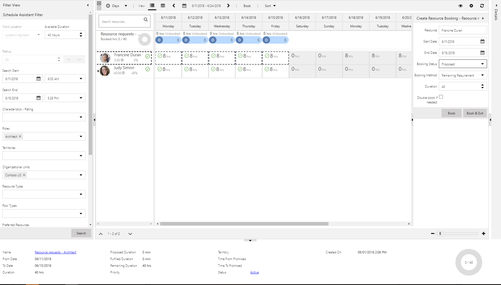
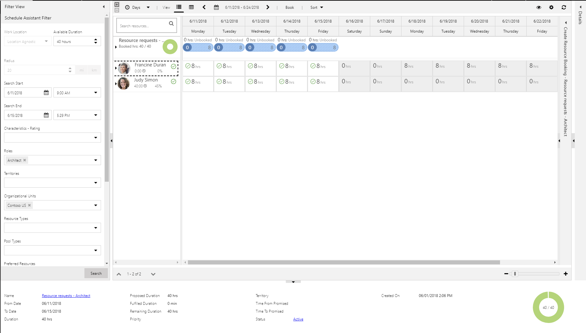
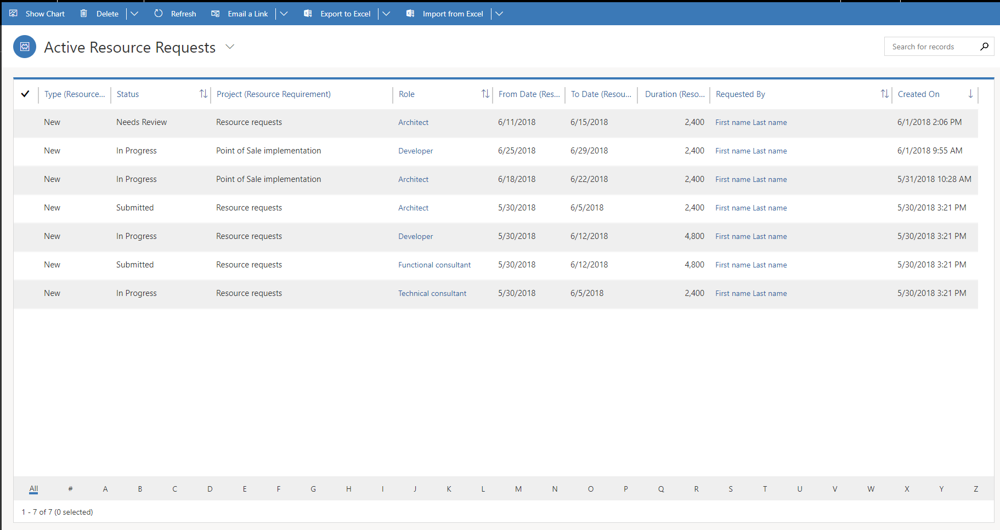
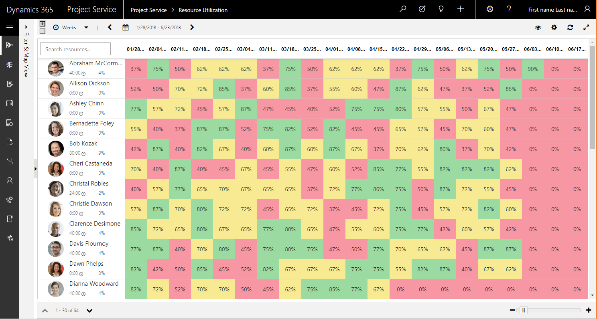
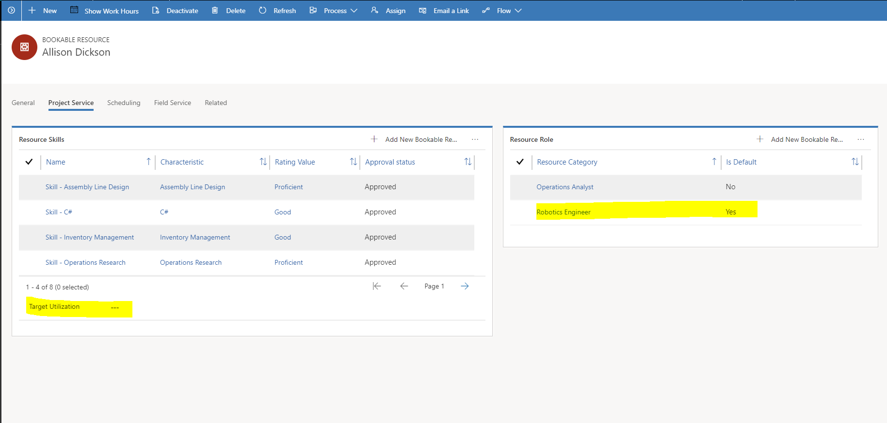
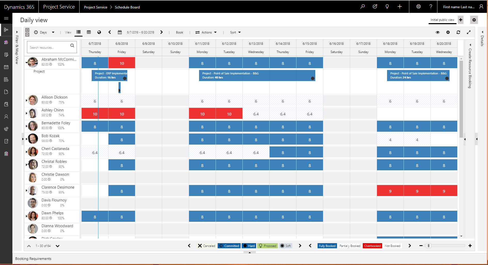
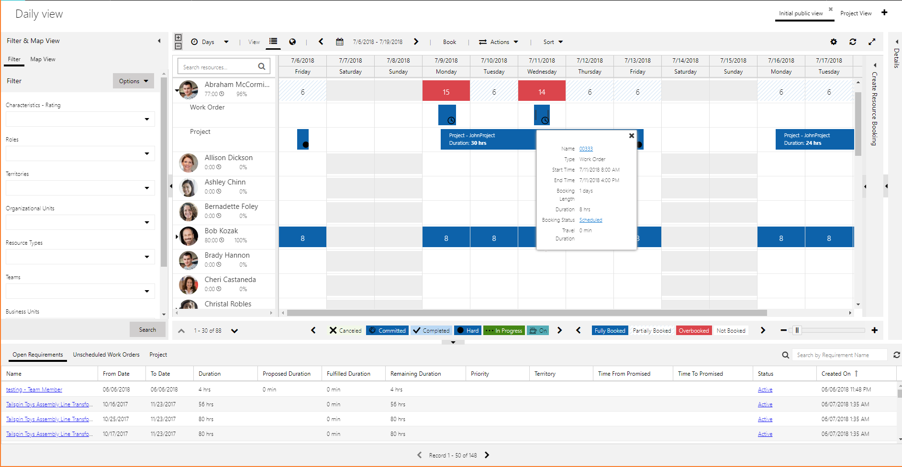
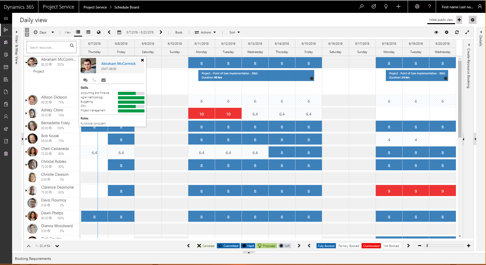

# Propose project resources

Resource managers can propose a resource to the project manager by using a resource request.

1. From the request grid or the request itself, select **Find Resources**.
2. On the **Schedule Assistant** page, select the resource, and then, in the **Create Resource Booking** pane, in the **Booking Status** field, select **Book**.

    

The following status updates occur:

- On the **Schedule Assistant** page, the status indicators are updated to indicate that the booking is proposed, not hard-booked.

    

- On the resource request, the status is changed to **Needs Review**.

    

- On the **Team** tab of the project, the generic team member's **Request Status** value is changed to **Needs Review**.

    

The project manager can either accept or reject the proposal.

When resource managers process resource requests, they can use any of the following approaches:

- Propose multiple resources to satisfy the demand if no single resource is available to fulfill the required hours. Proposed hours are then split among multiple resources that can satisfy the required hours. In this scenario, the hours can't overlap.
- Propose fewer resources than are required. In this scenario, the proposed resource capacity is less than the required hours that the requestor specified. Therefore, when the requestor accepts the proposed resources, an unfulfilled resource requirement is created to capture the remaining demand.
- Book multiple resources to satisfy the demand if no single resource is available to complete the work.
- Book fewer resources than are required. In this scenario, the booked hours are fewer than the required hours. The system guides you to propose resources instead of bookings, so that the requestor can verify and keep track of remaining demand.

## Billable utilization

Resources can have a target billable utilization. This target utilization is either defined as an attribute on a resource's default role or set on the record of the individual bookable resource. Utilization calculations are based on the actual hours that resources have reported by using approved time entries.

The following formulas are used to calculate utilization:

- Billable utilization = Chargeable actual hours ÷ Resource capacity
- Non-billable utilization = Actual time with billing type ID = Non-chargeable, Complementary, or Not available ÷ Resource capacity
- Internal = Actual time with no sales contract ÷ Resource capacity
- Resource capacity = Resource work hours – Out-of-office – Non-working days

You can find the **Resource Utilization** view in the **Resources** pane.

Each cell in the grid represents the billable utilization percentage of the resource in a period, such as a day, week, or month. The following formulas are used to color the cells:

- **Green:** Billable utilization \>= Resource target utilization
- **Yellow:** Target utilization – 20 \<= Billable utilization \< Target utilization
- **Red:** Billable utilization \< Target utilization – 20

Because the **Resource Utilization** view is based on the Schedule Board, you can use the filtering capabilities of the Schedule Board to filter your results.

The grid requires that you set a target utilization on either the role or the individual resource. To do this setup, go to **Resources** \> **Resource roles**.

Additionally, a default role must be assigned to each bookable resource. Go to **Resources** \> **Resources**. On the **Project Service** tab, verify that a resource role is defined, and that the **Is Default** field for it is set to **Yes**. You can add additional roles where **Is Default = No**. The role where the **Is Default = Yes** is used to evaluate the resource's utilization against the target for that role.

On the **Project Service** tab, you can also set an individual target utilization for the resource. The utilization calculation then uses that target utilization to evaluate the resource's target instead of the target of the resource's default role.

Utilization is shown for a resource only if that resource has approved, chargeable time during the period that is shown in the grid.

## Resource availability

It's critical that resource managers be able to view the availability of resources and update bookings. In some cases, there is no formal demand (resource request), but a resource manager must respond to an unplanned demand that comes through channels such as an email, phone call, or instant message. Resource managers use the Schedule Board to update resources and bookings.

Resource work hours are used as the basis for calculating the availability of a resource. Resource bookings consume the capacity of the resources.

The Schedule Board uses colors and shading to show bookings, availability, and overbookings, and also the status of bookings. A setting in the Schedule Board settings lets you show a legend.

If a right-pointing arrow appears next to an individual bookable resource on the Schedule Board, the resource can be expanded to show details of the work that the resource is booked on.

Because Dynamics 365 Project Service Automation uses the Universal Resource Scheduling engine, if you also have Dynamics 365 Field Service installed, you can view the details of resource bookings for projects, work orders, and any other entities that you've extended scheduling to.

To view more details about an individual resource, right-click it to open the resource card.

