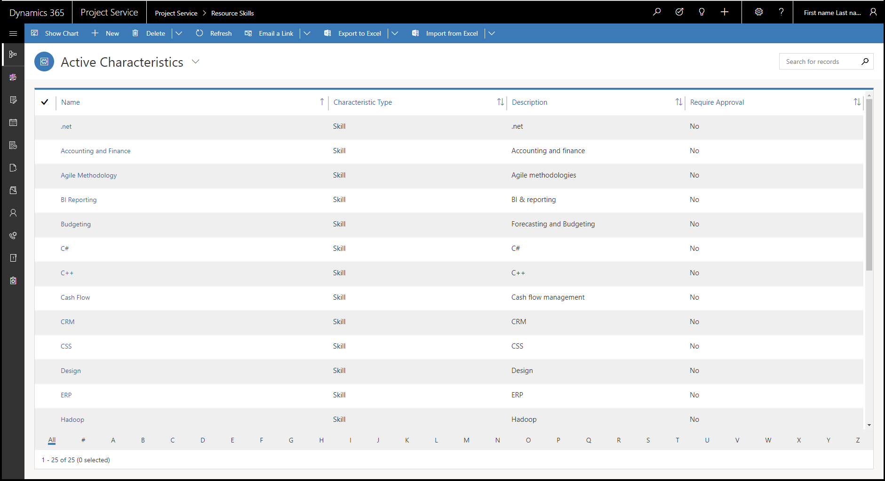
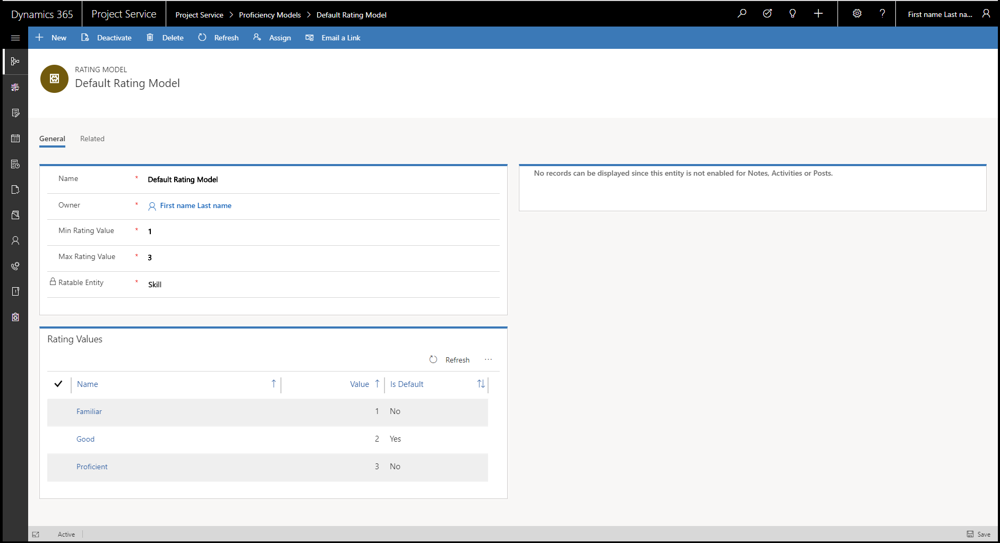

# Skills and proficiency models

[!INCLUDE[cc-applies-to-psa-app-3.x](../includes/cc-applies-to-psa-app-3x.md)]

Skills are resource characteristics that are shared between Dynamics 365 Project Service Automation and if present, Dynamics 365 Field Service. 

To maintain the repository of skills in Project Service Automation, go to **Resources** \> **Resource Skills**. 

> 

## Use proficiency models to rate resources

Skills for resources are rated by proficiency models. The individual ratings are in a proficiency model. 

1. To create a proficiency model, go to **Resources** \> **Proficiency Models**, and then select **New**.
2. In the new rating model, specify the minimum rating value, the maximum rating value, and the entity that is being rated.
3. In the **Rating Values** sub-grid, you can define the different rating values, from the minimum to the maximum.

> 

These rating values are shown on the **Resource Requirements**, **Schedule Board**, and **Schedule Assistant** filters.
