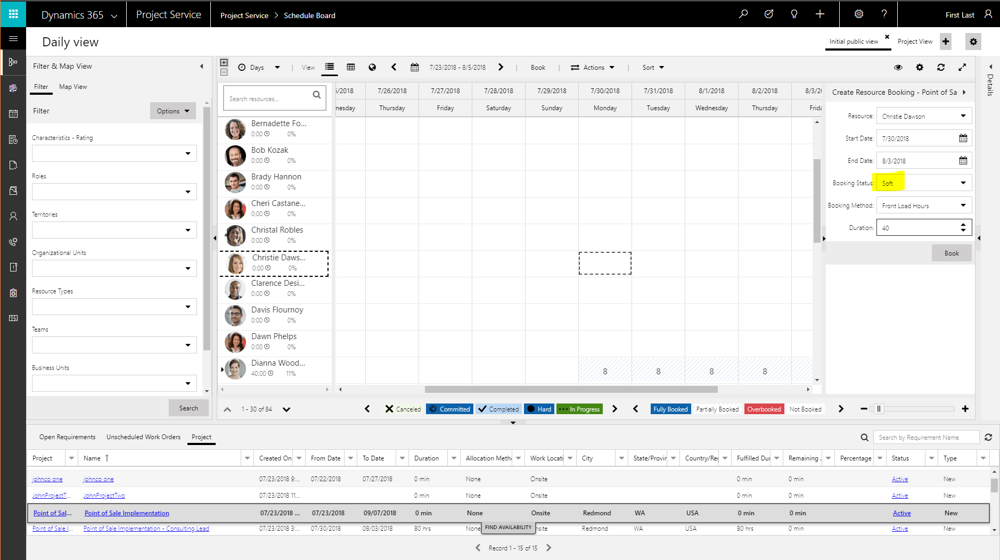
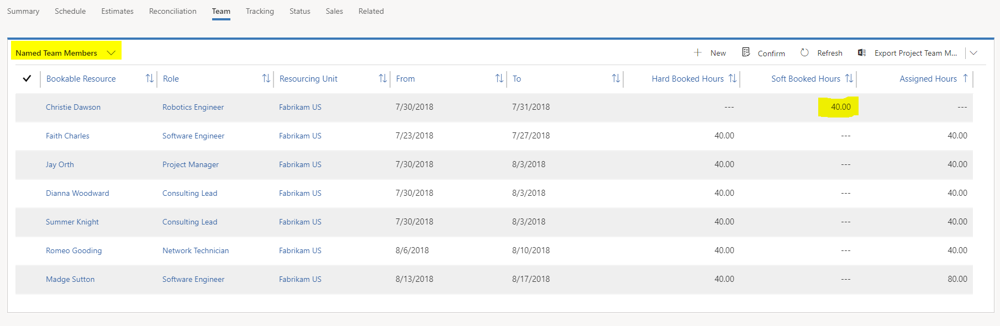
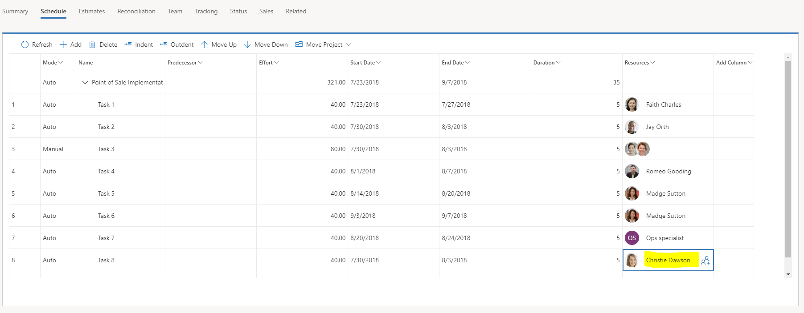
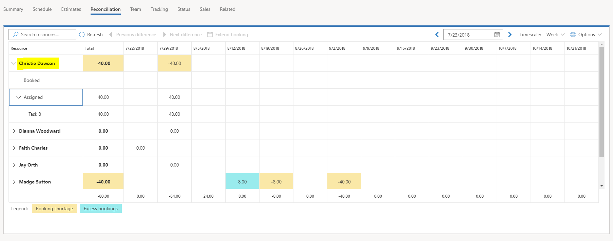
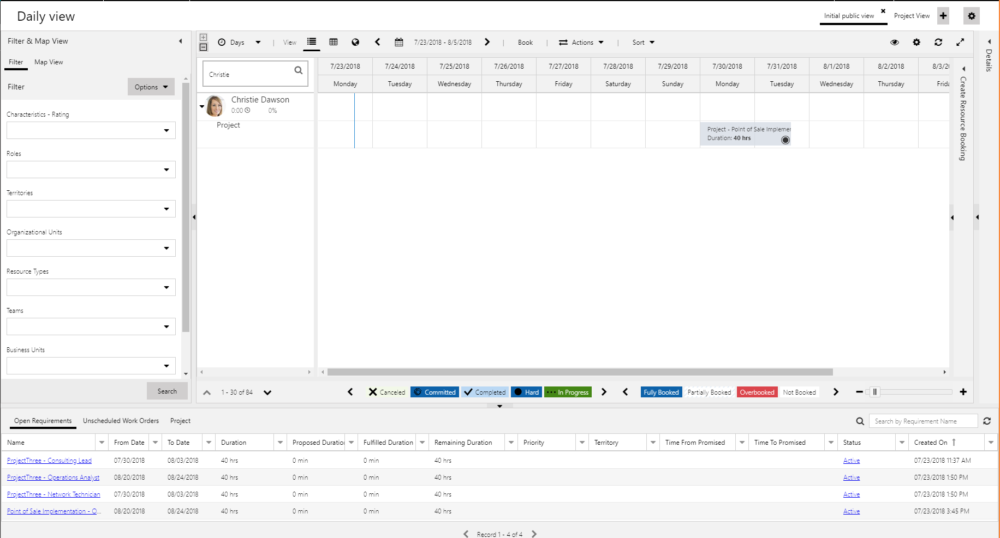
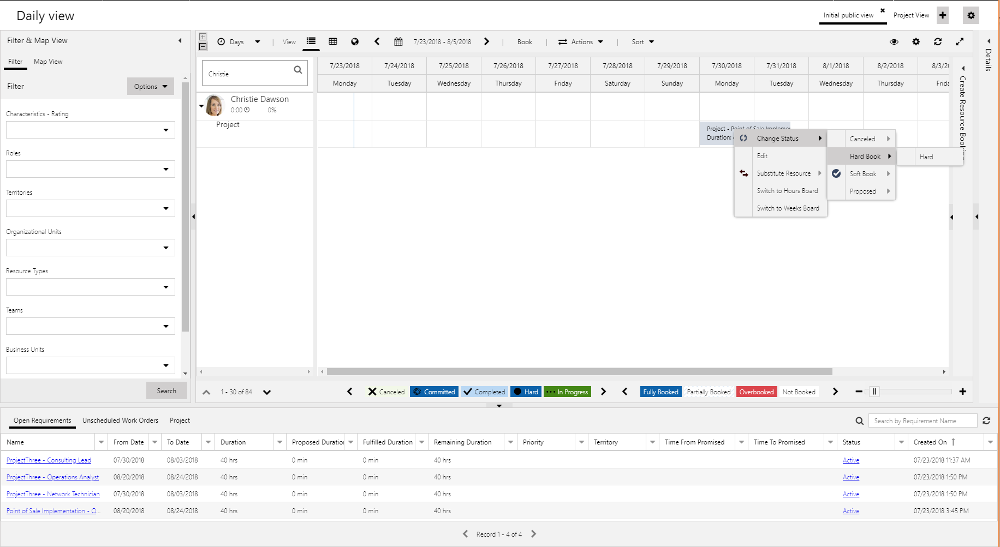
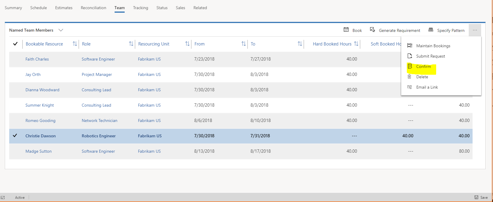

# Soft-book requirements

A resource requirement can be hard-booked. A hard booking creates a proposal that consumes a resource's capacity. The proposal is then sent back to the requester for approval. A soft booking tentatively adds a resource to a project team and has a different status on the Schedule Board, but it doesn't consume the resource's capacity. To soft-book a resource from the Schedule Board, set the **Booking Status** field to **Soft**.

When the **Team** tab is in the **Named Team Members** view, the resource appears there. The soft-booked hours are reported in the **Soft Booked Hours** column.

Soft-booked team members can be assigned to tasks.

On the **Reconciliation** tab, no bookings are shown for a soft-book resource, because the **Reconciliation** tab considers only hard-bookings.

> [!NOTE]
> You can't soft-book a resource from a requirement that was generated from a generic team member.

On the Schedule Board, a different coloring is used for soft bookings for a resource.

To convert a soft booking to a hard booking, on the Schedule Board, right-click the soft booking, and then select **Change Status** \> **Hard Book** \> **Hard**.

The booking is changed, and the status is changed on the Schedule Board. Because the booking status is now **Hard**, the resource is shown as booked, and its capacity and availability are adjusted.

You can use the same method to cancel a hard booking or a soft booking from the Schedule Board.

To convert a resource that is soft-booked to hard-booked on the project's **Team** tab, select the resource, and then select **Confirm**.

