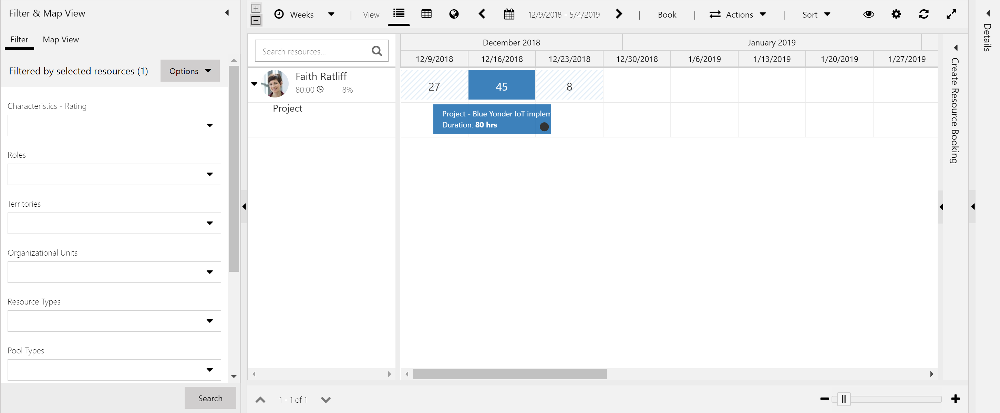
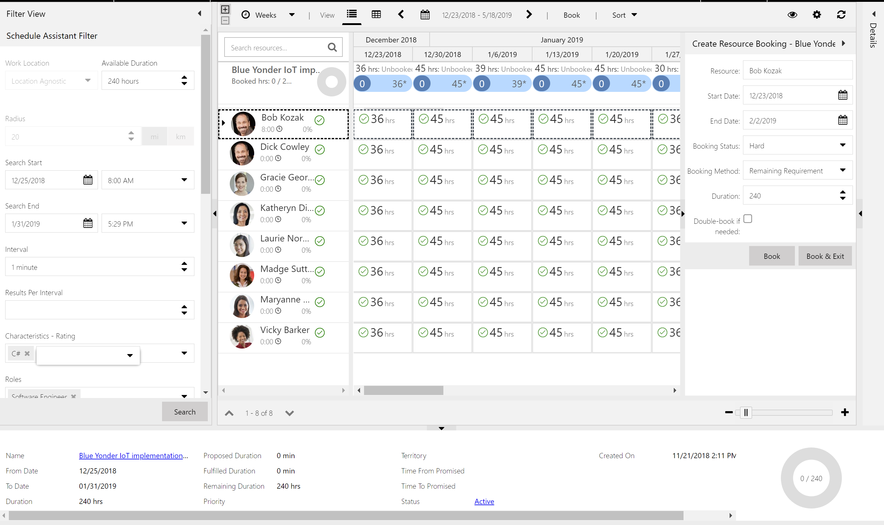
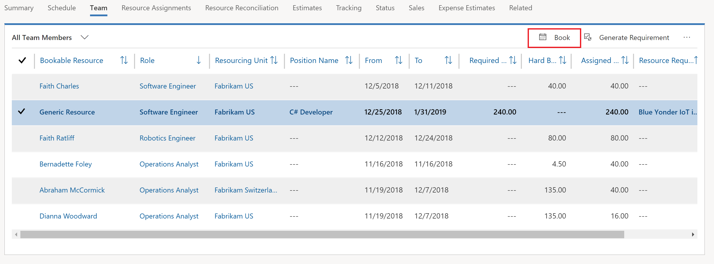
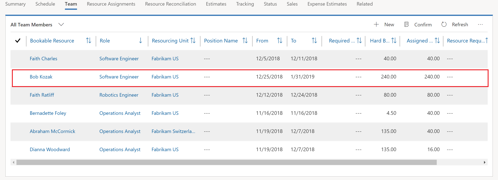
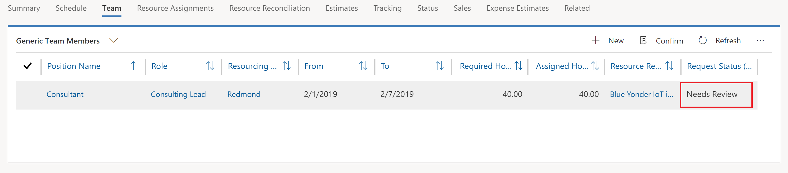
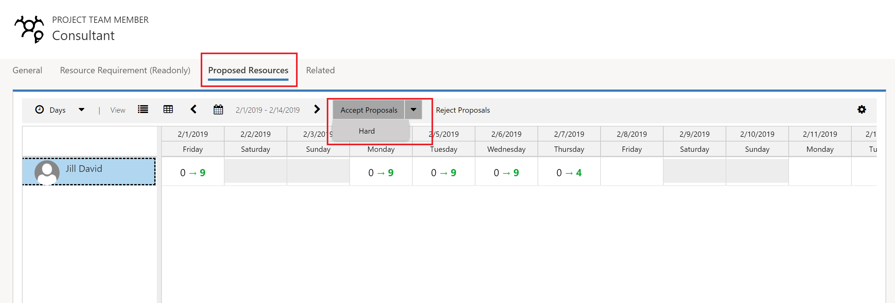
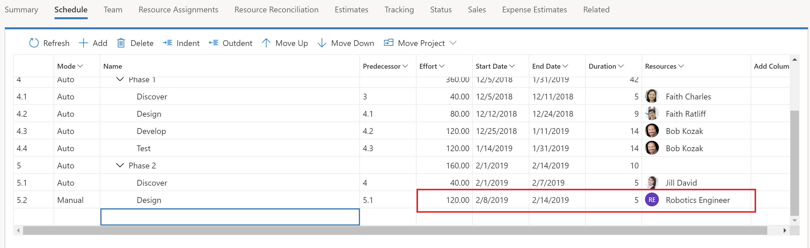
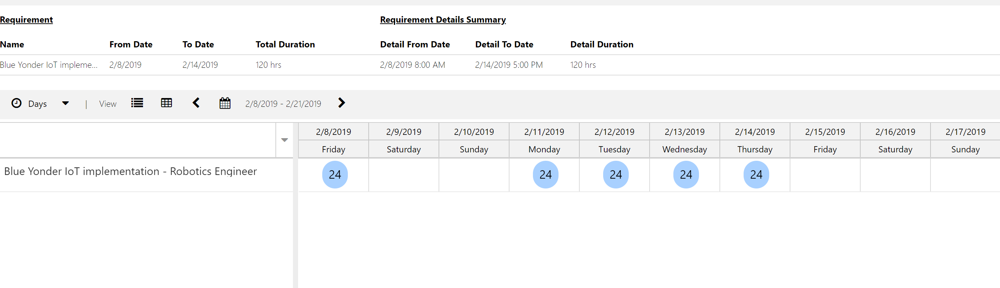
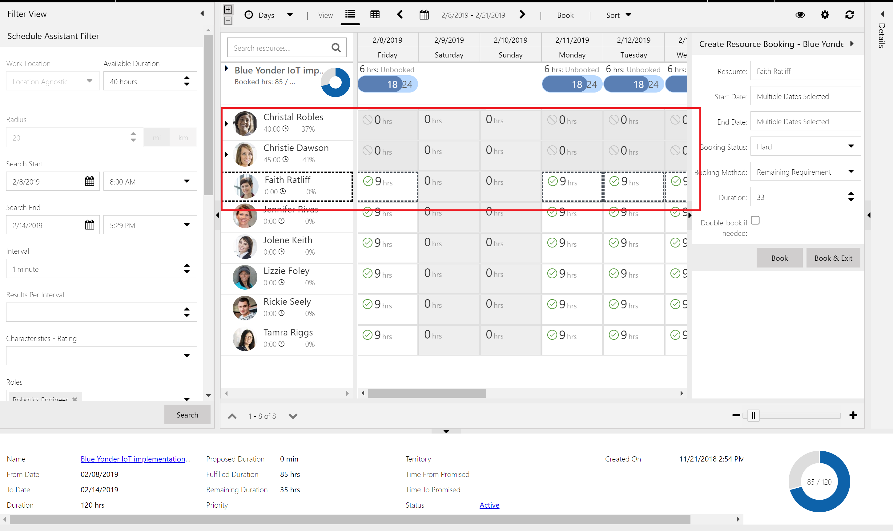

# Resourcing projects in Project Service Automation 

[!INCLUDE[cc-applies-to-psa-app-3.x](../includes/cc-applies-to-psa-app-3x.md)]

You can staff your project with a team of generic or named resources in Project Service Automation (PSA). You can use various methods to add and assign team members and to manage their bookings and assignments.

## Book and assign a named bookable resource on a task and project team

You can  add a named (or real) resource to your project team by booking them directly onto the team. To do this, complete the following steps.

1. In PSA, go to **Projects**, and select the open the project that ou are booking for.
2. On the **Project** page, on the **Team** tab, click **New**. 

3. In the **Quick Create Project Team Member** dialog, select the bookable resource. The **Role** field will populate with the resource's default role if they have one assigned. You can change the role if needed. 
4. Select the from and to dates that the resource will be needed and select the allocation method of the resource's capacity. 
5. If you want the team member to be a project approver, select **Yes** in the **Project Approver** field. This will mean that the team member can approve submitted time and expense entries for this project. 
6. Click **Save**.

7. On the **Project** page, click the **Schedule** tab to assign tasks to the new resource. The resource picker that is launched from the task grid
will show the team members for the project under Team Members.

In version 3, resource bookings and task assignments are not tightly coupled. This means that
when you use the resource picker in the schedule, you can potentially assign tasks to team
members for more hours than their bookings cover on the project.

You can see differences in team member bookings and assignments in either the
team tab or the resource reconciliation tab, where you can reconcile differences between
bookings and assignments for resources at a detailed level.

You can also use the resource picker in the schedule tab to select bookable resources
that are not already part of the project team. They show on the resource picker as
Other Resources

When you do this, the resource is added to the project team and assigned to the task, but no bookings are
made for them.

You can use the reconciliation tab’s extend bookings capability or the schedule
board to book the resource’s capacity to the project.

Once a team member is booked on your project, you can either use maintain
bookings or use the Schedule Board directly to manage their bookings.

## Assigning a generic bookable resource on a task and project team and then fulfilling with a “named” resource via Schedule Board 

In addition to booking and assigning named or real resources to your project,
you can assign generic resources to project tasks. These resources can serve as placeholders for
named resources until you are ready to staff your project with named resources. This manifests itself
mainly in the generic resource assignment and fulfilment scenario.

To do this you can type the position name of the generic resource in the resource cell of the schedule or click the resource icon in the cell and open the resource picker and type the name of the generic resource you wish to create.

This will open a team member quick create panel that allows you to set the role and organization unit of the generic resource team member.

Once created, it is assigned to the task and you can continue to assign that generic resource to other tasks in the task schedule.

Once you have assigned the generic resource you can generate a resource requirement for it and fulfil it either by directly booking or submitting a resource request to a resource manager.

 

Also, on the team member grid, generic resources can be added directly in addition to the resource picker experience as documented above. They are added with a resource requirement that is based on the start/end dates and allocation method specified in the quick create form.

You can see a difference if you add the generic team member directly and then assign more tasks to the generic resource than they have required hours to cover. You can click Generate Requirement to regenerate the requirement to true up the required hours 
against assignments.

You can also click the resource requirement link in the team grid to open the requirement and add skills, preferred resources, etc.

### Booking a named resource directly

You can select a generic resource with a requirement and click Book on the Team tab of the project or open the resource
requirement and click the book button there.

This will open the Schedule Assistant which you use to select and book a named
resource onto your project team.

When the booking is complete and totally fulfilled by a named resource, the generic resource is replaced with the named resource on the team.

The assignments on the schedule are updated with the named resource as well.

### Submitting a resource request 

You can also submit a generated resource requirement as a resource request for fulfillment by a resource manager persona.

Once you have generated a resource requirement for a generic team member, click on the Submit Request button.

The request status of the generic team member will change to Submitted.

Once the request is fulfilled by the resource manager, the generic resource will be replaced by a named resource if the resource manager has fulfilled the request or the generic resource will remain on the team and the request status will change to Needs Review, if the resource manager has proposed a named resource.

### Accepting or rejecting a proposed resource 

When the resource manager proposes a named resource back to the project manager, the generic team member’s request status changes to Needs Review.

Click on the arrow to open to open the team member and click on the Proposed Resources tab.

The grid shows the proposed resource’s current bookings and bookings once the proposal is accepted. From here you can select the proposed resource and click Accept Proposals for them to be booked onto your team.  You can also reject the resource and resubmit the request.

As with directly fulfilling a generic resource with a named resource, the generic resource will be replaced and the assigned tasks will be updated with the named team member.

## Multiple named resources fulfilling a generic resource 

Fulfilling a requirement for a generic resource with multiple real resources follows the same flow as a single resource described above.

For example, here is a task with a duration of 5 days and effort hours of 120hrs. This task cannot be completed by one resource that works a typical 8hr day over a 5 day week.

The requirement is for 120hrs of a Robotics engineert over 5 days, which is 24hrs per day.

Thus, you will need to book multiple resources to fulfill the requirement.

The main difference in this scenario is that the generic resource remains on the team with the assignment to the task and the booked real team members are not assigned as part of the position. The project manager will then be able to assign the work as they see fit to the real resources. The Reconciliation view can assist a project manager in breaking up the bookings across multiple resources to task assignments. The reason this is not done automatically is because in any scenario more complicated than the simple one above, such as where you have a bundle of tasks making up the requirement, the intent of how the project manager wants to assign, needs to be assumed by the system. Since the system cannot understand intent, chances are the assumptions will be different than intended and an incorrect or unpredictable result will happen. 
Then predictable outcome is that the generic remains assigned until the project manager deliberately assigns, with the assistance of the Reconciliation view.

