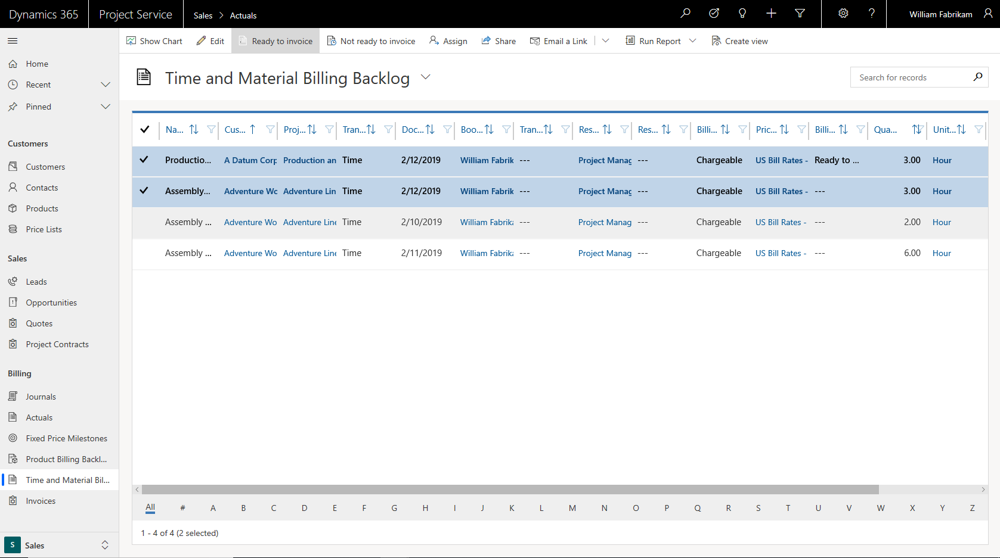
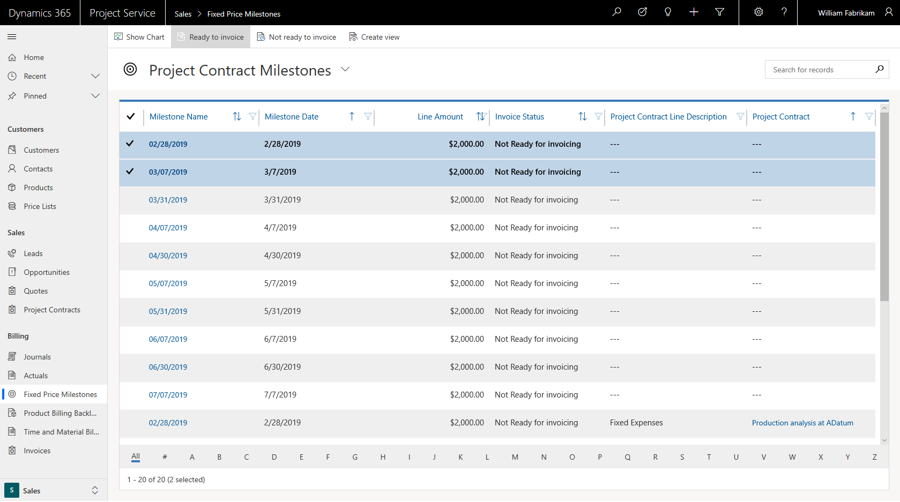

---

title: Review the invoicing backlog on projects and project contracts
description: This topic provides information about how to review time, expense, and product backlogs, and how to mark them as ready for invoicing.
author: rumant
manager: kfend
ms.service: dynamics-365-projectservice
ms.custom:
  - dyn365-projectservice
ms.date: 03/11/2019
ms.topic: article
ms.prod: 
ms.service: business-applications
ms.technology: Microsoft Dynamics 365 Project Service Automation 2.x and 3.x
audience: Admin
search.audienceType: 
  - admin
  - customizer
  - enduser
search.app: 
  - D365PS
---

# Review the invoicing backlog on projects and project contracts

[!INCLUDE[cc-applies-to-psa-app-3.x](../includes/cc-applies-to-psa-app-3x.md)]

When a transaction is ready to have an invoice created and processed, the transaction should be marked **Ready to invoice**. This topic describes the types of transactions that can be created.

## Review the time and material billing backlog

When a time or expense entry is submitted and approved for a project, PSA creates a project actual. If the combination of the project and the transaction class are mapped to a contract line for a time-and-materials project, two actuals are created when the entry is approved:

- Cost actual 
- Unbilled sales actual

Unbilled sales actuals represent the billing backlog, and their billing status must be set to **Ready to Invoice**. When a project invoice is created, unbilled sales actuals that are marked **Ready to Invoice** are copied over as invoice line details.

To review the billing backlog for time and materials, go to **Sales** \> **Billing** \> **Time and Material Billing Backlog**. Select all the unbilled sales actuals that are ready to be invoiced, and then select **Ready to Invoice**. The billing status of these actuals is changed to **Ready to Invoice**.

## Review the product billing backlog

In PSA, when a project contract has product-based contract lines, those lines are considered for invoicing whenever an invoice is created for the project contract. Any product that has contract lines that are marked **Ready to Invoice** is copied over to the project invoice as project invoice lines.

To review the billing backlog for products, go to **Sales** \> **Billing** \> **Product Billing Backlog**. Select all the product-based contract lines that are ready to be invoiced, and then select **Ready to Invoice**. The billing status of these lines is changed to **Ready to Invoice**.

## Review billing milestones on fixed-price contracts

Each project contract line that has a fixed-price billing method must define contract milestones. These contract milestones can be invoiced only if they are marked **Ready to Invoice**. 

To review billing milestones, go to **Sales** \> **Billing** \> **Fixed Price Milestones**. Select the milestones that are ready to be invoiced, and then select **Ready to invoice**. The billing status of these milestones is changed to **Ready to Invoice**.

