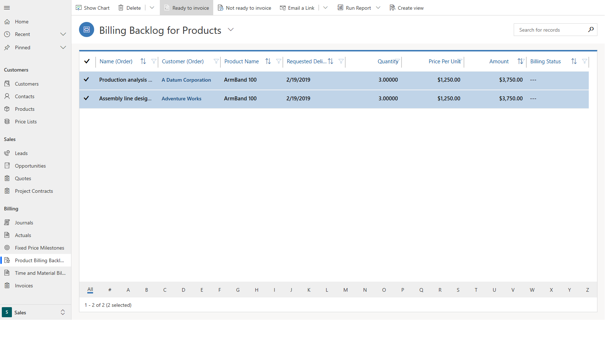

---

title: Review invocing backlog on Projects and / or Project Contracts
description: Process description of how to review time, expense, product backlog and mark them as ready for invoicing 
author: Rupa Mantravadi
manager: kfend
ms.service: dynamics-365-customerservice
ms.custom:
  - dyn365-projectservice
ms.date: 2/25/2018
ms.topic: article
ms.prod: 
ms.service: business-applications
ms.technology: Microsoft Dynamics 365 for Customer Engagement for Project Service 2.x and Microsoft Dynamics 365 for Customer Engagement for Project Service 3.x
audience: Admin
search.audienceType: 
  - admin
  - customizer
  - enduser
search.app: 
  - D365CE
  - D365PS
---
# Review invoicing backlog

[!INCLUDE[cc-applies-to-psa-app-3.x](../includes/cc-applies-to-psa-app-3x.md)]

In the latest version PSA, transactions that need to invoiced should be marked as "Ready to invoice" before invoicing can pick them up and create an invoice.  

Here’s a description of this process for the differnt types of transactions that can be created in Project Service application.  
### Review time and material billing backlog
Whenever a time or expense entry submitted for a project is approved, Project Service creates "project actuals". If the project and the transaction class combination maps to a time and material project contract line, the approved time or expense entry will result in 2 actuals:

a cost actual and

an unbilled sales actual.

These unbilled sales actuals represent the Billing backlog and must be marked as "Ready to invoice" i.e their billing status must be set to "Ready to invoice". When a project invoice is created, the Unbilled Sales actuals that are marked as "Ready to invoice" are copied over as invoice line details.  
To review Time and Material billing backlog, navigate to Sales->Billing -> Time and Material Billing backlog. Select all the unbilled sales actuals that are ready to invoice and then click the ribbon action "Ready to invoice". The billing status of these actuals changes to "Ready to invoice".
> 

### Review product billing backlog
When a project contract in Project service has a product-based contract line, these lines are considered for invoicing whenever an invoice is created for that project contract. Any product - based contract line that is marked as "Ready to invoice" will be copied over to the Project invoice as Project Invoice lines.

To review Product billing backlog, navigate to Sales->Billing -> Product Billing backlog. Select all the product-based  contract lines that are ready to invoice and then click the ribbon action "Ready to invoice". The billing status of these lines changes to "Ready to invoice".
> 
### Review billing milestones on fixed price contracts 
Each project contract line that has fixed price billing method must define Contract milestones. These Contract milestones must be marked as ready to invoice in order to be invoiced. 

To review billing milestones, navigate to Sales->Billing -> Fixed Price Milestones. Select the Milestones that are ready to be invoiced and then click the ribbon action "Ready to invoice". The billing status of these Milestones changes to "Ready to invoice".
> 

