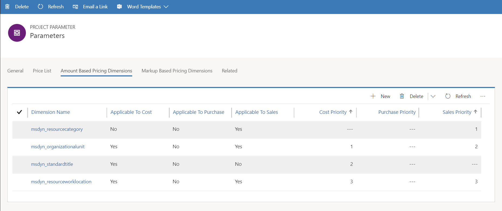
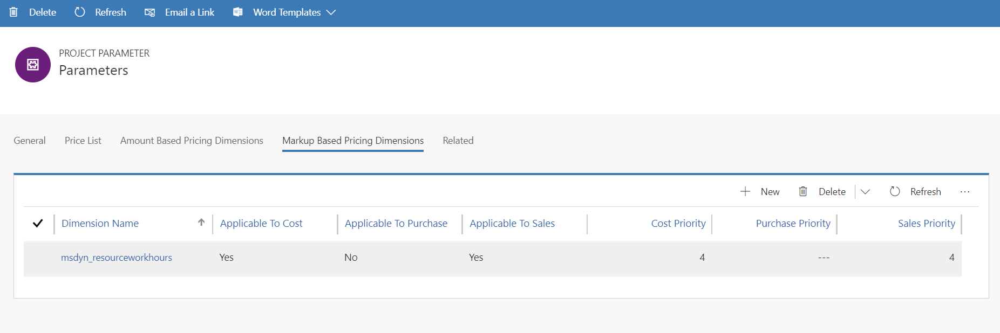

# Set up custom fields as pricing dimensions 

Before you begin, this topic assumes that you have completed the procedures in the topics, [Create custom fields and entities](create-custom-fields-entities.md) and [Add custom fields to price setup and transactional entities](field-references.md). If you haven't completed those procedures, go back and complete them and then return to this topic. 

This topic provides information about setting up custom pricing dimensions. In the Project Service web interface, on the **Parameters** page, the **Amount-Based Pricing Dimensions** tab shows the records in the pricing dimension entities. By default, Project Service installation creates 2 rows in the grid on this tab:

- **msdyn_resourcecategory** (Role)
- **msdyn_OrganizationalUnit** (Organizational Unit)

> [!IMPORTANT]
> Do not delete these rows. However, if you do not need them, you can make them not applicable in a specific context by setting **Applicable to Cost**, **Applicable to Sales**, and **Applicable to Purchase** all to **No**. Setting these attribute values to **No** has the same effect of not having the field as a pricing dimension.

For a field to become a pricing dimension, it must be:

- Created as a field in the **Role Price** and **Role Price markup** entities. For more information on how to do this, see [Add custom fields to price setup and transactional entities](field-references.md).
- Created as a row in the **Pricing Dimension** table. For example, add pricing dimension rows as shown in the following graphic. 

Notice that Resource Work hours (**msdyn_resourceworkhours**) has been added as a markup-based dimension and has been added to the grid on the **Markup Based Pricing Dimension** tab.

> [!IMPORTANT]
> Any change to pricing dimension data in this table, existing or new, is propagated to the Project Service pricing business logic only after the cache is refreshed. The cache refresh time may take up to 10 minutes. Allow that length of time to see the changes in price defaulting logic that must result from changes to the Pricing Dimension data.

## Attributes of the Pricing Dimensions table
The following sections provide information about the different attributes in the **Pricing Dimensions** table.

### Pricing Dimension Name
This value should be the exact same as the schema name of the field that is added to the **Role Price** table for custom pricing dimensions. For more information about adding fields to the **Role Price** table, see [Add custom fields to price setup and transactional entities](field-references.md).

### Type of dimension
There are two types of pricing dimensions:
  
  - **Amount-based dimensions**: The dimension values from the input context are matched to the dimension values on **Role Price** line and the price/cost is defaulted directly from the **Role Price** table.
  - **Markup-based dimensions**: These are dimensions where Project Service will adopt the following 3-step process to get the price/cost
 
    1. Project Service matches the non-markup-based dimension values from the input context to the Role Price line to get the base rate.
    2. Project Service matches all of the dimension values from the input context to the **Role Price Markup** line to get a markup percentage.
    3. Project Service applies the markup percentage from the second step to the base rate obtained from the **Role Price** table in the first step to arrive at final price/cost.
   
   The following table illustrates the calculation of price markups.
  
| Role        | Org Unit    |Work Location      |Standard Title      |Resource Work Hours      |  Mark Up|
| ------------|-------------|-------------------|--------------------|-------------------------|--------:|
|             | Contoso India|Onsite            |                    |Overtime                 |15     |
|             | Contoso India|Local             |                    |Overtime                 |10     |
|             | Contoso US   |Local             |                    |Overtime                 |20     |

If a resource from Contoso India whose base rate is 100 USD is working onsite, and they log 8 hours of Regular time and 2 hours of overtime on the time entry, the Project Service pricing engine will use the base rate of 100 for the 8 hours to record 800 USD. For the 2 hours overtime, a markup of 15% will be applied to the base rate of 100 to get a unit price of 115 USD and will record a total cost of 230 USD.

### Applicable to Cost 
If this is set to **Yes**, it indicates that the dimension value from the input context should be used to match to the **Role Price** and **Role Price Markup** when retrieving the cost and markup rates.

### Applicable to Sales
If this is set to **Yes**, it indicates that the dimension value from the input context should be used to match to the **Role Price** and **Role Price Markup** when retrieving the bill and markup rates.

### Applicable to Purchase
If this is set to **Yes**, it indicates that the dimension value from the input context should be used to match to the **Role Price** and **Role Price Markup** when retrieving the purchase price. Currently Project Service does not support subcontracting scenarios, so this field is not used. 

### Priority
Setting the dimension priority helps Project Service pricing produce a price even when it can't find an exact match between the input dimension values and the values from the **Role Price** or **Role Price Markup** tables. In this scenario, Project Service will use null values for unmatched dimension values by weighing the dimensions in order of their priority.

- **Cost Priority**: The value of a dimension's cost priority will indicate the weight of that dimension when matching against the setup of cost prices. The value of **Cost Priority** must be unique across dimensions that are **Applicable to Cost**.
- **Sales Priority**: The value of dimension's sales priority will indicate the weight of that dimension when matching against the setup of sales prices or bill rates. The value of **Sales Priority** must be unique across dimensions that are **Applicable to Sales**.
