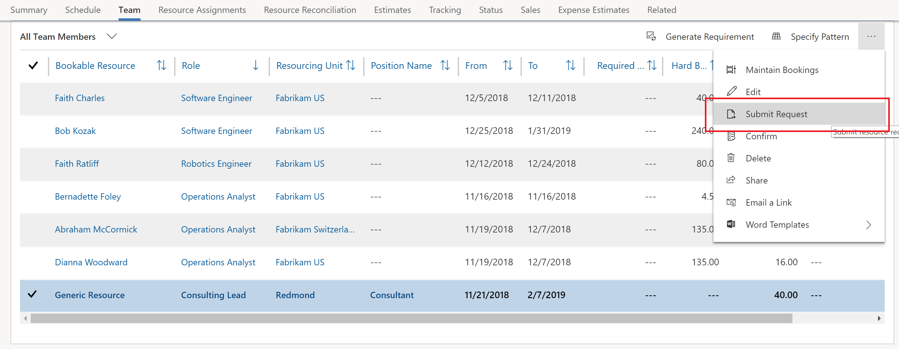

# Submit a resource request

[!INCLUDE[cc-applies-to-psa-app-3.x](../includes/cc-applies-to-psa-app-3x.md)]

You can submit a generated resource requirement as a resource request. The request is then sent to a resource manager for fulfillment.

1. In Project Service Automation (PSA), on the **Projects** page, click the **Team** tab to view a list bookable resources. 
2. Select the generic resource that has a resource requirement from the list and then click **Submit Request**.

The request status of the generic team member will change to **Submitted**.

After the request is fulfilled by the resource manager, the generic resource will be replaced by a named resource if the resource manager fulfills the request with the booking of a named resource. Otherwise, the generic resource will remain on the team and the request status will change to **Needs Review**, if the resource manager has proposed a named resource.
