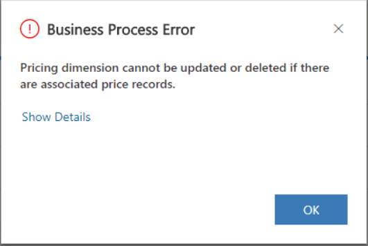

# Turn off a pricing dimension

You may need to review and update your pricing strategy every few years. Any updates you make might require that you turn off an existing pricing dimension and create a new one. For example, you may have previously priced by **Role**, but now you have decided to price by **Work Experience**. This may require you to turn off **Role** as a pricing dimension and create **Work Expereince** as a new pricing dimension. 

Turning off a pricing dimension, regardless if it is out-of-the-box or custom, can be done by setting the **Applicable to Cost** and **Applicable to Sales** fields of the Pricing Dimension to **No**.

However, when you do this, you might receive the following error message.

This error message indicates that there are price records that were previously set up for the dimension that is being turned off. All **Role Price** and **Role Price Markup** records that refer to a dimension must be deleted before the dimension’s applicability can be to set to **No**. This rule applies to both out-of-the-box pricing dimensions and any custom pricing dimensions that you may have created. The reason for this validation is because Project Service has a constraint that each **Role Price** record must have a unique combination of dimensions. For example, on a price list called **US Cost Rates 2018**, you have the following **Role price** rows. 

| Standard Title         | Org Unit    |Unit   |Price  |Currency  |
| -----------------------|-------------|-------|-------|----------|
| Systems Engineer|Contoso US|Hour| 100|USD|
| Senior Systems Engineer|Contoso US|Hour| 150| USD|

When you turn off **Standard Title** as the pricing dimension, and the Project Service pricing engine searches for a price, it will only use the **Org Unit** value from the input context. If the **Org Unit** of the input context is “Contoso US”, the result will be non-deterministic because both the rows will match. To avoid this scenario, when you create **Role Price** records, Project Service validates that the combination of dimensions is unique. If the dimension is turned off after the **Role Price** records are created, this constraint can be violated. Therefore, it is required that before you turn off a dimension, you delete all **Role Price** and **Role Price Markup** rows that have that dimension value populated.

