# Upgrade considerations - PSA version 2.x or 1.x to version 3
[!INCLUDE[cc-applies-to-psa-app-1x-2x](../includes/cc-applies-to-psa-app-1x-2x.md)]

## Project Service Automation and Field Service
Both Dynamics 365 Project Service Automation and Dynamics 365 Field Service use the Universal Resourcing Scheduling (URS) solution for resource scheduling. If you have both Project Service Automation and Field Service in your instance, you should plan on upgrading both solutions to the latest version (version 3.x for Project Service Automation, version 8.x for Field Service). Upgrading Project Service Automation or Field Service will install the latest version of URS, which means that inconsistent behavior is possible if both Project Service Automation and Field Service solutions in the same instance aren’t upgraded to the latest version.

## Resource assignments
In Project Service Automation version 2 and version 1, task assignments were stored as child tasks (also called line tasks) in the **Task entity**, and indirectly related to the **Resource Assignment** entity. The line task was visible in the assignment pop-up window on the Work Breakdown Structure (WBS).

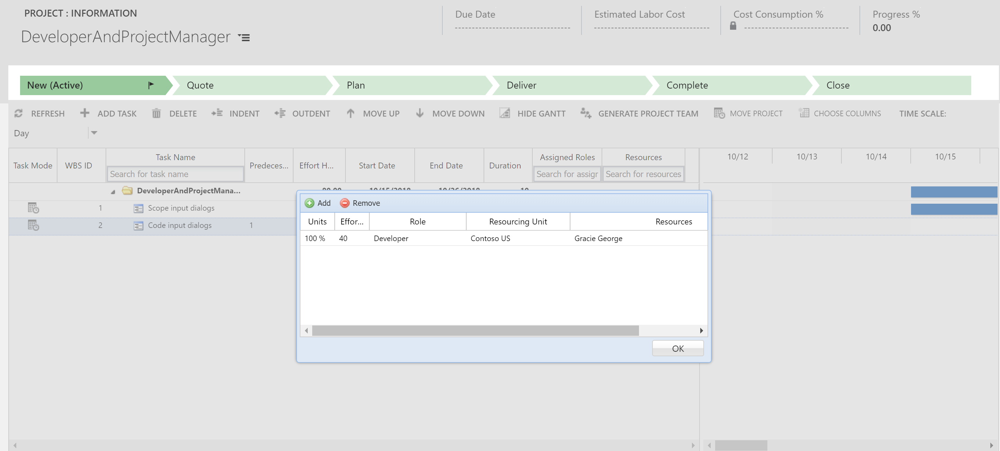

In version 3 of Project Service Automation, the underlying schema of assigning bookable resources to tasks has changed. The line task has been deprecated and there is a direct 1:1 relationship between the task in the **Task entity** and the team member in the **Resource Assignment** entity. Tasks that are assigned to a project team member are now stored directly in the Resource Assignment entity.  

These changes impact the upgrade of any existing projects that have resource assignments for named bookable resources and generic resources on a project team. This topic provides the considerations that you will need to take into account for your projects when you upgrade to version 3. 

### Tasks assigned to named resources
Using the underlying task entity, tasks in version 2 and version 1 allowed team members to portray a role other than their default defined role. For example, Gracie George, who’s by default assigned the role of Program Manager, could be assigned to a task with the role of Developer. In version 3, the role of a named team member is always the default, so any task that Gracie George is assigned to uses her default role of Program Manager.

If you have assigned a resource to a task outside of their default role in version 2 and version 1, when you upgrade, the named resource will be assigned the default role for all task assignments, regardless of role assignment in version 2. This will result in differences in the calculated estimates from version 2 or version 1 to version 3 because estimates are calculated based on the role of the resource and not the line task assignment. For example, in version 2, two tasks have been assigned to Ashley Chinn. The role on the line task for task 1 is Developer and for task 2, Program Manager. Ashley Chinn has the default role of Program Manager.

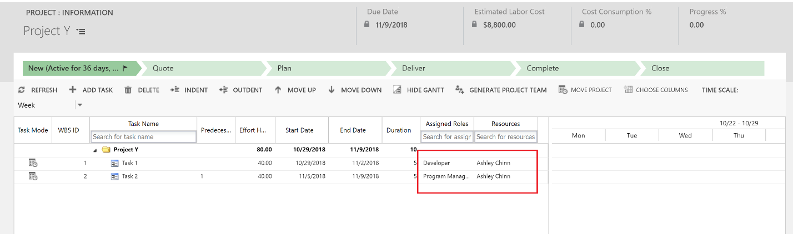

Because the roles of Developer and Program Manager differ, the cost and sales estimates are as follows:

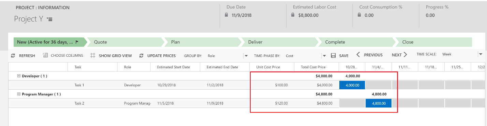

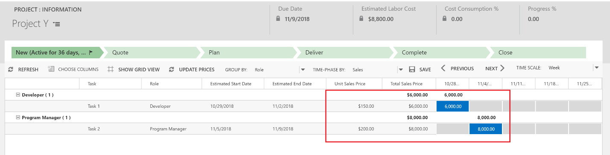

When you upgrade to version 3, line tasks are replaced with resource assignments on the task of the bookable resource team member. The assignment will use the default role of the bookable resource. In the following graphic, Ashley Chinn who has a role of Program Manager, is the resource.

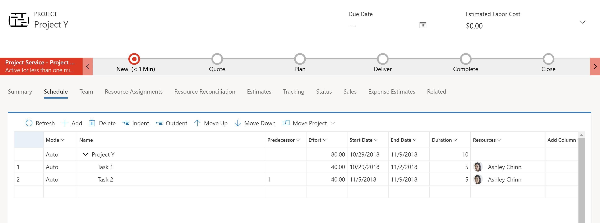

Because the estimates are based on the default role for the resource, the sales and cost estimates may change. Note that in the following graphic, you no longer see the **Developer** role as the role is now taken from the bookable resource’s default role.

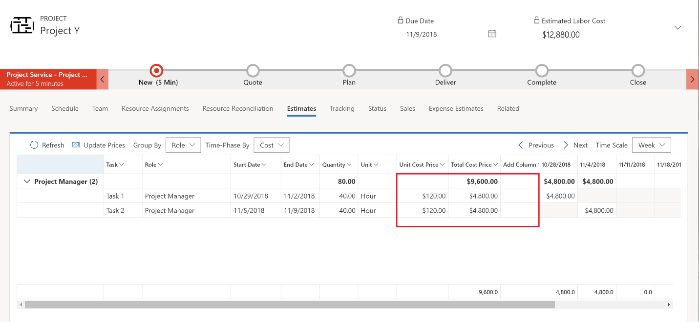
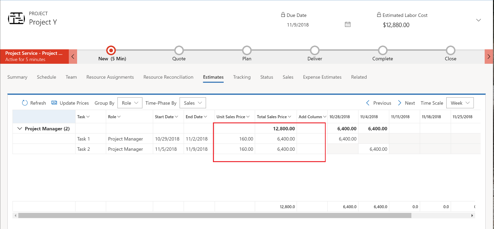

After upgrade is complete, you can edit a team member's role to be something other than the assigned default. However, if you change a team members role, it will be changed on all of their assigned tasks because team members are no longer allowed to be assigned multiple roles in version 3.

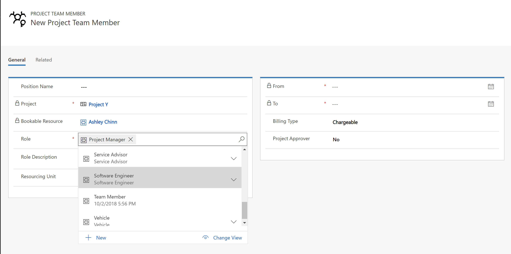

This is also true for line tasks that were assigned to named resources when you change the resource’s organization unit from the default to another organization unit. After the version 3 upgrade is complete, the assignment will use the resource’s default organization unit instead of the one set on the line task.

### Tasks assigned to generic resources
In version 2 and version 1, you can set the role and org unit on a task and then use the **Generate team** feature to generate generic resources based on the attributes set on the task. In version 3, you create the generic team members with role and org unit, and then assign the team members to tasks.

In version 2 and version 1, projects with generic resources can be in two states, or a mix of both at the task level. For example, you can have the following scenarios:

- Tasks with roles and org units set, but no affiliated resource assignment has been generated.
- Tasks with generic team member resource assignments that were assigned by creating generic resource using the **Generate team** feature.

Before you begin your upgrade, we recommend that you re-generate the team for each project that has tasks assigned to generic resources or has yet to have the generate team process run on them.

For tasks that are assigned to generic team members that were generated with **Generate Team**, the upgrade will leave the generic resource on the team and leave the assignment to that generic team member. We recommend that you generate the resource requirement for the generic team member after the upgrade but before you book or submit a resource request. This will preserve any org unit assignments on the generic team members that are different than the project’s contracting org unit.

For example, in the Project Z project, the contracting org unit is Contoso US. In the project plan, testing tasks within the Implementation phase have been assigned the role Technical Consultant and the assigned org unit is Contoso India.

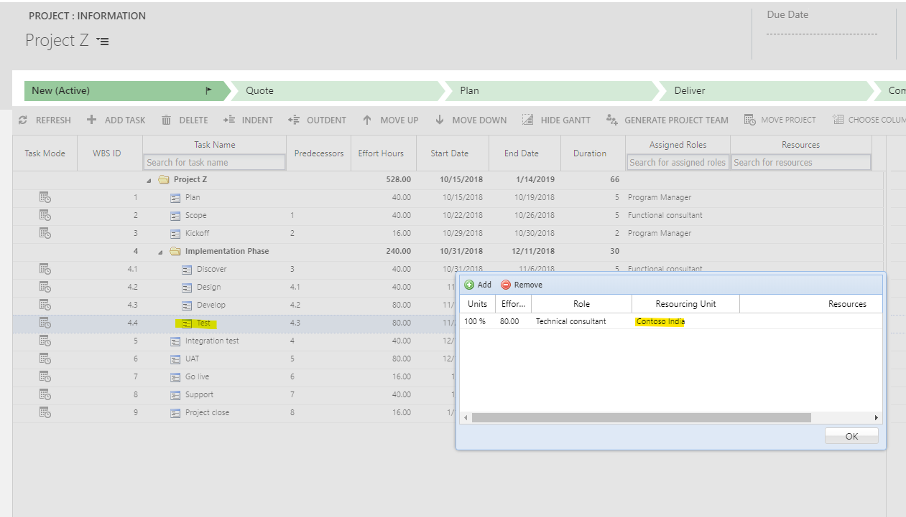

After the implementation phase, the integration test task is assigned to the role Technical consultant, but the org is set to Contoso US.  

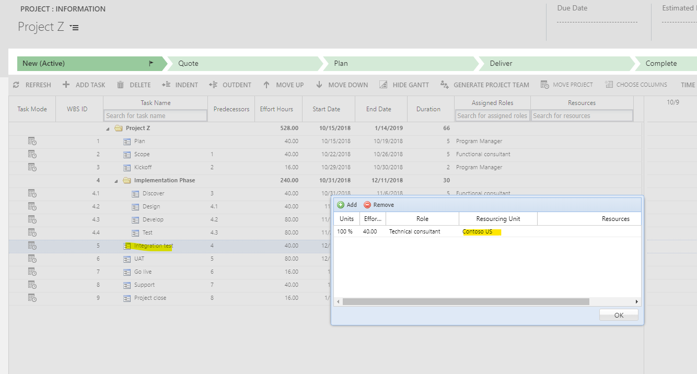

When you generate a team for the project, two generic team members are created due to the different org units on the tasks. Technical consultant 1 will be assigned the Contoso India tasks and Technical consultant 2 will have the Contoso US tasks.  

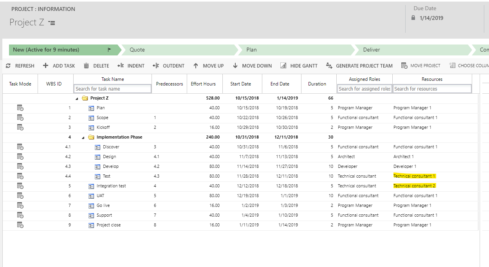

> [!NOTE]
> In Project Service Automation version 2 and version 1, the team member does not hold the organization unit, that is maintained on the line task.

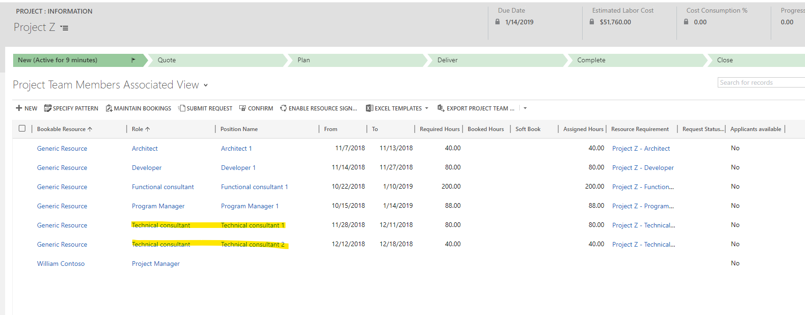

You can see the organization unit on the estimates view. 

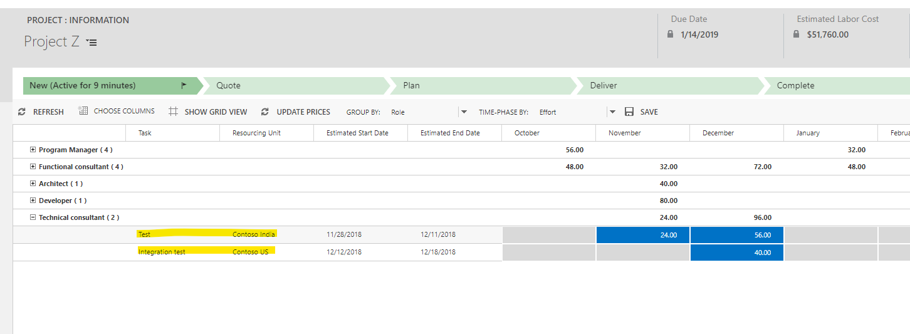
 
When the upgrade is complete, the organization unit on the line task that corresponds to the generic team member is added to the generic team member and the line task is removed. Because of this, we recommend that before you upgrade, you generate or re-generate the team on each project that contains generic resources.

For tasks that are assigned to a role with an org unit that differs from the org unit of the contracting project, and a team has not been generated, upgrade will create a generic team member for the role, but will use the contracting unit of the project for the team member's org unit. Referring back to the example with Project Z, this means that the contracting org unit Contoso US, and the project plan testing tasks within the Implementation phase have been assigned the role Technical Consultant with the org unit assigned to Contoso India. The Integration test task that is completed after the Implementation phase has been assigned to the role Technical consultant. The org unit is Contoso US and a team has not been generated. Upgrade will create one generic team member, a Technical consultant that has the assigned hours of all three tasks, and an org unit of Contoso US, the project’s contracting org unit.   
 
Changing the default of the different resourcing org units on un-generated team members is the reason we recommend that you generate or re-generate the team on each project that contains generic resources prior to the upgrade so that the org unit assignments are not lost.

