# What's new or changed in Project Service Automation version 3
[!INCLUDE[cc-applies-to-psa-app-1x-2x](../includes/cc-applies-to-psa-app-1x-2x.md)]

This topic provides information about the changes to user interface (UI), functionality, and terminology in Project Service Automation between version 2 or version 1 and version 3.

## Project scheduling
The project schedule, which was known as the Work Breakdown Structure (WBS) in previous versions, has been renamed Schedule and is accessed by clicking the **Schedule** tab. 

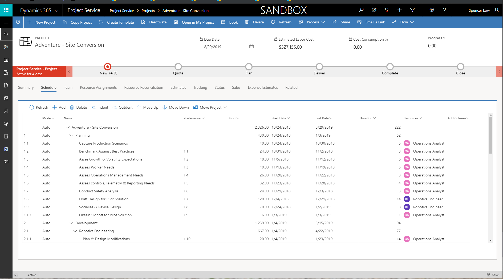

The schedule now has a new surface for interaction that is both modern and accessible. However, the underlying Project Service Automation scheduling engine has not changed. The control buttons in the schedule grid’s ribbon allow you to interact with the schedule similar to the previous version of Project Service Automation. Additional changes to the schedule include:

- **Gantt chart** - The Gantt chart is no longer present. A new Gannt visualization will be returning in a future update.
- **Column headers** - You can hide column headers in the grid by clicking the down indicator next to the column title. 
- **Columns** - You can show hidden columns by clicking **Add column**. 
- **Transaction category** - A **Transaction category** lookup has been added to the schedule grid and is shown by default. 
 
## Project templates
The following changes have been made to project template functionality.

### Create a project template 
You can create a project template in version 3 similar to previous versions of Project Service Automation. The template can contain only a schedule and the schedule can include assignments, but they are not required. If the schedule does have assignments, they can only be for generic resources. You can generate resource requirements for generic resources, but they can't be booked with real resources in the template. You can't book a real resource to a team in a template. 

### Create a template from an existing template
When you create a new project template from an existing template in Project Service Automation version 3, the following happens: 

- The source project’s schedule is copied into the template. 
- Generic resources are copied into the team and any generic resource assignments are copied over. Requirements for the generic resources are not copied over. 

### Create a template from an existing project
When you create a new project template from an existing project, the following happens: 

- The source project’s schedule is copied into the template. 
- Generic resources are copied into the team and any generic resource assignments are preserved. Requirements for the generic resources are not copied over.	
- Named resources, both assigned or unassigned are removed from the team and replaced with generic resources.
- If present, customer information is removed. 
- If present, references to quotes and contracts are removed. 

### Create a project from a template
In Project Service Automation version 3, when you create a new project from a template, the following happens:

- The schedule, team, and assignments are copied to the new project.   
- The start date is either the copy date or date selected by the user.   
- For any generic team members with resource requirements in the template, the requirements are not copied or generated automatically. You will need to generate them. 

## Copy a project
In Project Service Automation version 3, when you copy a project, the following happens: 

- The estimated start date is copied, but can be changed.  
- The project schedule and tasks are copied. 
- Generic resources and their assignments are copied. Resource requirements for the generic resources are not copied. You will need to re-generate them. 
- Real resources and their assignments are not copied. Instead, they are replaced by generic resources. 
- Actuals are not copied to the new project. 

## Move a scheduled project
When you move the schedule of existing project forward, the following happens: 

- Task dates are automatically moved to correspond with the movement period. 
- Assigned generic resources remain assigned.   
- If they are generated before the project is moved, requirements for the generic resource remain the same and are not automatically re-generated. You will need to generate them again to reflect the new assignments due to the task movement. 
- Assignments on real resources change to correspond with the task date movement. Bookings on real resources do not change. You will need to modify the bookings using the reconciliation view. 
- Team resources with bookings but no assignments do not change. 
- Actuals do not move. 

## Estimates
Estimates have been split into two tabs, **Resource assignment** and **Estimates**. The **Resource assignment** tab contains the effort estimates and shows the resource assignments for the tasks in a time-phased view. You can edit the estimates based on what the scheduling engine has generated.

The **Estimates** tab shows the cost and sales amounts for resource assignments. The amounts are read-only. The costing and sales pricing are now driven from the team member assignments on the schedule. This means that if you have a task without any assignment, the task will show under the unassigned bucket. This also means that without **role**, which is a default pricing dimension, there will be no estimated cost or sales if you have a customer or contract/quote associated with the project. 

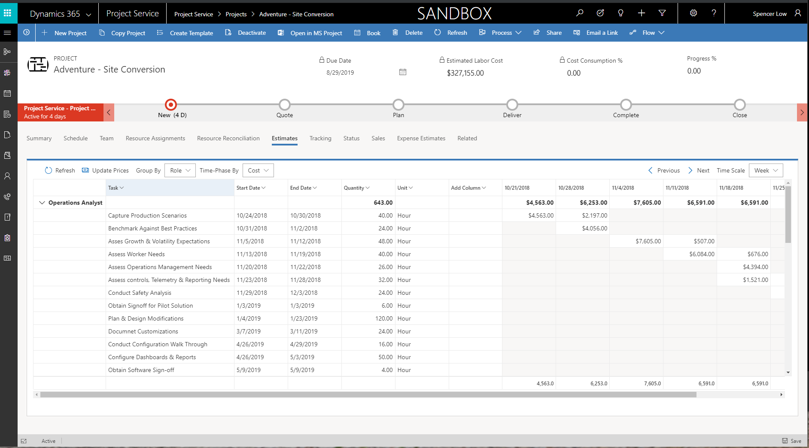
  
Category is also supported on tasks in the schedule view. Grouping by category on the time-phased view of estimates will provide a better experience, especially when you also have expense estimates in your project. Expense estimates are entered using a grid on a separate tab. 

Expense estimates can be entered in the grid on the **Expense estimates** tab. 

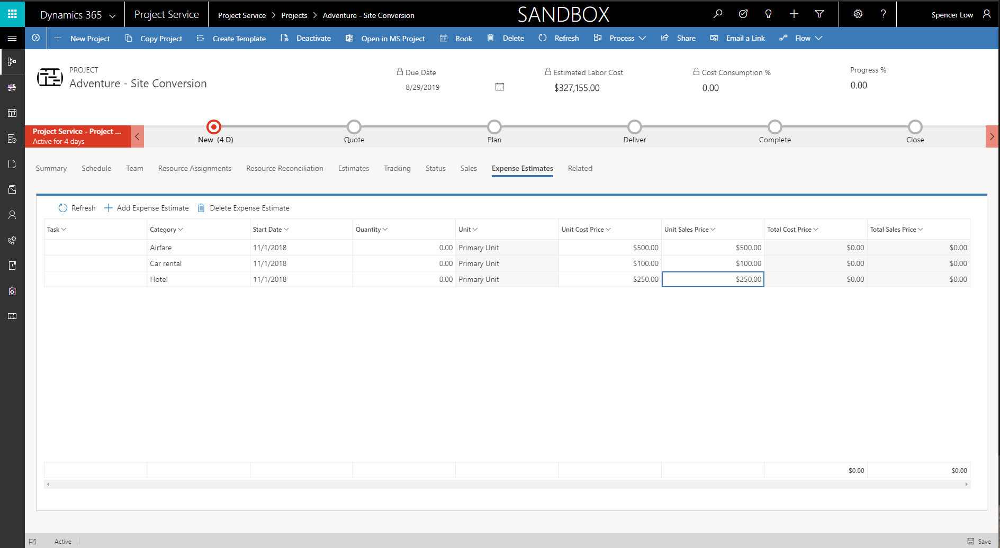

## Resource management
In Project Service Automation version 3, with the new Unified Client UI and changes in the relationship between bookings and assignments, staffing a project with generic or real resources has changed dramatically from version 2 and version 1. However, the concepts of bookable resources, both **real** and **generic** remain the same, as do team members, requirements, assignments, and bookings.   

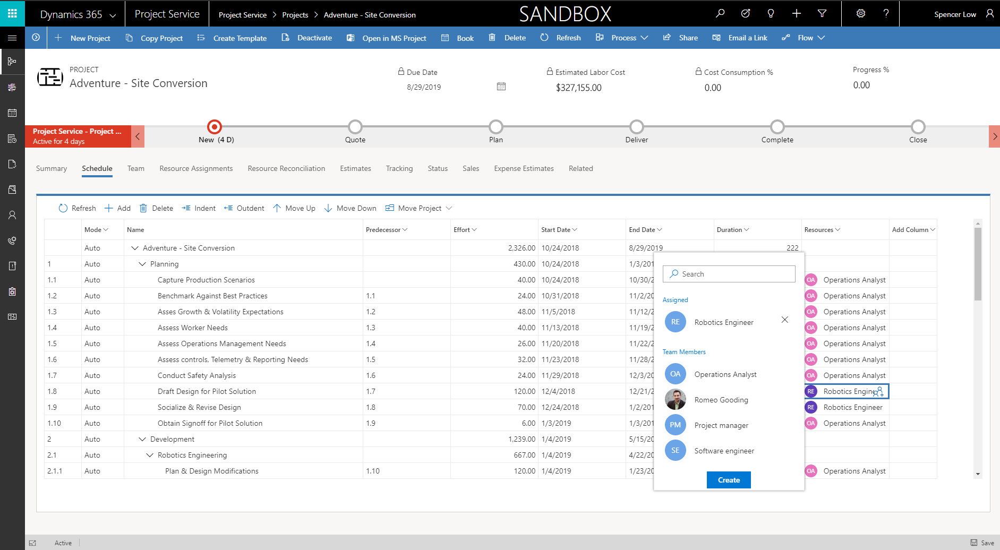

### Assign a real bookable resource 
In Project Service Automation version 3, bookings and task assignments are not as tightly intertwined as in previous versions of Project Service Automation. You can use the team grid to book a **real** team member, similar to in-market.

Using the resource picker on the schedule, you can select the team member created in the team view and then assign them to tasks. You can continue to assign tasks to them, even past their bookings. Use the **Reconciliation** tab to reconcile team members that have differences in bookings and assignments.

The resource picker will show the team members for the project. You can also use the resource picker to search for and view other bookable resources that are not part of the project team. You can assign them to a task and they will become part of the project team. You will need to book them using the **Schedule board** or **Reconciliation** tab.

### Assign a generic bookable resource on a task and project team and then fulfill with a real resource via Schedule Board 
In Project Service Automation version 3, the generate team functionality is not used for generic resources. Instead, you can create and directly assign a generic resource from the schedule by typing the position name of the generic resource in the resource cell of the schedule. Or, you can select the resource icon in the cell and then, using the resource picker, type the name of the generic resource you want to create. This will open a quick create panel that allows you to set the role and organization unit of the generic resource team member. After you create the resource, it is assigned to the task and you can continue to assign that generic resource to other tasks in the schedule.    
 
When you have assigned the resource to all of the appropriate tasks, you can generate a resource requirement and then fulfill it by directly booking with the **Schedule board** or by submitting a resource request. You can also add generic resources directly to the team member grid. 

Generic resources are added to the project team with no resource requirements and with the start/end dates of the project until the resource requirement is generated. To generate a requirement, select the generic resource and click **Generate**. The requirement link now displays and the required hours will be populated with the assigned hours. You can click the link to open and update the requirement.
  
When the booking is complete and totally fulfilled by a named resource, the generic resource is replaced with the named resource and the assignment on the schedule is updated with the named resource. 

Proposed resources for requirements are now stored on a tab instead of a separate section.

### Multiple named resources fulfilling a generic resource
When a requirement is fulfilled with multiple resources, the generic resource remains on the team and assigned to the task. The named team members who are booked are not assigned as part of the position. The project manager can assign the work as needed to the real resources.  The **Reconciliation** view provides a breakdown of the bookings across multiple resources to multiple task assignments. This is not done automatically because in more complicated scenarios, such as one where you have a bundle of tasks making up the requirement, the intent of how the project manager wants to assign, needs to be assumed. Because the system can't understand intent, the assumptions will likely be different than intended and an incorrect or unpredictable result will occur. The predictable outcome is that the generic resource remains assigned until the project manager deliberately assigns resources using the **Reconciliation** view.

### Reconciliation
The **Reconciliation** tab shows bookings and all assignments for each project team member. The view shows hours in cells which can represent time points from months to days. This view allows project managers to reconcile team member bookings and their assignments for their project team. This is helpful because bookings and task assignments are not tightly coupled, which allows for more flexibility when planning a project. 

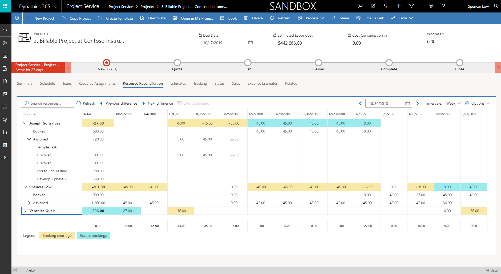

For each resource, the view takes the difference between a team member's bookings and a rollup of their task assignments and shows the following two differences that can occur with bookings and assignments in a project: 

- **Booking shortage** - Booking shortages occur when a resource has more assignments than bookings. Because this capacity has not been reserved, a project manager can correct this by extending the resource’s bookings to cover the deficit. 
- **Excess bookings** - Excessive booking occurs when a resource has been booked to the project but has not been assigned to tasks.  This may be an acceptable occurrence, for example if the resource has been booked prior to task assignment. However in other cases, the resource may not be planned to be assigned, and the PM should consider canceling the resource’s bookings to allow the capacity to be used for another project. 

When you have task assignments for a resource without bookings (a booking shortage), you can select the aggregate booking shortage and click **Extend booking**. From here, you can view the booking that is needed to address the resource’s shortage and their availability. 
 
## Time and expense
This section provides information about the changes in time, expense, and approval in version 3 of Project Service Automation. As part of the Dynamics 365 Project Service Automation solution, the **Time entry** feature has been refreshed to leverage the Unified Interface framework. This enables delivery of a consistent, uniform user interface that follows responsive design for optimal viewing on any screen size or device. 

### Landing page
The non-extensible custom time entry experience has been deprecated in version 3. Instead, there is now an extensible and accessible native grid experience. You can access time entry functionality by using the sitemap on the left. With this change, you will no longer be able to enter time for one week at a time. Instead, you will need to create a time entry for each day in the grid. After a few time entries have been created, users can bulk create time entries with **Copy** function explained later in this topic. 

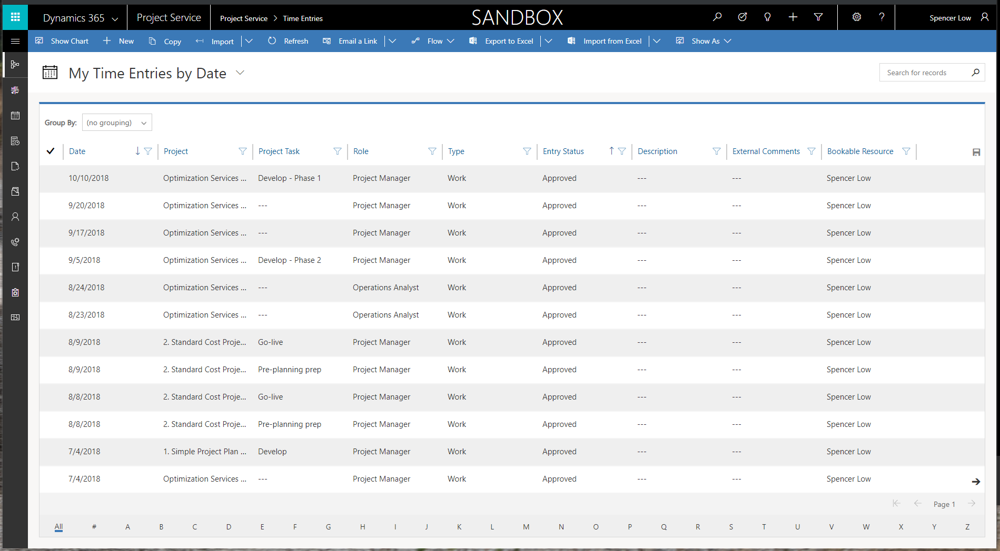
 
### Create new time entries 
Click **New** in the ribbon to open a quick-create page for time entry where you enter duration in minutes, hours, or days. To do this, just start typing h, m, or d along with the quantity.  

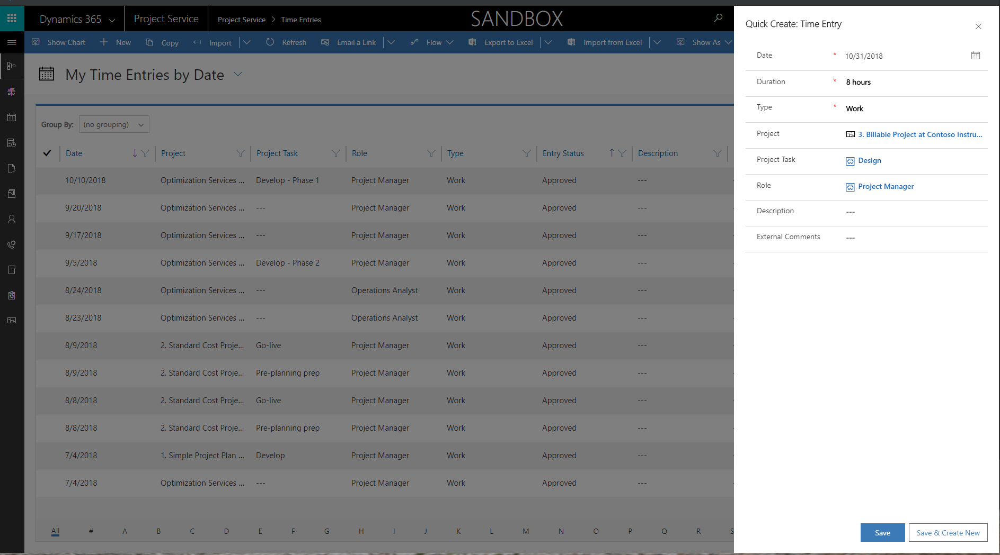

Look-up fields are backed by system views. For example, after you enter project information, the **Project task** field is set by default to **My open project tasks** view. To create time entries for tasks that are not assigned to the user, click **Change view** on the lookup and select **All Active project tasks**. After the time entry has been created and shows in the grid, you can edit any line values directly in the grid.  

### Bulk create/copy 
After a few time entries have been created, you can use the copy functionality to bulk create additional time entries. Click **Copy** to open the **Copy** dialog. In **From period: Start Date**, set the date range from which time periods must be copied from. In **To Period: Start Date**, specify the date for which time entries must be created. Click **Copy** to copy the time entries to the corresponding day of the week indicated in the **To Period**. For example, Monday's time entry from last week will be copied into Monday for the week indicated in the **To Period**. 

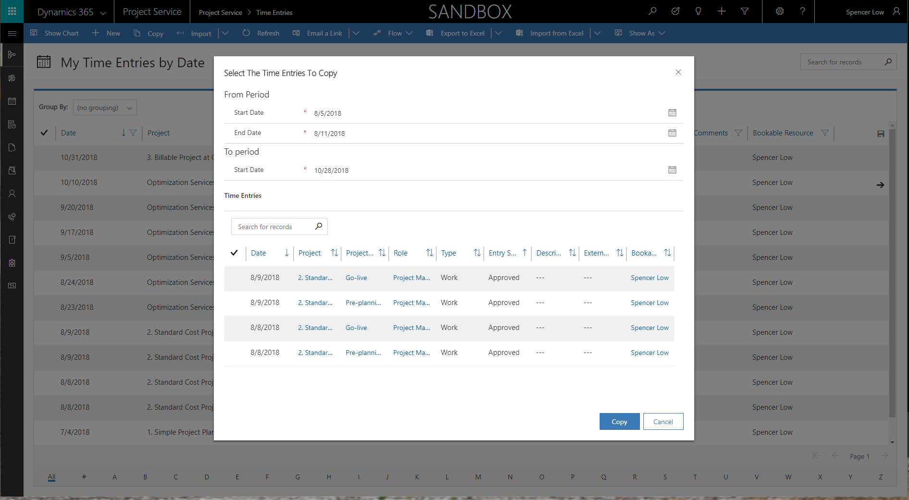
 
### Import data 
Assignments and exchange follow the same UI pattern, which allow the user to specify the date range from when bookings need to be imported. You must then explicitly choose the bookings that should be copied into **Draft** time entries. In version 3, you can no longer see the pattern of **Suggested** time entries on the grid and calendar.  

### Change in calendar control
In version 3, we have moved away from the custom calendar control and are now using the UC Calendar to display time entries for the week. With this calendar, you can view day, week, and month. 

> [!NOTE]
> A limitation on the Calendar is that this control does not support actions on individual calendar items. For example, you will not be able to select one or more calendar items and submit or delete those items. Clicking on a calendar item will open the **Time entry entity** page for additional actions. 

### Extensibility
**Capture data on custom fields in time and expense entry entities only** - Time entry uses an editable grid, a read-only grid, and calendar controls from the platform. All of these controls are native and therefore will support customizations. In Project Service Automation version 3, you can add additional custom fields, set up lookup fields, and back them up with custom views. You can also set custom business logic based on selected values in custom fields.  

**Capture data on custom fields in time and expense entry and propagate it through entities supporting the submission and approval flow** - The typical processing of time entries is shown in the following diagram.

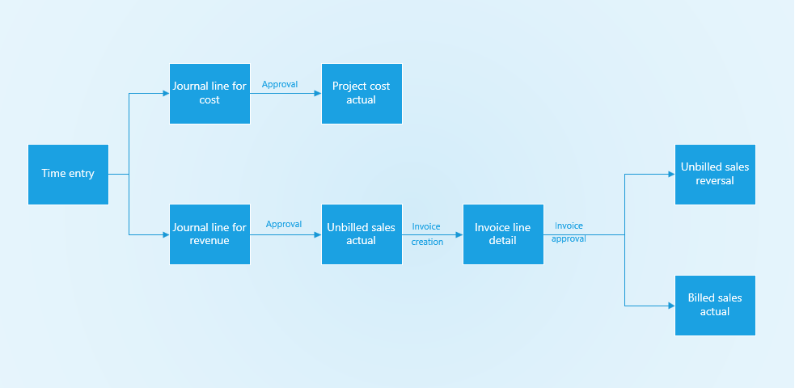

If business requirements stipulate that time and expense entities must capture custom pricing dimensions and propagate the values that are set by a time and entry resource in the custom pricing dimension through all of the entities in the previous graphic, see [Set up custom fields as pricing dimensions](set-up-pricing-dimensions.md)

To support business requirements where time and expense entities must capture custom non-pricing dimensions and propagate the values, you can use the pricing dimensions setup and express the custom dimensions as pricing dimensions with no cost or bill rate. Another scenario would be to add a custom field to each of the entities, using the same field name across all entities. Custom plug-ins can be created to relate records in the entities that are participating in the submission/approval flow using the transaction origin and transaction connection entities.  

### Delegate time and expense entry
The Common Data Service platform doesn't support one user impersonating another, which means in version 3 of Project Service Automation there is no support for delegated time and expense entry. However, partners and customers have leveraged a workaround to enable support for delegated time entry experiences in version 3. This is only a workaround and not a complete solution, so it is important to understand the limitations and only use this approach if the limitations are acceptable. 

> [!IMPORTANT]
> This information should only be considered suggested guidance for custom implementation by a partner/customer. The product team will not offer formal support for this functionality through any of our support channels.

### Customization details 
Customization allows you to add **Bookable resource** to the create and edit experiences, which will allow a user to act as a delegate by changing the **Booking resource** field to another user for whom time and expense entries need to be recorded. The following steps cover time entry delegation. The same information applies to expense entry delegation. 
 
1.	Ensure that the delegated user has global security access on projects and project tasks. 
1.	Because **Bookable resource**, which is a field on the **Time entry** entity, is not exposed on the **Quick create** page, you need to add it.

    -or-

    Create a custom view to view only time entries that are created for the resource. Publish the customizations on the app module designer for this view to show up under **View selector** on the **Time entries** page. There are two plug-ins that handle setting the manager for non-project time entries:

    - PreValidateTimeEntryCreate
    - PreValidateTimeEntryUpdate
 
1. Create a new plug-in to overwrite the **Manager** field to the manager of the user assigned in the **Bookable resource** field. Use the same **Execution stage** as the out-of-band (OOB) plug-in (pre-validation) and use an **Execution order** that is higher than OOB plug-ins (greater than 1). This will ensure that the custom plug-in is executed after the OOB plug-ins.  
 
### End user experience
1.	When you create a time entry on the quick create page, enter the Project and Project task details and then choose the user on **Bookable resource** field for whom the time entries need to be recorded for. 
2.	By default, this field defaults to the logged in user, however given that the user overrode this field, time entry is now created for the chosen **Bookable resource**.
3.	When you submit the time entries that you created for these records, the entries will be queued up for the approver in the project as expected. 
4.	When you recall the time entries created for the other user, the time entries will be returned to a state of **Draft** with the **Bookable Resource** field set to the other user. 
5.	Optionally, you can switch to the custom view to filter time entries created for the other user. 
 
### Limitations
**Copy** and **Import** functionality works only in the context of the user who is logged in. This means that it is not possible to copy or import time entries that are created for the user who is logged in as the bookable resource.

Time entries that are not for a project will be routed for approval to the manager of the bookable resource only if step 4 in the section **Customization Details** above is completed. Otherwise, non-project time entries for the other user will be incorrectly routed to the manager of the logged in user. 

### Other changes 
The **Bookings and Tasks** functionality has been removed. 

## Multidimensional pricing
To maximize flexibility and meet different business requirements, version 3 of Project Service Automation supports discrete application of pricing dimension sets to cost and bill rates. Dimension values can be set as the default and then propagated across the costing and pricing process from resource profiling to time entry to project actuals. Customer-specific configuration and modification or extension leverages standard customizability infrastructure.

Project Service Automation ships with a default set of pricing dimensions and roles and resource units, and allows for the setup of prices and costs for each Role and Organizational unit combination.

For customers of Project Service Automation who want to continue to use these out-of-the-box fields as pricing dimensions in version 3, there will not be any observable change. You can continue to use Project Service Automation as usual. If, however, you need to price or cost for your resources using other additional attributes, version 3 allows for adding your own custom pricing dimensions to Project Service Automation. The extension of custom pricing dimensions is a complicated configuration experience. 

## Quotes and contracts
In version 3 of Project Service Automation, aspects of setup and management for quotes and contracts have changed. The following sections provide more detailed information.

### Set up chargeability options
In versions 1 and 2, chargeability setup for roles and categories for specific quotes and contracts was done using the **Chargeability** view that was in the top navigation of a quote line or a contract line. This was also where you could set up prices for those roles and Expense categories.

As of version 3, setup of chargeability options by role and  Expense category will be done at the quote or contract line level. Pricing setup is separate from Chargeability setup. You will be able to find **Chargeable roles** and **Chargeable categories** as tabs on the **Quote line** and  **Contract line** pages without having to use the top navigation.

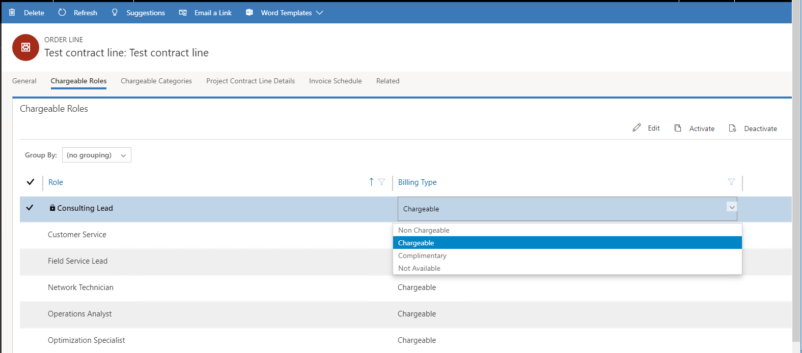
 
The setup of Chargeable roles and Chargeable categories also leverages the out-of-the-box editable grid control. For each role and category, the supported options for billing type during the Quoting and Contracting phase remain unchanged from prior versions as **Chargeable** and **Non-chargeable**. **Complimentary** is not a supported type during the Quoting or Contracting phase. **Complimentary** is supported only during Time or Expense approval.  
 
### Create and edit custom pricing for a Project Service Automation quote and project contract
In versions 1 and 2, using custom price list for specific quotes and contracts was done using **Edit prices** on the **Chargeability** view. The **Chargeability** view was located in the top navigation of a quote line or a contract line. This was also where you could set up chargeability options for roles and or expense categories.

As of version 3, creating and using a custom project price list on a Project Service Automation quote and Project Service Automation project contract has been separated from chargeability setup. Project Service Automation quote and Project Service Automation project contracts have a new tab called **Project price lists**. This tab shows an associated view of all Project price lists that are attached to the Project Service Automation quote or project contract. To create a custom price list from an existing price list that is already associated to the project quote or contract, click **Create custom pricing**. This will make a copy of all the associated price lists and attach them to the Quote or contract. You can now open the price list and edit role or expense category price so that those pricing changes will only apply to this quote or contract. 
  
The following graphic is before custom price lists have been created.

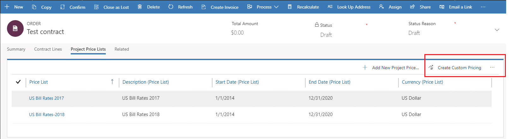

The following graphic shows after custom price lists have been created.

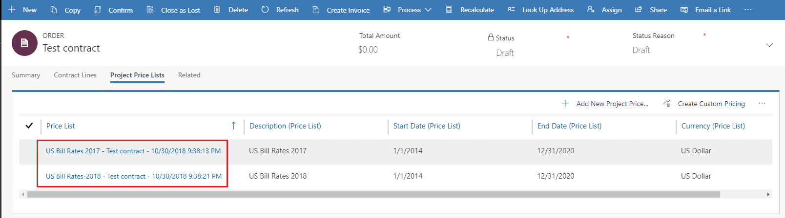

> [!NOTE]
> A short lag might occur between when you click **Create Custom Pricing** to when the custom price list is created. We recommend refreshing the grid instead of clicking multiple times. A custom price list has been created if the associated price list name has the quote name or the project contract name appended to it.
