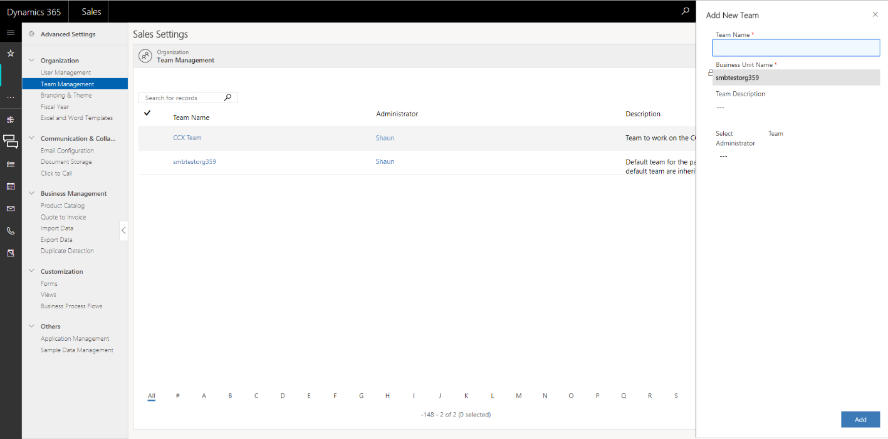

# Add or manage teams in [!INCLUDE[pn-sales-business-doc-name](../includes/pn-sales-business-doc-name.md)], Preview

[!INCLUDE[cc-applies-to-update-9-0-0](../includes/cc-applies-to-update-9-0-0.md)]

[!INCLUDE[Pre-release disclaimer](../includes/cc-beta-prerelease-disclaimer.md)]

In [!INCLUDE[pn-sales-business-doc-name](../includes/pn-sales-business-doc-name.md)], a team is a group of users who share and collaborate on business records. A user can be associated with multiple teams.

1.  Go to **Advanced Settings** &gt; **Team Management**.

2.  Select **Add Team**.

3.  Enter the following details, and then select **Add**.

  -   Team Name

  -   Business Unit Name: This is defaulted to your organization name.

  -   Team Manager: Select a manager for the team.

  -   Team Administrator: Select the person who will do the team administration, such as adding or removing members to the team.

   

## Add members to the team

1.  In the **Team Management** page, select the team you want to add members to, and then on the command bar, select **Add Members**.

2.  Select the members, and then select **Add**.

## Remove members from the team

1.  In the **Team Management** page, select the team you want to remove the members from, and then on the command bar, select **Remove Members**.

2.  Select the members you want to remove, and then select **Remove**.

## Manage Roles

When a team is assigned a role, the team members are assigned the set of privileges associated with that role.

1.  Select **Advanced Settings** &gt; **Team Management**.

2.  Select a team you want to assign a role to, and then on the command bar, select **Manage Roles**.

3.  In the **Manage Roles** dialog box, select the security role you want for the team, and then select **OK**.

### See Also
[Add or manage users in [!INCLUDE[pn-sales-business-doc-name](../includes/pn-sales-business-doc-name.md)], Preview](add-edit-users.md)   
[Quick Setup & Advanced Settings overview](quick-setup-advanced-settings-overview.md)
