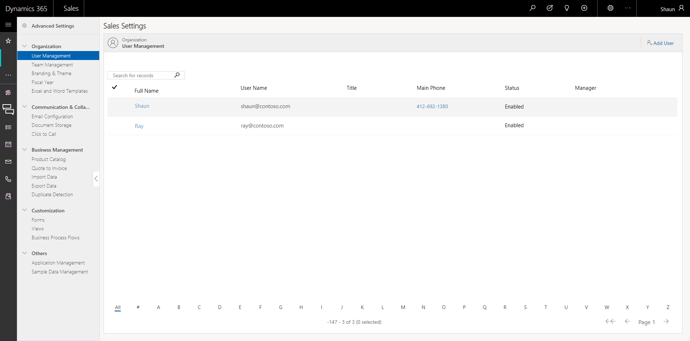

# Add or manage users in [!INCLUDE[pn-sales-business-doc-name](../includes/pn-sales-business-doc-name.md)], Preview

[!INCLUDE[cc-applies-to-update-9-0-0](../includes/cc-applies-to-update-9-0-0.md)]

[!INCLUDE[Pre-release disclaimer](../includes/cc-beta-prerelease-disclaimer.md)]

To log on to [!INCLUDE[pn-sales-business-doc-name](../includes/pn-sales-business-doc-name.md)], Preview, every user in your organization must have a user account. Create a user account for each user to give them access to the Sales app.

When you create a user in the Sales app, you can define a user ID, generate password, assign license and security role in a single step.

After you provide these details, and select **Add**, a user is automatically created in [!INCLUDE[pn-azure-active-directory](../includes/pn-azure-active-directory.md)], and the user account is available in [!INCLUDE[pn-office-365](../includes/pn-office-365.md)] and the Sales app.
 
## Create a user account

To create a user

1.  Make sure you have the global administrator role in [!INCLUDE[pn-office-365](../includes/pn-office-365.md)] and the System Administrator role in [!INCLUDE[pn-sales-business-doc-name](../includes/pn-sales-business-doc-name.md)].

2.  Go to **Advanced Settings** &gt; **User Management**.
 
3.  Select **Add Users**.

      

4.  Follow the instructions in the **Confirm user account creation** dialog box.

    The **Add New User** pane appears.

      

5.  Enter the following details:

     - First Name 
     - Last Name 
     - Display Name (required). This is automatically populated based on the first name and last name, and can be changed.
     - Username (required). This must be a unique name. A domain name, which is usually the organization name is appended to the username. For example: xyz@contoso.com
     - User email address

6.  In the **Role** drop-down list, select a role that you want to assign to the user. You must assign at least one role to the user at this time. To assign multiple roles, see Assign a security role to the user.

 > [!IMPORTANT] 
 > Assign a role with only the privileges the user needs.

7.  Under **Password**, select the **Make this user change the password when they first sign in** checkbox to have the user enter a new password when they sign in.

8.  Select **Contact information** to provide more details about the user.

9.  Select **Add**.

 > [!NOTE]
 >If there’s a single license type for your organization, a license will be automatically assigned to the users. If there are no licenses left, a user will be created but no license will be assigned. The user will not be able to use [!INCLUDE[pn-sales-business-doc-name](../includes/pn-sales-business-doc-name.md)] until a license is assigned.

## Assign a security role to a user

Security roles control a user’s access to data through a set of access levels and privileges. The combination of access levels and privileges that are included in a specific security role sets limits on the user’s view of data and on what actions the user can perform with that data.

[!INCLUDE[pn-sales-business-doc-name](../includes/pn-sales-business-doc-name.md)] provides a default set of security roles.

-   Salesperson - Business

-   Sales Manager - Business

-   System Administrator

-   System Customizer

You can assign more than one security role to a user. The effect of multiple security roles is cumulative, which means that the user has the permissions associated with all security roles assigned to the user.

> [!IMPORTANT] 
> You must assign at least one security role to every user. The service does not allow access to any user who does not have at least one security role.

In [!INCLUDE[pn-sales-business-doc-name](../includes/pn-sales-business-doc-name.md)]:

1.  Select **Advanced** **Settings** &gt; **User Management**.

2.  Select a user you want to assign a role to, and then on the command bar, select **Manage Roles.**

3.  In the Manage User Roles dialog box, select the security role or roles you want for the user or users, and then select **OK**.

## Join Team

Teams are a collection of users. Teams let users across an organization collaborate and share information. To add users to a team:

1.  Select the users you want to add to the team, and then on the command bar, select **Join Teams**.

2.  In the **Join Team** dialog box, select the teams you want to add the users to, and then select **OK**.

## Change the manager

Assign a manager or change existing manager. The manager is responsible for administering the work of a group of users.

1.  Select the users you want to change, and then on the command bar, select **Change Manager**.
2.  In the **Change Manager** dialog box, select the Lookup button to choose a manager, and then select **OK**.

### See Also
[Quick Setup & Advanced Settings overview](quick-setup-advanced-settings-overview.md)  
[Add or manage teams](add-edit-teams.md)
