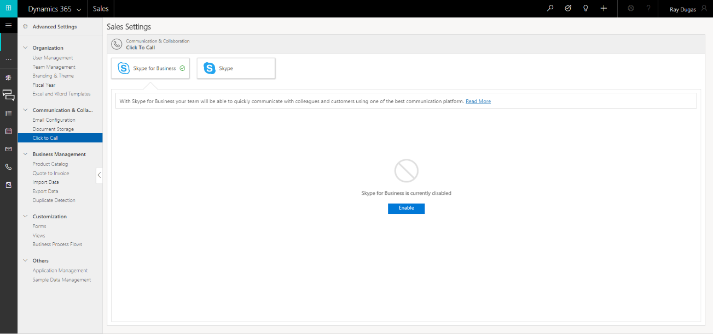

# Set up click-to-call

Integration with Skype and Skype for Business helps you to easily check on the availability of a contact and to make a call with one click from within [!INCLUDE[pn-ms-dyn-365-for-sales](../includes/pn-ms-dyn-365-for-sales.md)].

Skype for Business integration is built and packaged as a solution within [!INCLUDE[pn-ms-dyn-365-for-sales](../includes/pn-ms-dyn-365-for-sales.md)]. To integrate with Skype for Business, you must have a Skype for Business license, and must install the solution.

To use Skype, all users in the organization must install Skype and have a Skype account.

## Supported clients

-   Skype for Business desktop client

-   Skype for [!INCLUDE[pn-ms-windows-short](../includes/pn-ms-windows-short.md)] desktop client or the Skype for [!INCLUDE[pn-ms-windows-short](../includes/pn-ms-windows-short.md)] 8 app.

>[!Note]
>Each person involved in the communication must have the either Skype for Business or Skype installed and running on their PC or [!INCLUDE[pn-ms-windows-short](../includes/pn-ms-windows-short.md)] 8 device.

## Configure Skype for Business or Skype

1.  In **Advanced Settings**, choose **Click to Call**.

   

  You’ll see tiles for the communication channels available to you: Skype for Business and Skype.
  
  By default, Skype is selected.

2.  Depending upon the channel you want to configure for your organization, click the tile for Skype for Business or Skype, and then click **Enable**.

    A consent dialog box appears.

3.  Click **I Agree**.

The channel is automatically configured with the default settings for you, and turned on. When a channel is turned on, a check mark is shown on the tile. You can’t turn a channel off until you turn another channel on.

You can have only one channel configured at any given time.

## Enable Presence

If your organization uses Skype for Business, it can display the availability status of any [!INCLUDE[pn-ms-dyn-365-for-sales](../includes/pn-ms-dyn-365-for-sales.md)] users who also have Skype for Business. A user can see the presence status of other users. The presence of users is shown in the header of the user entity form, owner lookup in all applicable entities, list of users, and sales team subgrid.

By default, presence is automatically enabled for the users. To disable the presence, clear the **Enable IM Presence** check box.

