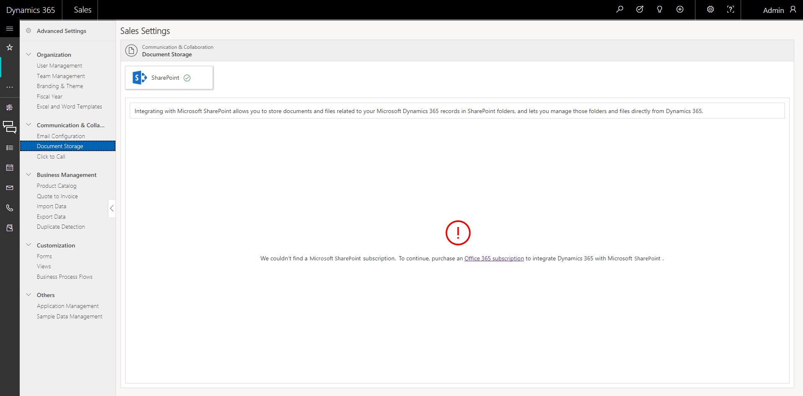
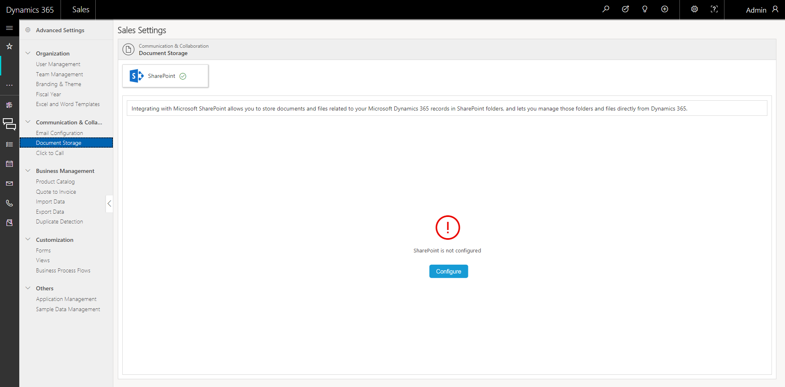

# Configure [!INCLUDE[pn-sales-business-doc-name](../includes/pn-sales-business-doc-name.md)], Preview to integrate with SharePoint

[!INCLUDE[cc-applies-to-update-9-0-0](../includes/cc-applies-to-update-9-0-0.md)]

[!INCLUDE[Pre-release disclaimer](../includes/cc-beta-prerelease-disclaimer.md)]

Store the documents related to [!INCLUDE[pn-sales-business-doc-name](../includes/pn-sales-business-doc-name.md)], Preview entity records in [!INCLUDE[pn-ms-sharepoint-long](../includes/pn-ms-sharepoint-long.md)] and quickly access, share, and manage these documents from the Sales app by integrating with [!INCLUDE[pn-ms-sharepoint-long](../includes/pn-ms-sharepoint-long.md)] Online.

## Prerequisites

To be able to configure [!INCLUDE[pn-sharepoint-short](../includes/pn-sharepoint-short.md)], you must have:

-   Sales Manager-Business or System Administrator role

-   [!INCLUDE[pn-office-365](../includes/pn-office-365.md)] subscription

-   [!INCLUDE[pn-sharepoint-short](../includes/pn-sharepoint-short.md)] Online subscription

[!INCLUDE[pn-sharepoint-short](../includes/pn-sharepoint-short.md)] can be configured from the Quick Setup or Advanced Setup.

## Integrate with [!INCLUDE[pn-sharepoint-short](../includes/pn-sharepoint-short.md)] 

1.  Initiate [!INCLUDE[pn-sharepoint-short](../includes/pn-sharepoint-short.md)] configuration from Quick Setup.

    1.  When you log on to [!INCLUDE[pn-crm-shortest](../includes/pn-crm-shortest.md)] for the first time, a Welcome page appears.

    2.  Select the **Go to the Quick Setup** tile.

    3.  In the Quick Setup wizard, select the **Document Storage** icon.

    -OR-

2.  Initiate [!INCLUDE[pn-sharepoint-short](../includes/pn-sharepoint-short.md)] configuration from Advanced Settings.

    1.  Select the Site Map icon .

        A navigation pane opens on the left side.

    2.  Select **Advanced Settings**.

        If your organization doesn’t have a [!INCLUDE[pn-sharepoint-short](../includes/pn-sharepoint-short.md)] subscription, you’ll need to first purchase a [!INCLUDE[pn-sharepoint-short](../includes/pn-sharepoint-short.md)] subscription.

   

3.  Return to [!INCLUDE[pn-sharepoint-short](../includes/pn-sharepoint-short.md)] Configuration again after purchasing a subscription. This time, a [!INCLUDE[pn-sharepoint-short](../includes/pn-sharepoint-short.md)] subscription is detected.

   

 > [!Important]
 > If your organization has a [!INCLUDE[pn-sharepoint-short](../includes/pn-sharepoint-short.md)] subscription and if [!INCLUDE[pn-sharepoint-short](../includes/pn-sharepoint-short.md)] isn’t already configured, you’ll see an option to configure it. If it is already configured, you’ll see a message that [!INCLUDE[pn-sharepoint-short](../includes/pn-sharepoint-short.md)] is configured.

4.  Select **Configure**.

5.  In the **Automatic Configuration of [!INCLUDE[pn-sharepoint-short](../includes/pn-sharepoint-short.md)]** dialog box, select **I Agree**.

    The following configuration happens in the background:

    1.  The [!INCLUDE[pn-sharepoint-short](../includes/pn-sharepoint-short.md)] URL is automatically identified based on the organization’s [!INCLUDE[pn-office-365](../includes/pn-office-365.md)] tenant. The URL format is:

    2.  A [!INCLUDE[pn-sharepoint-short](../includes/pn-sharepoint-short.md)] sub site is created with the [!INCLUDE[pn-sharepoint-short](../includes/pn-sharepoint-short.md)] default root URL. This URL is used to configure [!INCLUDE[pn-sharepoint-short](../includes/pn-sharepoint-short.md)]. For example, a subsite /[!INCLUDE[pn-crm-shortest](../includes/pn-crm-shortest.md)]/&lt;orgname&gt; is created under tenant.sharepoint.com.

    3.  The [!INCLUDE[pn-sharepoint-short](../includes/pn-sharepoint-short.md)] site is validated.

        By default, [!INCLUDE[pn-sharepoint-short](../includes/pn-sharepoint-short.md)] is enabled on the following entities:

       -   Account
       -   Contact
       -   Lead
       -   Opportunity
       -   Quote
       -   Invoice
       -   Product
       -   Appointment
       -   Task
       -   Phone Call

      The folder structure is created based on the **Account** entity. This means that the folders are created under the folder for the related account.

      For example, the following folder structure is created for a document for an opportunity record “100 Bikes” that has a related account as Margie’s travel:

      `:.../account/Margie's Travel/opportunity/100 Bikes&lt;entityGUID&gt;.`

      You’ll see a confirmation message when [!INCLUDE[pn-sharepoint-short](../includes/pn-sharepoint-short.md)] is successfully configured.

6.  If any error occurs during configuration, a message is shown. Errors can occur in many cases like issues with permissions, issues while validating a site, or while creating a folder.

7.  Select **Retry**.

    All the backend configuration steps are performed again in the background.

### See Also
[Manage your SharePoint documents](create-manage-documents.md)  
[Overview of Dynamics 365 for Sales, Preview](overview-dynamics-365-for-sales.md)  
[Quick Setup & Advanced Settings overview](quick-setup-advanced-settings-overview.md)
