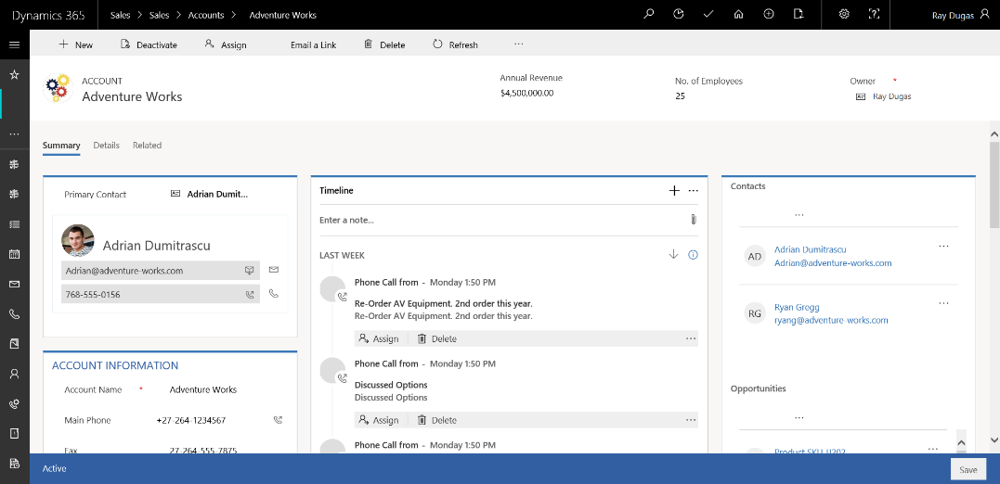

# Manage your customers

[!INCLUDE[cc-applies-to-update-9-0-0](../includes/cc-applies-to-update-9-0-0.md)]

[!INCLUDE[Pre-release disclaimer](../includes/cc-beta-prerelease-disclaimer.md)]

In [!INCLUDE[pn-sales-business-doc-name](../includes/pn-sales-business-doc-name.md)], Preview, accounts and contacts records types are used to store information about your customers.

Accounts are organizations you do business with, and contacts are individual people with whom you have a relationship. A contact may or may not be associated to an account.

Accounts and contacts share a one-to-many relationship, which means that a single account can have multiple contacts.

You can add accounts or contacts manually or use the Import wizard in your Sales app to get in all your customer data in to the system.

## Create or edit an account

1.  Select the Site Map icon , and then select **Accounts**.

2.  To create a new account, select **New**.

    -OR-
 
    To edit an existing account, open the account.

2.  Fill in or change the information. Don’t know what to enter in a field? Hover over the field name to see a tooltip.

 Required fields are marked with a red asterisk (\*). Here are some important fields in the account record:

   

 **Summary tab.** Use the summary tab to store all the primary information about the account. This is the tab you’ll use the most.

 The left pane includes fields like:
  - **Primary Contact.** The main person you are working with at this account.
  - **Account Name.** The name of the organization you do business with. This name is used in searches, reports, and lookup fields related to accounts.
  - **Parent Account**. The parent organization of an account. The parent account must also be added as an account first to be able to choose it as a parent account.
  -   The middle pane, which is called a timeline, records all the activities related to the account or the communication with the account.
  -   The right pane shows everything that’s happening with the account. In other words, it shows related records to the account.
 **Details tab.** This is used for track important profile information about an account like their industry, number of employees or annual revenue.
 **Related tab.** This is used for track important profile information about an account like their industry, number of employees or annual revenue.

3.  Select **Save**.

## Create or edit a contact

Typically, contacts are associated with an account. However, in some cases, contacts won’t have an associated account.

Account and contact forms are very similar as they store similar information about the customers.

To create or edit a contact

1.  Select the Site Map icon , and then select **Contacts**.

2.  To create a new contact, select **New**.

    -OR-

    To edit an existing contact, open the contact record.

3.  Fill in or change the information. Don’t know what to enter in a field? Hover over the field name to see a tooltip.

    Here are some important fields of a contact record:

      

    The summary tab stores all the primary information about the contact.

    The left pane includes important details like the following:

    - **Full Name.** This is combination of First Name and Last Name. 

    - **Account Name.** This points to the account record this contact is associated with.

    - **Contact Info.** Fields like Email, Business Phone, and Mobile Phone fields store the contact details of the contact.

    The rest of the sections are similar to that of an account form.

4.  Select **Save** on the lower right corner.

### See Also

[Develop sales from lead to cash in Dynamics 365 for Sales, Preview](develop-sales-lead-to-cash.md)  
[Overview of Dynamics 365 for Sales, Preview](overview-dynamics-365-for-sales.md)
