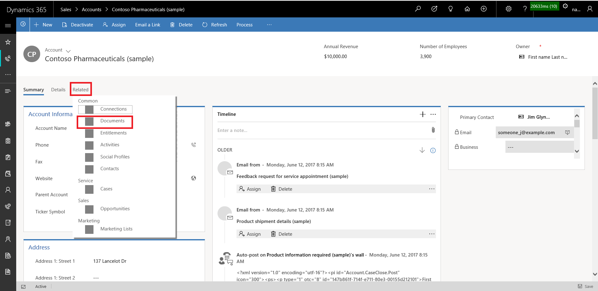
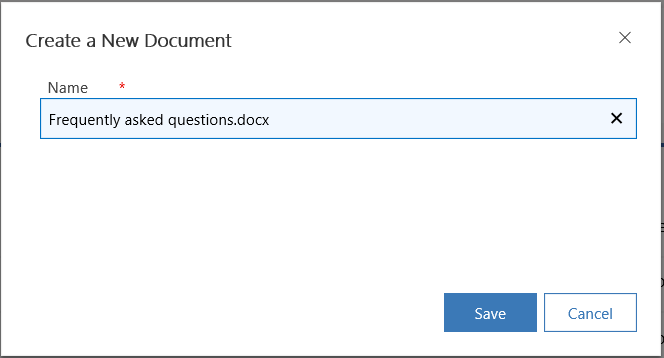
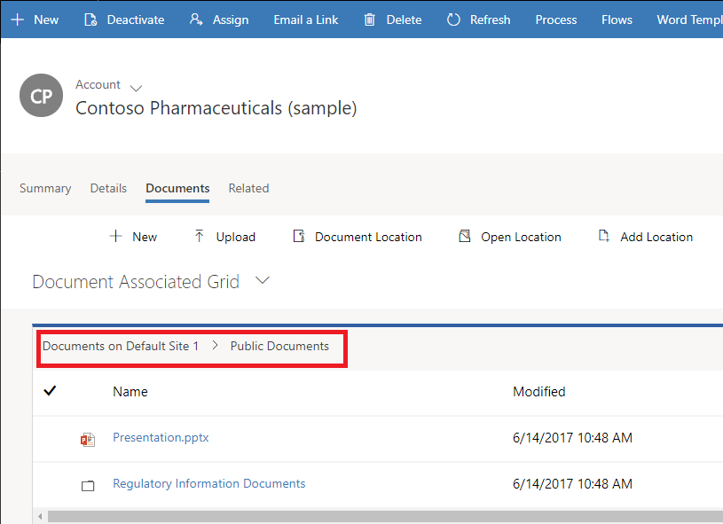
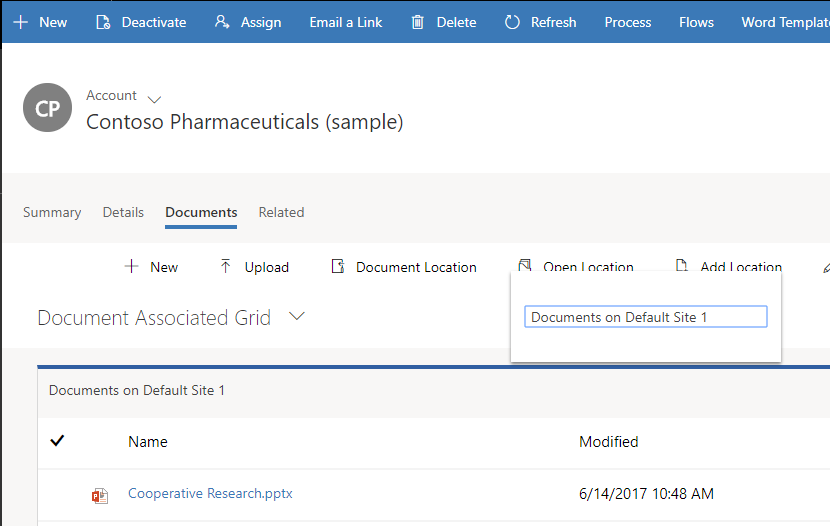
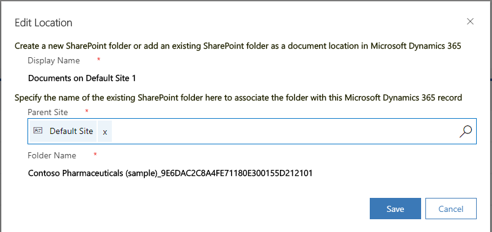
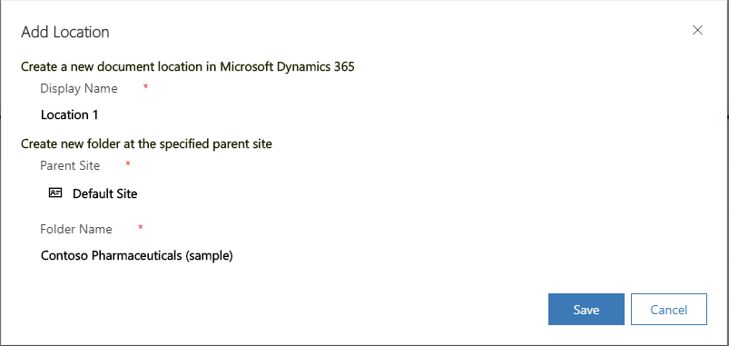

# Manage your [!INCLUDE[pn-sharepoint-short](../includes/pn-sharepoint-short.md)] documents and document locations in [!INCLUDE[pn-sales-business-doc-name](../includes/pn-sales-business-doc-name.md)], Preview

[!INCLUDE[cc-applies-to-update-9-0-0](../includes/cc-applies-to-update-9-0-0.md)]

[!INCLUDE[Pre-release disclaimer](../includes/cc-beta-prerelease-disclaimer.md)]

With [!INCLUDE[pn-sales-business-doc-name](../includes/pn-sales-business-doc-name.md)], Preview, you can store your documents on [!INCLUDE[pn-sharepoint-short](../includes/pn-sharepoint-short.md)], and manage them from within your app.

The documents that you create in the Sales app are stored on [!INCLUDE[pn-sharepoint-short](../includes/pn-sharepoint-short.md)], and are automatically synced to your desktop and mobile devices.

> [!Note]
> Before you can use [!INCLUDE[pn-sharepoint-short](../includes/pn-sharepoint-short.md)] to store the documents, it must be enabled by your system administrator.

> [!Important]
> This feature requires that you have an [!INCLUDE[pn-office-365](../includes/pn-office-365.md)] subscription or a subscription to an online service such as [!INCLUDE[pn-sharepoint-short](../includes/pn-sharepoint-short.md)].

## What record types support document management?

By default, [!INCLUDE[pn-sharepoint-short](../includes/pn-sharepoint-short.md)] is enabled on the following entities:

-   Account

-   Contact

-   Lead

-   Opportunity

-   Quote

-   Invoice

-   Product

-   Appointment

-   Task

-   Phone Call

## Where do you access the documents from?

For record types that support document management, open the record, select the **Related** tab, and then select **Documents**.

  

## What happens when you navigate to the Documents tab first time?

When [!INCLUDE[pn-sharepoint-short](../includes/pn-sharepoint-short.md)] is enabled, for record types that support document management, a default document location (folder) is automatically created on [!INCLUDE[pn-sharepoint-short](../includes/pn-sharepoint-short.md)] the first time you go to the **Documents** tab. The name of the document location is in the following format: &lt;record\_name&gt;\_&lt;record\_id&gt;.

## View existing [!INCLUDE[pn-sharepoint-short](../includes/pn-sharepoint-short.md)] documents

Open a view with a document grid.

For example,

1.  Select the Site Map icon , and then select **Opportunities**

2.  Select the **Related** tab, and then select **Documents**.

    

3.  Select **Document Location** to filter the document list. Select from the available document locations.

## Create a new document

To create a new [!INCLUDE[pn-sharepoint-short](../includes/pn-sharepoint-short.md)] document in your app:

1.  Go to the record you want to create the document for, and select the **Documents** tab.

2.  Navigate to the document location and folder where you want to create this new document.

3.  Select **New**, and then choose a document type such as [!INCLUDE[cc-microsoft](../includes/cc-microsoft.md)] Word, [!INCLUDE[cc-microsoft](../includes/cc-microsoft.md)] [!INCLUDE[pn-excel-short](../includes/pn-excel-short.md)], [!INCLUDE[cc-microsoft](../includes/cc-microsoft.md)] PowerPoint, or OneNote.

  You can also create a folder from here.

4.  In the **Create a New Document dialog** box, enter a document or folder name.

    

5.  Select **Save**.

  The document is created in the folder of the current document location you’re in.

  If you create a folder, you’ll be able to see a folder hierarchy at the top of Documents list.
 
    

 Select on the folder name to navigate between the folders.

## Upload a document

To upload existing document to [!INCLUDE[pn-sharepoint-short](../includes/pn-sharepoint-short.md)] from your app:

1.  Go to the record you want to create the document for, and select the **Documents** tab.

2.  Select **Upload.**

3.  Select the file you want to upload. You can select only one file at a time.

    The document is created in the folder of the current document location you’re in.

   > [!Note]
   > You can upload a file of up to 50 MB of size. ### If your internet connection is slow, you may get an error while uploading large files.

4.  If files with the same name exists in [!INCLUDE[pn-sharepoint-short](../includes/pn-sharepoint-short.md)], select if you want to overwrite the files.

5.  Select **Upload**.

## Manage [!INCLUDE[pn-sharepoint-short](../includes/pn-sharepoint-short.md)] locations

You may create new or edit existing [!INCLUDE[pn-sharepoint-short](../includes/pn-sharepoint-short.md)] locations from your app.

In the **Documents** list

1.  To open the location, on the command bar, select **Open Location**, and then select the location.

   

2.  To edit the location, on the command bar, select **Edit Location** &gt; &lt;location name&gt;.

  The **Edit Location** dialog box appears.

    

3.  The display name, parent site, and folder name is automatically populated. Provide the new location details, and select **Save**.

4.  To add a location, on the command bar, select **Add Location**.

  The **Add Location** dialog box appears.

    

5.  The display name, parent site, and folder name is automatically populated. Change the details if required, and then select **Save**.

## Create folders

1.  To create folders to store documents, on the command bar, select **New** > **Folder**.

2.  In the **Create a New Folder** dialog box, enter a name of the folder, and select **Save**.

   > [!Note]

   > If your folder name contains a slash (/), [!INCLUDE[pn-sales-business-doc-name](../includes/pn-sales-business-doc-name.md)] creates nested folders. For example, if you enter the folder name as Bike/2001, two folders are created: "Bike" and "2001". The 2001 folder is created inside the Bike folder.

## Actions on documents

When you select one or more documents in the Documents list, you can take the following other common [!INCLUDE[pn-sharepoint-short](../includes/pn-sharepoint-short.md)] actions on the documents:

-   Edit

-   Delete

-   Check in

-   Check out

-   Discard check out

-   Edit properties

### See Also
[Configure Dynamics 365 for Sales, Preview to integrate with SharePoint](configure-document-management.md)  
[Manage your customers](create-accounts-contacts-customers.md)  
[Overview of Dynamics 365 for Sales, Preview](overview-dynamics-365-for-sales.md)
