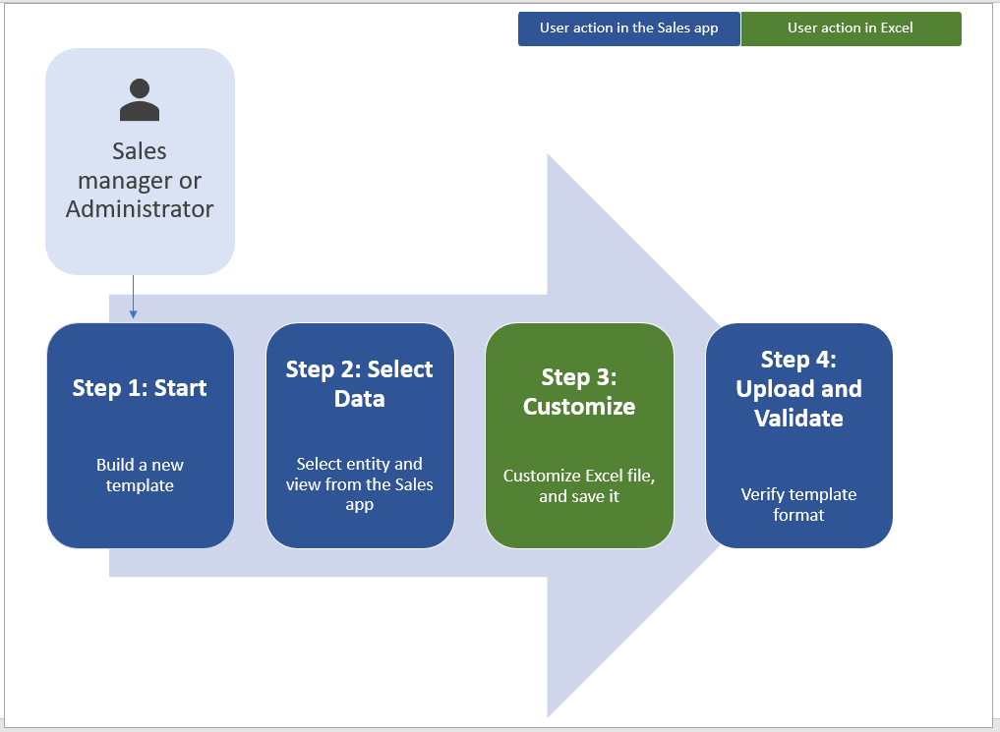
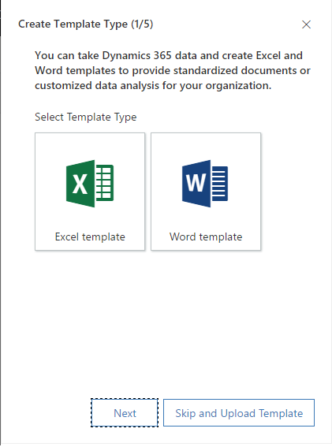
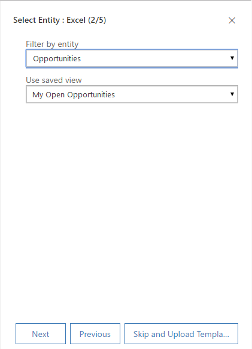
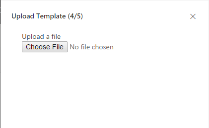

# Create and manage [!INCLUDE[pn-excel-short](../includes/pn-excel-short.md)] templates in [!INCLUDE[pn-sales-business-doc-name](../includes/pn-sales-business-doc-name.md)], Preview

[!INCLUDE[cc-applies-to-update-9-0-0](../includes/cc-applies-to-update-9-0-0.md)]

[!INCLUDE[Pre-release disclaimer](../includes/cc-beta-prerelease-disclaimer.md)]

[!INCLUDE[cc-microsoft](../includes/cc-microsoft.md)] [!INCLUDE[pn-excel-short](../includes/pn-excel-short.md)] provides powerful ways to analyze and present your [!INCLUDE[pn-sales-business-doc-name](../includes/pn-sales-business-doc-name.md)], Preview data. With [!INCLUDE[pn-excel-short](../includes/pn-excel-short.md)] templates, you can easily create and share your customized analysis with others in your organization.

You can use [!INCLUDE[pn-excel-short](../includes/pn-excel-short.md)] templates for:

-   Sales Forecasting

-   Pipeline Management

-   Leads Scoring

-   Territory Planning

-   And much more…

Try out the [!INCLUDE[pn-excel-short](../includes/pn-excel-short.md)] templates included with [!INCLUDE[pn-crm-2016](../includes/pn-crm-2016.md)] for Sales to get a quick view of what kind of analysis is possible. The Pipeline Management template is shown here:

  

Templates display information from the view defined for a record type (entity). There are four steps for creating an [!INCLUDE[pn-excel-short](../includes/pn-excel-short.md)] template.

  

## Step 1: Create a new template from existing data

1.  Make sure you have the System Administrator role in [!INCLUDE[pn-sales-business-doc-name](../includes/pn-sales-business-doc-name.md)].

2.  Go to **Advanced** **Settings** &gt; **[!INCLUDE[pn-excel-short](../includes/pn-excel-short.md)] and Word Templates** &gt; **New** **Template**. You must have a System Administrator or System Customizer role to be able to access the Advanced Settings page.

3.  Select **[!INCLUDE[pn-excel-short](../includes/pn-excel-short.md)] Template**, and then select **Next**.

     

4.  Select an entity to which the template applies. The template will use data from this entity. The views you can select in the next field depend on the entity you select.

5.  The view defines the query used to display records and the columns or fields that are shown. Select a view, and then select **Next**.

     

6.  In the **Download Template** page, select **Download**.

7.  To upload the template later, select **Upload the template** later check box, and then select **Next**.

8.  To upload the template back after you customize the data, go to the list of templates, and then select **Upload Template**. [!INCLUDE[proc-more-information](../includes/proc-more-information.md)] [Upload the template and share it with others](#step-3-upload-the-template-and-share-with-others)  

## Step 2: Customize the data in [!INCLUDE[pn-excel-short](../includes/pn-excel-short.md)]

Open the newly-created template in [!INCLUDE[pn-excel-short](../includes/pn-excel-short.md)] to customize the data.

  

Let’s walk through a simple example of customizing an [!INCLUDE[pn-excel-short](../includes/pn-excel-short.md)] template using [!INCLUDE[pn-sales-business-doc-name](../includes/pn-sales-business-doc-name.md)] sample data.

Example customization of Opportunities data  

1.  Select Enable Editing to allow customization of the [!INCLUDE[pn-excel-short](../includes/pn-excel-short.md)] spreadsheet.

2.  Add a new column and name it “Expected Revenue”.

     

3.  Create a formula for expected revenue. Don’t refer to cells using their addresses; define and use names instead.

     

4.  Create a pivot table and chart.

   Place user-added content above or to the right of the existing data table. This prevents the content from being overwritten if you add new data in [!INCLUDE[pn-sales-business-doc-name](../includes/pn-sales-business-doc-name.md)] later and you create a new [!INCLUDE[pn-excel-short](../includes/pn-excel-short.md)] template.

   For more information, see: [Best practices and considerations for using [!INCLUDE[pn-excel-short](../includes/pn-excel-short.md)] templates](#best-practices-and-considerations-for-using-excel-templates).  

   

5.  Save the spreadsheet.

You’re now ready to upload the [!INCLUDE[pn-excel-short](../includes/pn-excel-short.md)] template into [!INCLUDE[pn-sales-business-doc-name](../includes/pn-sales-business-doc-name.md)].

## Step 3: Upload the template and share with others

When you have your [!INCLUDE[pn-excel-short](../includes/pn-excel-short.md)] template customized the way you want, you can upload it into [!INCLUDE[pn-sales-business-doc-name](../includes/pn-sales-business-doc-name.md)].

Administrators can use the **Advanced Settings** page to upload the [!INCLUDE[pn-excel-short](../includes/pn-excel-short.md)] template into [!INCLUDE[pn-sales-business-doc-name](../includes/pn-sales-business-doc-name.md)].

> [!Note]
> Users in your organization can see the templates available to them by selecting the **[!INCLUDE[pn-excel-short](../includes/pn-excel-short.md)] Templates** button on the command bar in the list of records.

Upload the [!INCLUDE[pn-excel-short](../includes/pn-excel-short.md)] template into [!INCLUDE[pn-sales-business-doc-name](../includes/pn-sales-business-doc-name.md)]

1.  In [!INCLUDE[pn-sales-business-doc-name](../includes/pn-sales-business-doc-name.md)], go to **Advanced Settings** &gt; **[!INCLUDE[pn-excel-short](../includes/pn-excel-short.md)] and Word Templates** &gt; **Upload Template**.

2.  Find and upload the file.

     

3.  Select **Upload**.

   You’ll see the summary of the file you’re uploading.

4.  Select **Finish**.

## Best practices and considerations for using [!INCLUDE[pn-excel-short](../includes/pn-excel-short.md)] templates

Here are some things you need to be aware of to create and make best use of [!INCLUDE[pn-excel-short](../includes/pn-excel-short.md)] templates in [!INCLUDE[pn-sales-business-doc-name](../includes/pn-sales-business-doc-name.md)].

- **Test your [!INCLUDE[pn-excel-short](../includes/pn-excel-short.md)] templates**

  [!INCLUDE[pn-excel-short](../includes/pn-excel-short.md)] has lots of features. It’s a good idea to test your customizations to see that all [!INCLUDE[pn-excel-short](../includes/pn-excel-short.md)] features work as expected in your templates.

- **Data in templates and privacy concerns**

  By default, pivot chart data is not updated when a spreadsheet is opened. This can create a security issue if certain pivot chart data should not be seen by users with insufficient permissions.

 **Consider the following scenario:**

-   A [!INCLUDE[pn-sales-business-doc-name](../includes/pn-sales-business-doc-name.md)] administrator creates a template where the view contains sensitive data in a pivot chart which is uploaded into [!INCLUDE[pn-sales-business-doc-name](../includes/pn-sales-business-doc-name.md)].

-   A salesperson who should not have access to the sensitive data in the pivot charts uses the template to create an [!INCLUDE[pn-excel-short](../includes/pn-excel-short.md)] file to do data analysis.

   **The outcome.** The salesperson might be able to see the pivot chart data as uploaded by the [!INCLUDE[pn-sales-business-doc-name](../includes/pn-sales-business-doc-name.md)] administrator including access to views for which the salesperson does not have permissions.

  In addition, iOS does not support updating pivot data and pivot charts when using the [!INCLUDE[cc-microsoft](../includes/cc-microsoft.md)] [!INCLUDE[pn-excel-short](../includes/pn-excel-short.md)] app on iOS devices.

 > [!Important]
 
 > Sensitive data should not be included in pivot tables and pivot charts.

- **Set pivot chart data to automatically refresh**

  By default, pivot chart data does not automatically refresh when you open the spreadsheet. Other types of charts do update automatically.
 
  In [!INCLUDE[pn-excel-short](../includes/pn-excel-short.md)], right-click the pivot chart, and then select **PivotChart Options** &gt; **Refresh data** when opening the file.

    

-   **Placing new data**

 If you want to add content to the [!INCLUDE[pn-excel-short](../includes/pn-excel-short.md)] template, place your data above or to the right of the existing data. A second option is to place your new content on a second sheet.

-   **[!INCLUDE[pn-excel-short](../includes/pn-excel-short.md)] templates with images may cause an error**

 If you attempt to view [!INCLUDE[pn-sales-business-doc-name](../includes/pn-sales-business-doc-name.md)] data with an [!INCLUDE[pn-excel-short](../includes/pn-excel-short.md)] template that has an image saved in it, you may see the following error: “An error occurred while attempting to save your workbook. As a result, the workbook was not saved.” Try removing the image from the template and reloading it into [!INCLUDE[pn-sales-business-doc-name](../includes/pn-sales-business-doc-name.md)].

-   **[!INCLUDE[pn-excel-short](../includes/pn-excel-short.md)] templates and Office Mobile app in [!INCLUDE[pn-ms-windows-short](../includes/pn-ms-windows-short.md)] 8.1**

 [!INCLUDE[pn-excel-short](../includes/pn-excel-short.md)] templates will not open in [!INCLUDE[pn-ms-windows-short](../includes/pn-ms-windows-short.md)] 8.1 devices with the Office Mobile app. You’ll get the following error message: “We’ve recovered as much of your document as we could, but you can’t edit it. Try to open and repair the document on your PC to fix the problem.”

 This is a known issue.

 Use table column names and range names in formulas

 When you create [!INCLUDE[pn-excel-short](../includes/pn-excel-short.md)] formulas, don’t use column titles or cell numbers. Instead, use the table column names, and define names for cells or cell ranges.

### See Also
[Use document templates in Dynamics 365 for Sales, Preview](Use-document-templates-create-standardized-documents.md)  
[Quick Setup & Advanced Settings overview](quick-setup-advanced-settings-overview.md)
