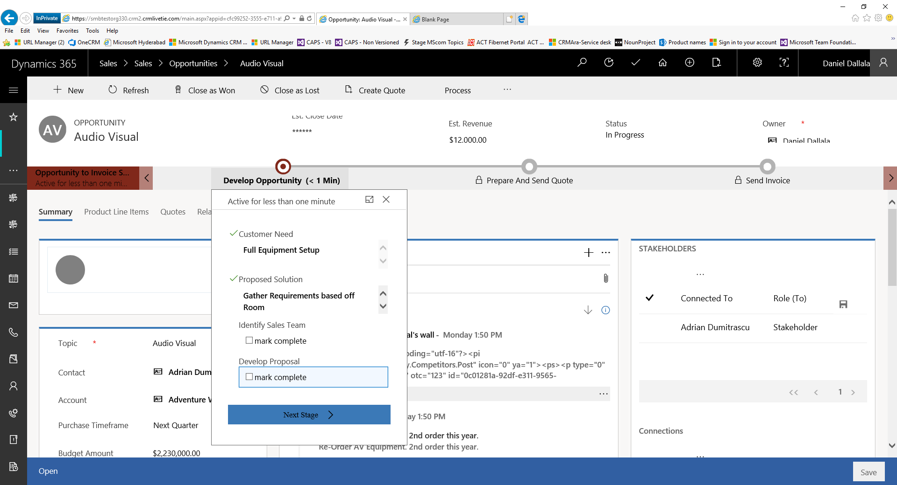

# Manage opportunities in [!INCLUDE[pn-sales-business-doc-name](../includes/pn-sales-business-doc-name.md)], Preview

[!INCLUDE[cc-applies-to-update-9-0-0](../includes/cc-applies-to-update-9-0-0.md)]

[!INCLUDE[Pre-release disclaimer](../includes/cc-beta-prerelease-disclaimer.md)]

In [!INCLUDE[pn-sales-business-doc-name](../includes/pn-sales-business-doc-name.md)], Preview, an opportunity is a potential sale, like a lead, but with an opportunity you can forecast revenue, set a potential close date, and factor in a probability for the sale. You must link a new opportunity to an existing account or contact.  

## Create and convert opportunities

You can create a new opportunity, or convert one from a qualified lead without re-entering the data. When you convert a qualified lead to an opportunity, you can access the lead record, which includes activities, from the corresponding opportunity form. The preferred way is to create an opportunity from a lead.

In an opportunity you can track contact information, the salesperson working on the opportunity, the probability of closing the sale, and the projected closing date of the sale.

## Recalculate opportunities

When you add a product to an opportunity, the opportunity's estimated revenue value is calculated based on the price, discounts, taxes, and other pricing modifications for the product.

## Add sales transactions

You can start a sales transaction, such as a quote or invoice, from within the opportunity record. The advantage of starting sales transactions in this manner is that much of the information is automatically entered based on the opportunity data. You can also view any sales transaction records from within the opportunity record to track the overall sales process and expected revenue.

## Create or edit an opportunity

If you’re following the sales process from start to finish, you qualify a lead to turn it into an opportunity. [!INCLUDE[proc-more-information](../includes/proc-more-information.md)] [Develop sales from lead to cash (Sales)](https://www.microsoft.com/en-us/dynamics/crm-customer-center/nurture-sales-from-lead-to-order-sales.aspx)  

1.  Select the Site Map icon , and then select **Opportunity**.

2.  If you’ve qualified a lead to an opportunity, open the opportunity from the list.

3.  To create a new lead, on the command bar, select **New**.

    In the opportunity form, make sure that your potential customer’s important details are captured. Most of the fields will be automatically populated from the lead record.

 -   Topic. Interest of the opportunity, such as specific product details.

 -   Contact. The contact associated with this opportunity.

 -   Account. The account associated with this opportunity.

 -   Purchase timeframe. The timeframe by when the account or contact is likely to purchase.

 -   Budget Amount.

 -   Probability. Indicates the likelihood of a sale occurring.

 -   Purchase Process. Indicates whether the purchase process involves and individual or a committee.

 -   Est. Close Date. An estimated date by which the opportunity is expected to close.

 -   Est. Revenue. Opportunities with products added to them have their estimated revenue value calculated based on the base price, volume discounts, manual discounts, taxes, and other pricing modifications. When opportunities are saved, [!INCLUDE[pn-sales-business-doc-name](../includes/pn-sales-business-doc-name.md)] recalculates the estimated revenue value based on any changes to the products or product quantities associated with the opportunity.

4.  In the **Stakeholders** section, select the **More Commands** button , and then select **+ New Connection** to add a contact as a stakeholder. A *stakeholder* is a key contact at the account who will be involved in decision-making. 

    In the **Lookup Records** dialog box, enter a name or select the Lookup icon to choose from a list of suggestions. When you've  entered the name you want, select **Add**. To create a new contact, select **+ New**. By default, the contact you add is assigned the **Stakeholder** role. Click the role corresponding to the contact to select a different role such as Decision Maker or Technical Buyer. 

5.  Similarly, in the **Sales Team** section, select the **More Commands** button , and then select **+ New Connection** to add a member of the sales team (from your organization).

6.  To save your changes, on the command bar, **Save**.

7.  Add products to your opportunity. For more information, see the section

8.  Follow the process bar to move the opportunity to the next stage. In the **Develop Opportunity** stage, enter data for these fields:

 - **Customer Need**. Enter what interests the opportunity, such as specific product requirements.

 - **Proposed Solution**. Enter the plan for what your organization can offer the account, such as product details.

 - **Identify Sales** **Team**. Select the check box to indicate that you’ve included information about who in your organization will be involved in pursuing the opportunity.

 - **Develop Proposal**. Select the check box to indicate you’ve included notes on how the account will be approached (optional).

    

9.  In the **Develop Opportunity** stage, select **Next**.

    The next step is to create and send a quote to your customer. More information. Create and send a quote to your customer.

## Add products to your opportunity

To add products to the opportunity, select the **Product Line Items** tab.

1.  In the list of opportunities, open the opportunity for which you want to add products.

2.  Go to the **Product Line Items** tab.

3.  In the Product Line Items grid, on the command bar, select **Add New**.

4.  In the **Quick Create** form, do the following, and select **Save**:

    1. **Select Product**. Toggle the field to indicate whether you want to add an existing product or create a new one.

        To use an existing product, select the **Lookup** button to search for and add a product.  

        To create a write-in product, select **Write-In**, and then type the name of the product.

    2. **Pricing.** Select the pricing option. By default, this uses the price that is listed in the product catalog. To override the price, select **Override Price**. When you override the price, you can specify a price that you want to charge for each unit of the product.

    3. **Quantity.** Enter the quantity of the product or service that will be included.

    4. **Manual Discount.** If you want, you can enter a discount to the product.

    5. **Tax. If required,** enter the appropriate tax amount.

   The right side of the page shows the total amount and discount based on the number of products added to the opportunity.

5.  If you want the pricing to be automatically calculated based on the products and quantities added, toggle the **Revenue** field to **System Calculated**. If not, toggle it to **User Provided**.

## Recalculate an opportunity

To change the estimated revenue value of an opportunity based on any changes to the associated products or product quantities, recalculate the opportunity.

1.  In the list of opportunities, open the opportunity for which you want to recalculate the estimated revenue.

2.  Go to the **Product Line Items** tab, and modify the list of products associated with the opportunity.

3.  In the right section, verify that the Revenue field is set to **System Calculated**.

4.  Select **Save**.

5.  On the command bar, select **Recalculate Opportunity**.

6.  Select **Save** or **Save and Close**.

## Close an opportunity

Whether you win a sale or close an opportunity, you probably want to close it.  You will have the option to reopen the opportunity later if it becomes a viable sale.  

1.  In the list of opportunities, open the opportunity you want to close.

2.  On the command bar, select **Close as Won** or **Close as Lost**.

3.  Enter the details in the dialog box, and select **OK**.

### See Also
[Develop sales from lead to cash in Dynamics 365 for Sales, Preview](develop-sales-lead-to-cash.md)  
[Overview of Dynamics 365 for Sales, Preview](overview-dynamics-365-for-sales.md)  
[Manage tasks, appointments, email, or phone calls in Dynamics 365 for Sales, Preview](create-manage-activities.md)
