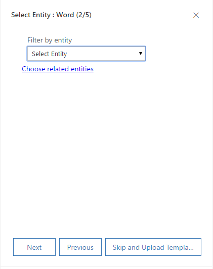

# Create and manage Word templates in [!INCLUDE[pn-sales-business-doc-name](../includes/pn-sales-business-doc-name.md)], Preview

[!INCLUDE[cc-applies-to-update-9-0-0](../includes/cc-applies-to-update-9-0-0.md)]

[!INCLUDE[Pre-release disclaimer](../includes/cc-beta-prerelease-disclaimer.md)]

[!INCLUDE[cc-microsoft](../includes/cc-microsoft.md)] Word provides powerful ways to present your [!INCLUDE[pn-sales-business-doc-name](../includes/pn-sales-business-doc-name.md)], Preview data in a standardized and well formatted document. With Word templates, you can easily create and share your template with others, so all the documents that go out to your customer have a consistent look as per your organization’s branding.

When the templates are ready, users can generate standardized documents automatically populated with [!INCLUDE[pn-sales-business-doc-name](../includes/pn-sales-business-doc-name.md)] data with just one click.

Follow the steps in this topic to successfully create Word templates in [!INCLUDE[pn-sales-business-doc-name](../includes/pn-sales-business-doc-name.md)].

### Step 1: Create a Word template

1.  Make sure you have the System Administrator role in [!INCLUDE[pn-sales-business-doc-name](../includes/pn-sales-business-doc-name.md)].

2.  Go to **Advanced** **Settings** &gt; **[!INCLUDE[pn-excel-short](../includes/pn-excel-short.md)] and Word Templates** &gt; **New** **Template**. You must have a System Administrator or System Customizer role to be able to access the Advanced Settings page.

3.  Select **Word Template**, and then select **Next**.

    

4.  Select an entity to which the template applies. The template will use data from this entity.

    

5. To select the fields that you want to be included in the Word template, select **Choose Related Entities**. The **Choose Related Entity** dialog box opens.

  The relationships you select on this screen determine what entities and fields are available later when you define the Word template. Only select the relationships you need to add [!INCLUDE[pn-sales-business-doc-name](../includes/pn-sales-business-doc-name.md)] data to the Word template. When you’re done selecting, select **Done**.

  Here are some example relationships for the Account entity.

  -   1:N Relationship. An account can have multiple contacts.

  -   N:1 Relationship. A lead, account, or contact can have multiple accounts.

  -   N:N Relationship. An account can have multiple marketing lists. A marketing list can have multiple accounts.

   > [!Note]
   > To ensure documents download in a timely matter, there is an upper limit of 100 for the number of related records returned for each  relationship. For example, if you’re exporting a template for an account, and you want to include a list of its contacts, the document will return at most 100 of the account’s contacts.

6.  In the **Select Entity** dialog box, select **Next**.
7.  Select **Download** to create a Word file on your local computer with the exported entity included as XML data.
8.  To upload the template later, select **Upload the template later** check box, and then select **Next**.
9.  To upload the template back after you customize the data, go to the list of templates, and then select **Upload Template**. 

 [!INCLUDE[proc-more-information](../includes/proc-more-information.md)] [Upload the template back into [!INCLUDE[pn-sales-business-doc-name](../includes/pn-sales-business-doc-name.md)]](#BKMK_Upload)  

### Step 2: Enable the Developer tab

Open the Word template file. At this point, the document appears to be blank.

  

To see and add [!INCLUDE[pn-sales-business-doc-name](../includes/pn-sales-business-doc-name.md)] XML data, you need to enable the Word Developer tab.

1.  Go to **File** &gt; **Options** &gt; **Customize Ribbon**, and then select the **Developer** check box.

   

2.  Select **OK**.

 The **Developer** tab now appears in the Word ribbon.

   

### Step 3: Define the Word template

Use the XML Mapping Pane to define the Word template with [!INCLUDE[pn-sales-business-doc-name](../includes/pn-sales-business-doc-name.md)] entity fields.

1.  In your Word template, select **Developer** &gt; **XML Mapping Pane**.

   

 The default XML schema is selected.

   

2.  Select the [!INCLUDE[pn-sales-business-doc-name](../includes/pn-sales-business-doc-name.md)] XML schema. It will begin with “urn:microsoft-crm/document-template/”.

   

 > [!Important]
 
 > If you have frequent accidental edits that cause Word to freeze or have performance degradation, be sure to turn off the AutoCorrect options according to the section: “A known issue and how to avoid it”.

3.  Expand the entity to see all available fields, right-click the field you wish to add, and then select **Insert Content Control** &gt; **Plain Text**.

   

 The field from [!INCLUDE[pn-sales-business-doc-name](../includes/pn-sales-business-doc-name.md)] is added to the Word template.

   

 Add additional entity fields, add descriptive labels and text, and format the document.

 A completed template might look like this:

   

 Some content control fields you entered likely have multiple lines of data. For example, accounts have more than one contact. To include all the data in your Word template, set the content control field to repeat.

 Set content control fields to repeat

  1.  Put fields with repeating data in a table row.

  2.  Select the entire table row in the template.

       

  3.  In the XML Mapping Pane, right-click the relationship containing the content control fields, and then select **Repeating**.

       

   When you use the Word template in [!INCLUDE[pn-sales-business-doc-name](../includes/pn-sales-business-doc-name.md)] to create a document, the table will populate with multiple rows of data.

   When the template has the fields and formatting you want, save it and upload it into [!INCLUDE[pn-sales-business-doc-name](../includes/pn-sales-business-doc-name.md)].

### Step 4: Upload the Word template back into the Sales app

When you have your Word template built the way you want, save it so you can upload it into [!INCLUDE[pn-sales-business-doc-name](../includes/pn-sales-business-doc-name.md)].

An administrator can use the Advanced Settings page to upload the Word template into [!INCLUDE[pn-sales-business-doc-name](../includes/pn-sales-business-doc-name.md)].

> [!Note]

> Users in your organization can see the templates available to them by selecting the **Word Templates** button on the command bar in the list of records.

1.  In the Sales app, go to **Advanced** **Settings** &gt; **[!INCLUDE[pn-excel-short](../includes/pn-excel-short.md)]** **and Word** **Templates**.

2.  Select **Upload Template**.

3.  Find and upload the file.

   

4.  Select **Upload**.

 You’ll see the summary of the file you’re uploading.

5.  Select **Finish**.

### See Also
[Use document templates to create standardized documents](Use-document-templates-create-standardized-documents.md)  
[Quick Setup & Advanced Settings overview](quick-setup-advanced-settings-overview.md)
