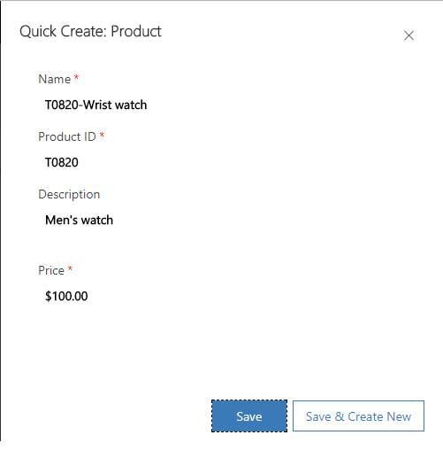

# Create a product catalog in [!INCLUDE[pn-sales-business-doc-name](../includes/pn-sales-business-doc-name.md)], Preview

[!INCLUDE[cc-applies-to-update-9-0-0](../includes/cc-applies-to-update-9-0-0.md)]

[!INCLUDE[Pre-release disclaimer](../includes/cc-beta-prerelease-disclaimer.md)]

Products are the backbone of your business. The product catalog in [!INCLUDE[pn-sales-business-doc-name](../includes/pn-sales-business-doc-name.md)], Preview is a collection of products and their pricing information. Make it easier for your sales reps to increase their sales by creating a product catalog quickly.

## Add products

1.  Make sure you have the Sales Manager – Business or a System Administrator role to be able to add products in [!INCLUDE[pn-sales-business-doc-name](../includes/pn-sales-business-doc-name.md)].

2.  Go to **Settings** &gt; **Product Catalog**.

3.  Select **New Product**.

  When you add a product, you only need to fill in some basic details about the product:

  - **Name**. Enter a name of the product.

  - **Product ID**. Enter a unique ID of the product.

  - **Description**. Add more details about the product.

  - **Price**. Enter the price at which the product is to be sold. Just enter digit.

  > [!Note]

  > The currency that is selected when your organization is provisioned is selected by default. You can’t change the currency once it is set.

    

4.  Select **Save.** The product is created and is automatically published. When a product is published, its status changes to “Active”. The sales person can select the active products in the sales transactions like associating it with an opportunity or quote.

## Edit a product

There may be times when you must edit a product to capture more accurate details. For example, to align to a change in strategy or to change other details of the product for some reason, you can edit a product.

1.  Make sure you have the Sales Manager – Business or a System Administrator role to be able to add products in [!INCLUDE[pn-sales-business-doc-name](../includes/pn-sales-business-doc-name.md)].

2.  Go to **Settings** &gt; **Product Catalog**.

3.  Open the product that you want to edit.

4.  You can only change the name, description or price list of the product.

5.  Select **Save**.

  The product is automatically set to “Active” status.

  > [!Note]
 
  > If you edit a retired product, it will be set to “Retired” status on saving it. If a product is retired, you can reactivate it.

## Delete products

1.  Make sure you have the Sales Manager – Business or a System Administrator role to be able to delete products in [!INCLUDE[pn-sales-business-doc-name](../includes/pn-sales-business-doc-name.md)].

2.  Go to **Settings** &gt; **Product Catalog**.

3.  Select the product that you want to delete, and on the command bar, select **Delete**.

   If the selected product is used in an opportunity, quote, or invoice, you can’t delete it. Instead, it will be set to the “Retired” state.

## Clone products

When you're creating a new product, save time by cloning an existing one. This creates a copy of the original record with all the details except for the name and ID.

1.  Make sure you have the Sales Manager – Business or a System Administrator role to be able to clone products in [!INCLUDE[pn-sales-business-doc-name](../includes/pn-sales-business-doc-name.md)].

2.  Go to **Settings** &gt; **Product Catalog**.

3.  Select the product that you want to clone, and on the command bar, select **Clone**.

## Import products

You may also use the import templates to bring in bulk data of products in to [!INCLUDE[pn-sales-business-doc-name](../includes/pn-sales-business-doc-name.md)]. [!INCLUDE[proc-more-information](../includes/proc-more-information.md)] [Import data into Dynamics 365 for Sales](import-data.md)  

### See Also
[Develop sales from lead to cash in Dynamics 365 for Sales, Preview](develop-sales-lead-to-cash.md)  
[Quick Setup & Advanced Settings overview](quick-setup-advanced-settings-overview.md)
