# Customize forms (Sales, Preview)

[!INCLUDE[cc-applies-to-update-9-0-0](../includes/cc-applies-to-update-9-0-0.md)]

[!INCLUDE[Pre-release disclaimer](../includes/cc-beta-prerelease-disclaimer.md)]

In [!INCLUDE[pn-sales-business-doc-name](../includes/pn-sales-business-doc-name.md)], Preview, forms provide the user interface that people use to interact with the data they need to do their work. It is important that the forms people use are designed to allow them to find or enter the information they need quickly. You can use the form designer to customize the forms included with [!INCLUDE[pn-sales-business-doc-name](../includes/pn-sales-business-doc-name.md)], Preview to meet the specific needs of your organization.

> [!IMPORTANT]

> Only customizations done within the app are supported. You should not try to customize your forms outside of the app itself.

## How do forms relate to entities?

A form is a set of data-entry fields that matches the items your organization tracks for a specific entity. For example, your organization might have fields that track a customer’s previous orders and specific requested reorder dates.

When you publish a customized form, you are publishing an updated version of the entity associated with the form.

## What forms can you customize?
You can customize any of the following forms in [!INCLUDE[pn-sales-business-doc-name](../includes/pn-sales-business-doc-name.md)], Preview: 

- Account
- Contact
- Invoice
- Lead
- Opportunity
- Quote 

To access the forms:

1. Open **Advanced Settings**, and then under **Customization**, choose **Forms**.

  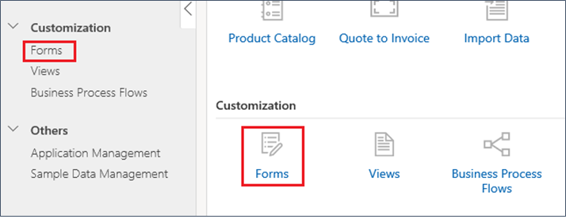

  You'll see the list of available forms. 

  
  
  The name of the form is **Business** for all entities. The page also displays the date when the form was published, and whether the form is active or not.

2. To open a form, just choose the form you want in the **Name** column, or select a form, and then choose **Edit** above the search field.

## What types of customizations can you do?

Form customization in [!INCLUDE[pn-sales-business-doc-name](../includes/pn-sales-business-doc-name.md)], Preview is limited to basic field customization. You can't customize controls (timeline or Bing maps, for example) or change the layout of a form by adding or removing new form sections or tabs or rearranging sections and tabs. 

## Get oriented with the form designer
In the form designer, the sections of the form are displayed on the left with tabs that contain additional information about the form. The available tabs depend on the form. For example, the Account form has a **Summary** tab and a **Details** tab. The Opportunity form has a **Product Line** tab but no **Details** tab. Each tab includes different parts of the form.

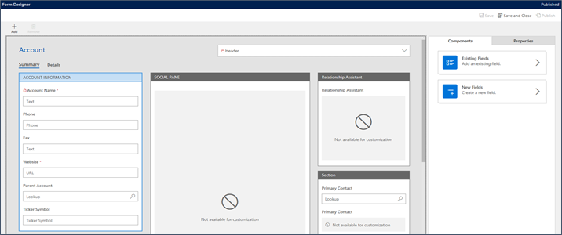

> [!TIP]

> You can see whether the form you opened is published in the upper-right corner of the designer.

### Components tab

Use the **Components** tab to add or modify fields. 

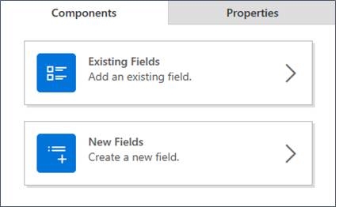

#### Existing fields

When you choose **Existing Fields**, the fields associated with the entity for the form are displayed. 

#### New fields

When you choose **New Fields**, you can select from the different field types available for your field. If you add a new field that was not included with the app, it becomes a custom field.

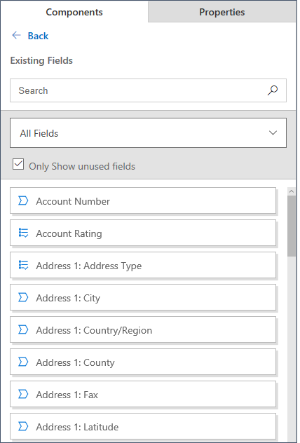

#### Search for a field on the Components tab

Use the **Search** box on the **Components** tab to search for a field by name. Just type all or part of the name and then press Enter. The list of fields displayed automatically updates to include only those that match your search text. For example, if you want to find fields related to email, enter **email** in the **Search** box. The list of fields updates to show only fields that include **email** in the name.

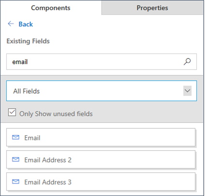

#### Filter the list of displayed fields on the Components tab

You can also filter which fields are displayed on the **Components** tab. If you select **All Fields**, the list displays all the fields for the entity associated with the form. If you select **Custom Fields**, the list displays only the fields created by you or another customizer.

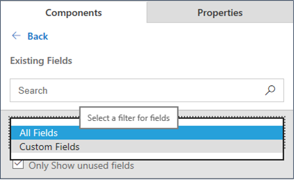

To show only the fields that are not already used on the form, select the **Only Show unused fields** check box.

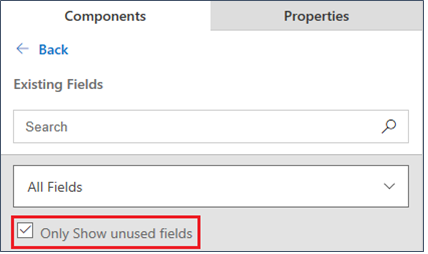

### Properties tab

The **Properties** tab shows the properties for the section of the form or field you select. When you select a section or field on a form, the **Properties** tab automatically opens. 

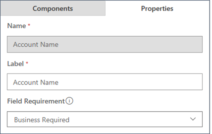

If you select a section that is not available for customization, you won't be able to select the **Properties** tab.

### Customize the header for a form

Updating the fields included in the form header works the same way as other sections of the form. Field headers can include any type of field except multi-line fields, such as a multi-line text field.. By default, headers include a single row with 3 or 4 columns, depending on the form.

You can move fields from one columnn to another by dragging them. When you do this, the existing field in the target column will switch places with the field you move. Note that you can't drag or cut and paste a field from another section of a form to the form header, however, or from the header to another section of the form.

> [!NOTE] 

> The header section of a form can't be deleted from the form. 

To customize the fields used in the header, select the **Show header fields** arrow.

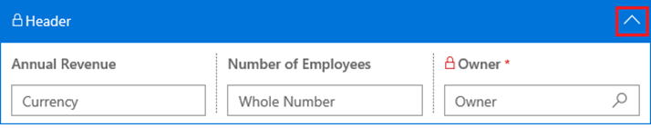

If you want to replace a field used in the header, you need to first remove one of the fields. Dragging a field from the **Components** tab over an existing field will not replace the existing field.

## Common tasks for customizing your forms

This section includes common form customization tasks.

### Add fields to a form

1.	Open the form you want to add a field to.

2.	On the **Components** tab, choose **Existing Fields** or **New Fields** to display a list of available fields.

3.	Select the section of the form you want to add the field to.

4.	Do one of the following:

    -	Double-click the field in the **Components** pane.
    
    -	Select the field in the **Components** pane, and then press Enter.
    
    -	Drag the field from the **Components** pane and drop it onto the section of the form where you want it.
    
If you double-click a field or select it and press Enter, the field will be added as the last field in the section currently selected

When you create a new field, you can create the field and define the properties for it at the same time, or you can set the properties after you add it to a form. Fields that you create are listed as custom fields on the **Components** tab.

By default, the maximum number of custom fields you can add to a form is 10. This value can be changed by your administrator. If  you attempt to add more than the allowed number of custom fields, you’ll receive an error message. 

### Add a field that allows a user to select a value or multiple values from a drop-down list

It's very easy to create a drop-down list that allows users to select a single or multiple values.

  1.  Select the form section you want to add the field to.
  
  2.  On the **Components** tab, choose **New Fields**, select **Dropdown** (if users will select a single value) or **Multi-select drop-down** (if users will select more than one value from the list), and then add the field to the selected form section by dragging it, double-clicking it, or pressing Enter.
  
  3.  On the **Properties tab**:
  
      - Enter a display name.
      
      - Select a value for **Field Requirement** or leave it as optional.
      
      - Choose **Add options**, and then in the box that appears, enter the values for the list. Make sure to enter one value per line as in the following example:
  
        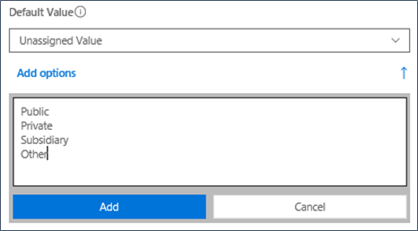
        
      - If you're creating a dropdown list, you can specify a default value for the list by selecting it in the **Default Value** property. The **Default Value** property shows which choice will be selected by default when the user opens the form. 
      
      > [!NOTE]
      
      > The **Default Value** property is not available for multi-select drop-downs.

### Add a field that allows a user to select from just two options

In many cases, you'll want a field that allows a user to select from just two options. For example, the Opportunity form includes a **Revenue** field that has two values: **System Calculated** or **User Provided**. The user must select one or the other value. 

 

For the Opportunity form, the two options are represented as a check box. You could choose to represent the values as two option buttons or a list instead of a check box if you prefer. 

To create a two-option field:

  1.  Select the form section you want to add the field to.
  
  2.  On the **Components** tab, choose **New Fields**, select **Two Options**, and then add the field to the selected form section by dragging it, double-clicking it, or pressing Enter.
  
  3.  On the **Properties tab**:
  
      - Enter a display name.
      
      - Select a value for **Field Requirement** or leave it as optional. 
      
      - Under **Options**, if you want the values to be something other than **Yes** or **No**, enter the values you want. Note that the **Default Value** property is automatically changed if you change these values. The **Default Value** property shows which choice will be selected by default when the user opens the form. 
      
      - Under **Control Formatting**, if you don't want the two values to be represented as two radio buttons, choose **Check box** or **List** instead.
  
        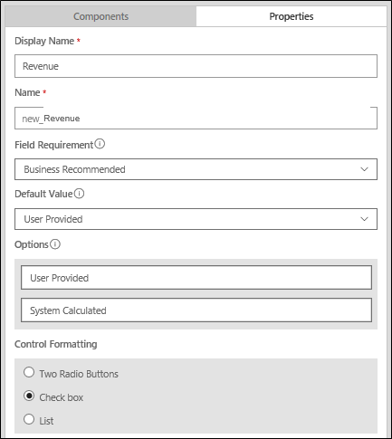

### Rearrange fields

You can rearrange the fields on a form so they’re displayed in a different order, or move fields from one section to another. 

To rearrage fields:

  1. Select the field you want to move, or use the Tab key to navigate between sections and fields until the one you want is selected.
  
  2. Do one of the following:

     -	Drag the field to a different place in the same section or to a different section of the form.
     
     -	Use the Ctrl+X keyboard shortcut to cut the field from its current position. Then select the field (either in the same section or a different section) that you want the field to be positioned after and press Ctrl+V to paste it. If you don’t select a field in a section, the field will be positioned as the last field in the section when you paste it. 

### Remove fields 

  - Select the field in the designer and then choose **Remove** at the top of the designer.

    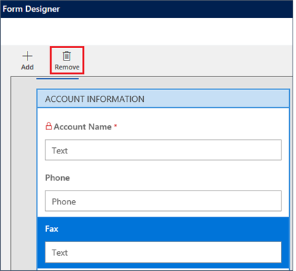

Note that you can’t remove locked fields (indicated by a red padlock icon next to the field name). A red asterisk next to the label indicates the field is set to **Business Required**.

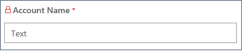

When you attempt to remove a locked field, you will see the following error message:

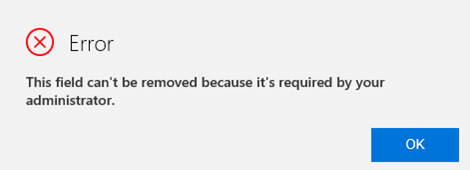

When a field is removed from a form, it's moved to the list of unused fields on the **Components** tab.

### Modify properties for a field

You can edit the properties for any field on the form. 

  1. Select the field. 
  
     When you select a field, the **Properties** tab is automatically opened and displays the properties for that field. The available properties depend on the type of field that’s selected. You can change any of the properties displayed except those that are locked.

  2. After you make your changes, choose **Apply** to apply the changes. You may have to scroll down to see the **Apply** button when using lower screen resolutions.

    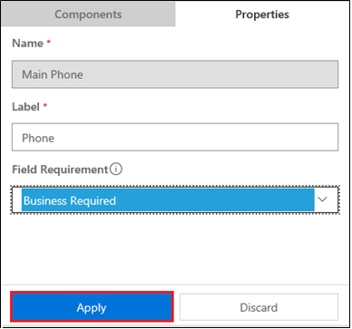

### Change a field label

  - Select the field, and then choose the pencil button. This is the same as changing the value for the label in the **Properties** tab.

    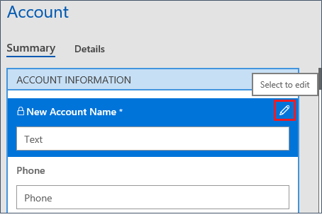

    The label is displayed in a text field where you can change it.

    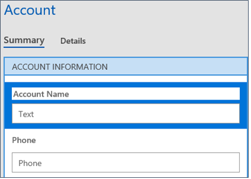

### Make fields optional or required

You can specify that a field is optional, business recommended, or business required by setting the **Field Requirement** property. When a field is set to **Business Required**, a red asterisk is displayed next to the label on the form.

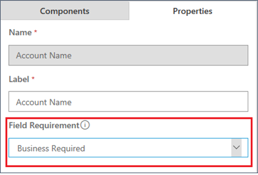

Note that when you change this property, the metadata is updated for all forms that use that field.

You can't remove fields set to **Business Required** from a form. You can change the field to **Optional**, and then remove it, however.

### Save a form

  - When you’re finished customizing your form, or to save your progress, choose **Save** or **Save and Close** in the upper-right corner of the designer. 
  
    If the form you have open has not been changed since it was last saved, the **Save** button is disabled.

    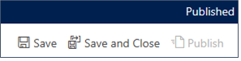

> [!NOTE] 

> Forms that contain errors will not be saved, and forms that are not saved cannot be published. You’ll need to correct any errors in the form before you can save and publish it. Errors are highlighted in red in the designer so that you can easily find them.

### Publish a form

After you save the changes to your form, you’ll need to publish it to make it available to users. 

  - To publish your form, choose **Publish**.

    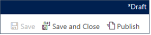

### See also

[Customize views](customize-views.md) 
[Customize business process flows](customize-business-process-flows.md)

