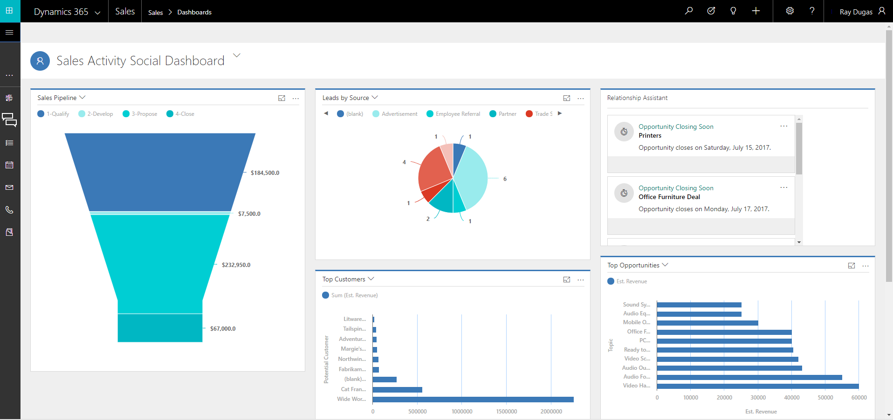
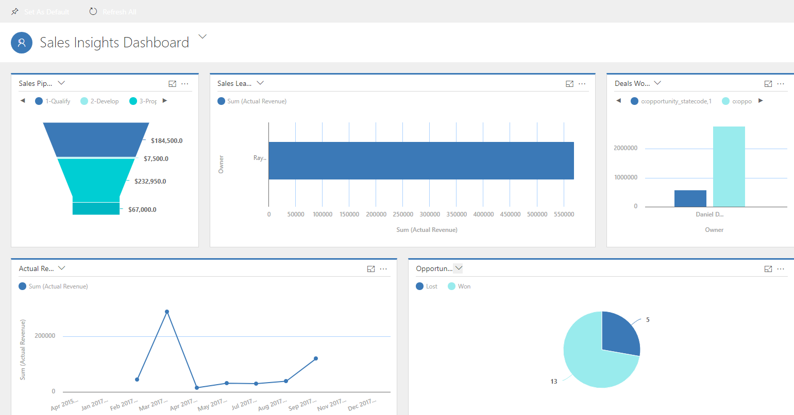
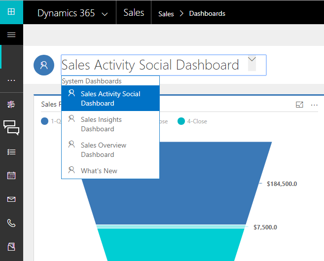
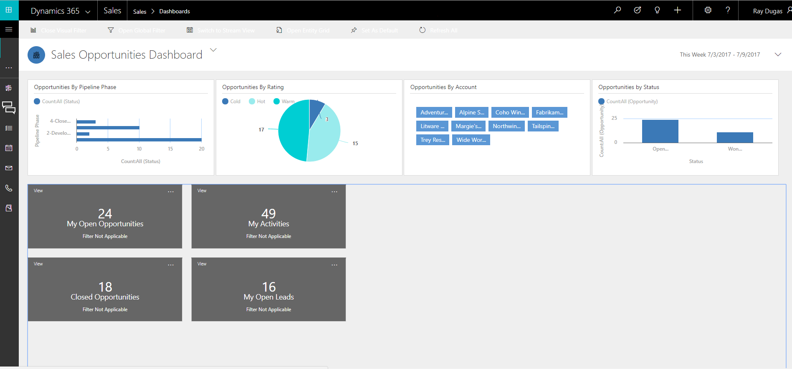

# Gain insights with dashboards in [!INCLUDE[pn-sales-business-doc-name](../includes/pn-sales-business-doc-name.md)], Preview

[!INCLUDE[cc-applies-to-update-9-0-0](../includes/cc-applies-to-update-9-0-0.md)]

[!INCLUDE[Pre-release disclaimer](../includes/cc-beta-prerelease-disclaimer.md)]

Dashboards in [!INCLUDE[pn-sales-business-doc-name](../includes/pn-sales-business-doc-name.md)], Preview provide an overview of business data ‒ actionable information that’s viewable across the organization. Use dashboards to see important data at a glance.

Dashboards use views, list, and charts to bring data that is meaningful to you in one place.

## Where to find dashboards

To go to dashboards, select the Site Map icon , and then select **Dashboards**.

## Dashboards in [!INCLUDE[pn-sales-business-doc-name](../includes/pn-sales-business-doc-name.md)]

The Sales app comes with the following pre-built dashboards that you can use to quickly get insights on your sales data and team performance.

### Sales Activity Social Dashboard

This dashboard shows all activities that are happening in the sales team. You’ll see important data such as who are your top customers, what are the top opportunities your team is working on, or where are most of your leads coming from.

  

### Sales Insights dashboard

This dashboard shows data that helps sales managers or sales VP get important insights on how their sales team is performing. The sales pipeline shows open opportunities in different stages. The deal won vs. deal lost chart shows the number of opportunities won or lost by an owner. The dashboard also includes chart that show important financial data such as the actual revenue by each user.

  

### Sales Overview Dashboard

The sales overview dashboard shows daily work-related sales numbers such as the activities you’re working on, sales pipeline, or top opportunities.

  

## Open a different dashboard

You can use the view selector to select a dashboard of your choice. Select the dashboard name, and from the drop-down list, select the dashboard you want to open.

  

## Set a dashboard as default

To see a specific dashboard every time you log on to [!INCLUDE[pn-sales-business-doc-name](../includes/pn-sales-business-doc-name.md)], set it as default. To do this, open the dashboard, and on the command bar, select **Set as Default**.

## Entity dashboards

Other than the dashboards described earlier, there are dashboards specific to entities. These are available for account, contact, lead, opportunity, quote and invoice entities. Remember, an entity is the same as a record type.

To see an entity dashboard, go to the list of records for the entity, and then on the command bar, select **Open Entity Dashboard**.

For example, in the list of opportunities when you select the **Open Entity Dashboard**, the following dashboard specific to opportunity entity is displayed.

  

You can use the global or visual filters to filter and see only the data that is important to you.

### See Also
[Overview of Dynamics 365 for Sales, Preview](overview-dynamics-365-for-sales.md)  
[Learn the basics](learn-basics.md)
