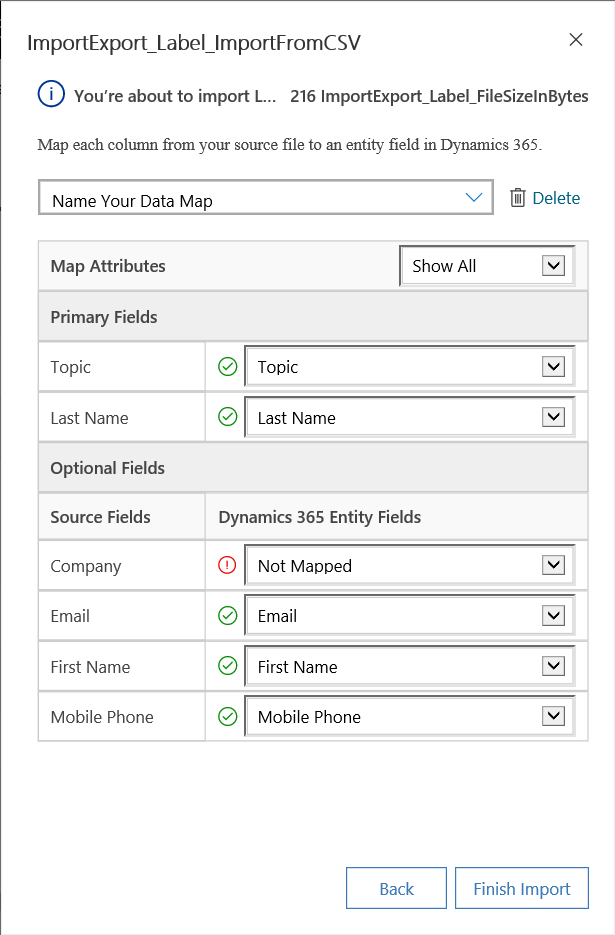
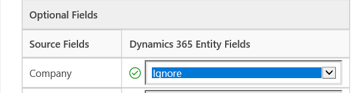
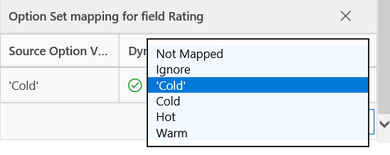
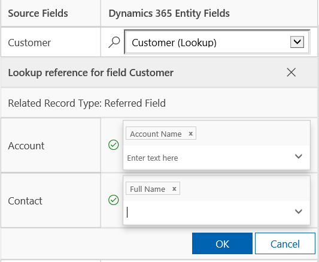
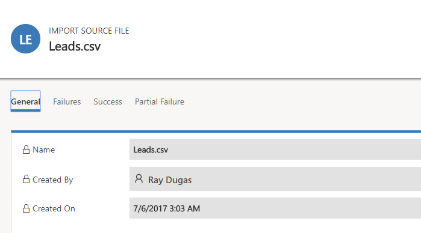

# Import contacts, accounts, or leads into [!INCLUDE[pn-sales-business-doc-name](../includes/pn-sales-business-doc-name.md)], Preview

[!INCLUDE[cc-applies-to-update-9-0-0](../includes/cc-applies-to-update-9-0-0.md)]

[!INCLUDE[Pre-release disclaimer](../includes/cc-beta-prerelease-disclaimer.md)]

Bring in your customer and sales data quickly into your app by importing it. It can be used for importing data into most record types.

[!INCLUDE[pn-sales-business-doc-name](../includes/pn-sales-business-doc-name.md)], Preview processes imports in the background. After an import completes, you can review which records succeeded, failed to import, or were partially imported. To fix the records that failed to import, export them into a separate file, fix them, and then try to import them again. You can delete all records associated with an import.

## Supported file types

You can import data from the following file types:

-   comma separated value file

-   [!INCLUDE[pn-excel-short](../includes/pn-excel-short.md)] templates available in [!INCLUDE[pn-sales-business-doc-name](../includes/pn-sales-business-doc-name.md)] ([!INCLUDE[proc-more-information](../includes/proc-more-information.md)] [Export data or template](#_Export_data_or))  

## Prepare your file for import

Follow the guidelines in this topic to make sure that your file imports successfully.

1.  Put records for each record type in a separate file.

2.  Make sure that the file is in one of the following formats:

  -   Comma-separated value (CSV) file (A data file with a .csv file extension. Typically a CSV file consists of fields and records, stored as text, in which the fields are separated from one other by commas.) (.csv) format

  -   [!INCLUDE[pn-excel-short](../includes/pn-excel-short.md)] template
3.  If your import file is a CSV file, make sure that it is correctly delimited.

  You can use double quotation marks (“) or single quotation marks (‘) as data delimiters.

.  Make sure the first line of a file is the column headings.

  Edit your file and add column headings (Text used in the first row of a spreadsheet or file that labels the data in each column.) if they are not already present.

  > [!Note]

  > Make sure that the .csv file does not contain:

  > -   Multiple lines in the first line (header row).

  > -   Quotation marks in the first line. In [!INCLUDE[pn-sales-business-doc-name](../includes/pn-sales-business-doc-name.md)], quotation marks are used as data delimiters.

  > -   Data separated with a semicolon (;) or comma (,). In [!INCLUDE[pn-sales-business-doc-name](../includes/pn-sales-business-doc-name.md)], semicolons and commas are used as field delimiters.

  > [!Important]
  
  > To import quickly, it will help to have your column headings match the display name (The label that is used by default when an attribute is displayed on a form, in a list, or in a report. The **Display Name** for each attribute can be changed in the **Customization** area by a user with an appropriate security role.) of fields in [!INCLUDE[pn-sales-business-doc-name](../includes/pn-sales-business-doc-name.md)]. This will help in automatic mapping of data while you import.

5.  Make sure data exists for all business-required fields.

  A record will only import if all [!INCLUDE[pn-sales-business-doc-name](../includes/pn-sales-business-doc-name.md)] business-required (Attributes that are required before a record can be saved. Required fields are marked with an asterisk.) fields are mapped, and if the data exists in each of the source columns that are mapped to the required fields. You can either determine the required fields in advance, or identify missing required mappings during the import. In either case, make sure you have required data in each record. To determine which fields are business-required, open the form for the record type as if you were creating a new record, and identify fields that are marked with a red asterisk (\*).
  
  The following list shows default business-required fields for commonly imported record types.
  
    - Account: **Account Name**
    - Contact: **Last Name**
    - Lead: **Topic, Last Name, Company Name**
    - Product: **Default Unit, Unit Group, Decimals Supported**
  
  **Example showing sample leads to import:**
  
  The following lines show what the data might look like for a .csv format file containing leads to import. The first line contains the field names, and the remaining lines are imported as data.

  `Company,Last Name,First Name,Topic,Email,Mobile Phone
  
  “Designer Bikes”“Groth”“Brian”“Mountain bikes”“someone@example.com”“555-555-0112”
  
  “Major Sporting Goods”“Bedecs”“Anna”“Components”“555-555-0171”`

  > [!Note]

  > By default, the maximum size of the files that you can import is 8 megabytes (MB).

## Import records from an [!INCLUDE[pn-excel-short](../includes/pn-excel-short.md)] template

1.  Start your import.

    1.  You can start import multiple places. If you are a person with a sales person role, go to any list of records, for example list of leads, and on the command bar, **Import from [!INCLUDE[pn-excel-short](../includes/pn-excel-short.md)]**.

    2.  If you are an administrator, go to **Quick Setup** or **Advanced Settings**, and then select **Import Data**. Then in the **Import Data** page, select the record type you want to import the data for, and then in the next drop-down list, select **[!INCLUDE[pn-excel-short](../includes/pn-excel-short.md)]**.

2.  Select **Browse** to upload a file.

3.  Select **Next**.

4.  All the fields in your source file are automatically mapped. Select **Finish Import**.

## Import records from a CSV file

1.  Start your import.

    1.  You can start import multiple places. If you are a person with a sales person role, go to any list of records, for example list of leads, and on the command bar, Import from CSV.

    2.  If you are an administrator, go to Quick Setup or Advanced Settings, and then select **Import Data**. Then in the Import Data page, select the record type you want to import the data for, and then in the next drop-down list, select CSV.

2.  To make sure that the import is successful, be sure to follow the steps in Prepare a file for import.

3.  Select a file to upload. Only a comma-separated value file and an [!INCLUDE[pn-excel-short](../includes/pn-excel-short.md)] template file is supported.

4.  Select **Next**.

5.  If you have an alternate key defined, select it from the **Alternate Key** drop-down list.

    The alternate key is used to uniquely identify and update records during import instead of using the primary key. Some external data systems do not store primary keys. In such case, an alternate key can be used to uniquely identify records. [!INCLUDE[proc-more-information](../includes/proc-more-information.md)] [How alternate key and duplicate detection work during import](#how-alternate-key-and-duplicate-detection-work-during-import)  

6.  In the **Data Delimiter** drop-down list, select the data delimiter that you’ve used in your CSV file.

7.  Select **Review Mapping**.

    1.  In the **Review Mapping** page, review how your column headings are mapped to the fields in [!INCLUDE[pn-sales-business-doc-name](../includes/pn-sales-business-doc-name.md)].

       By default, the **Primary Fields** section of the wizard shows all the required fields for the entity that must be mapped for the data to import successfully on the left side.

       > [!Note]

       > If you’ve selected an alternate key, all the fields of the alternate key also become required fields and must be mapped.

       If the column headings of your source file match the field display names, these fields will be automatically mapped. All the mapped fields will be shown with a green check mark.

    2.  If the column headings don’t match, the unmapped fields will be shown with a Red exclamation mark. Select a [!INCLUDE[pn-crm-shortest](../includes/pn-crm-shortest.md)] field to map to the unmapped column heading of your file.

        

      > [!Tip]

      > To quickly filter on only the unmapped fields, select **Unmapped** from the **Map Attributes** drop-down list.

      In the **Optional Fields** section, the left side shows the column headings in your source file. If the column headings match the field display names, the fields will be automatically selected in the corresponding drop-down lists.

       

     If the column headings don’t match, the unmapped fields will be shown with a Red exclamation mark.

    3. Select a [!INCLUDE[pn-sales-business-doc-name](../includes/pn-sales-business-doc-name.md)] field to map to the unmapped column heading of your file. You may also select **Ignore** from the drop-down list. If you select **Ignore** for a column, the data in that column won’t be imported into [!INCLUDE[pn-sales-business-doc-name](../includes/pn-sales-business-doc-name.md)].

        

    4.  While importing your data, if any column in your source file includes fixed set of values, you must map the column to a field of [Option Set](javascript:toggleInline('51908')) type. A column of this type has values such as "Yes" or "No," or "Hot," "Warm," or "Cold." To do this, select the  icon next to the option set field. Option set mapping section opens:  

        

      For each **Source Option Values** item, select an item from the **[!INCLUDE[pn-crm-shortest](../includes/pn-crm-shortest.md)] Option Values** list to map it, and then select **OK**.

      When you are mapping the source values to items in the **[!INCLUDE[pn-crm-shortest](../includes/pn-crm-shortest.md)] Option Values** list, the Import Data Wizard temporarily adds the items from the source values to the **[!INCLUDE[pn-crm-shortest](../includes/pn-crm-shortest.md)] Option Values** list. You can map the source list values to the existing options in [!INCLUDE[pn-crm-shortest](../includes/pn-crm-shortest.md)] or to the added values. If you map to one of the added values, these new values are created in [!INCLUDE[pn-sales-business-doc-name](../includes/pn-sales-business-doc-name.md)].

     For example, your source values and the [!INCLUDE[pn-crm-shortest](../includes/pn-crm-shortest.md)] target values could have the following values before the import starts:

     | **Source values** | **[!INCLUDE[pn-sales-business-doc-name](../includes/pn-sales-business-doc-name.md)] target values** |
     |-------------|------------|
     | Low         | Cold       |
     | High        | Warm       |
     |             | Hot        |
     
     During the import, the Import Data Wizard adds the source values to the [!INCLUDE[pn-crm-shortest](../includes/pn-crm-shortest.md)] target values:
        
     | **Source values** | **[!INCLUDE[pn-sales-business-doc-name](../includes/pn-sales-business-doc-name.md)] target values** |
     |-------------------|---------|
     | Low               | Cold    |
     | High              | Warm    |
     |                   | Hot     |
     |                   | Low     |
     |                   | High    |
     
     You can map Low in the source values to Cold in the [!INCLUDE[pn-crm-shortest](../includes/pn-crm-shortest.md)] target values. Also, you can map High in the source values to High in the [!INCLUDE[pn-crm-shortest](../includes/pn-crm-shortest.md)] target values.
     
     Based on these mappings, the Import Data Wizard creates "High" as a [!INCLUDE[pn-crm-shortest](../includes/pn-crm-shortest.md)] target value. It does not create "Low" as a [!INCLUDE[pn-crm-shortest](../includes/pn-crm-shortest.md)] target value because you did not map any source value to the added [!INCLUDE[pn-crm-shortest](../includes/pn-crm-shortest.md)] target value of "Low".
     
      > [!Note]
      > You can also map a column in your source file to a field of type “Two Options” and “Multiselect Option Set” (where a field can have multiple values). You must map each **Source Option Values** to the items in the **[!INCLUDE[pn-crm-shortest](../includes/pn-crm-shortest.md)] Option Values** list. When mapping to a field of type Multiselect Option Set, if your source file includes values that aren’t available in [!INCLUDE[pn-sales-business-doc-name](../includes/pn-sales-business-doc-name.md)], new values won’t be created in [!INCLUDE[pn-sales-business-doc-name](../includes/pn-sales-business-doc-name.md)].

    5. If some data in your source file reference other existing records in [!INCLUDE[pn-sales-business-doc-name](../includes/pn-sales-business-doc-name.md)], you must map the column in the source file to a lookup field of [!INCLUDE[pn-sales-business-doc-name](../includes/pn-sales-business-doc-name.md)].

      For example, you want to import the file Leads.csv that contains customer records. The **Customer** column in the Leads.csv contains the associated account or contact data.

      To do this, select the  icon next to the lookup field. The Lookup Reference section opens and lists the related entities to the current entity. For each entity, select the fields to search during import to retain the relationships between the records, and then select **OK**.  

          

    6.  To save these mappings as a data map, enter a name in the **Name your data map** box.

          

        You can just select this data map when you want to import similar data in the future. The data map maps data based on the mappings you’ve defined earlier.

8.  Select **Finish Import** when you have mapped each column from the source file to a [!INCLUDE[pn-sales-business-doc-name](../includes/pn-sales-business-doc-name.md)] field or have selected **Ignore** in the list under **[!INCLUDE[pn-crm-shortest](../includes/pn-crm-shortest.md)] Entity Fields**.

### How alternate key and duplicate detection work during import

Note the following on how alternate key and duplicate detection works while importing records in [!INCLUDE[pn-sales-business-doc-name](../includes/pn-sales-business-doc-name.md)]:

- **When Duplicate Detection is disabled, and alternate key is not defined in [!INCLUDE[pn-sales-business-doc-name](../includes/pn-sales-business-doc-name.md)]**. The import process creates new records. If a matching GUID is found, import process updates the record.

- **When duplicate detection is disabled, and alternate key is selected**. Records with same alternate key data are updated and other records are created in [!INCLUDE[pn-sales-business-doc-name](../includes/pn-sales-business-doc-name.md)].

- **When duplicate detection is disabled, and alternate key is not selected.** In this Alternate key is considered as the primary key because it is available in [!INCLUDE[pn-sales-business-doc-name](../includes/pn-sales-business-doc-name.md)]. Records with same alternate key will fail with an error message during import.

- **When duplicate detection is enabled, and alternate key is not defined**. Duplicate detection rule is followed. The import process creates new records. If any matching GUID is found, the import process updates the records.  If any records match the duplicate detection rule, an error message is shown.

- **When duplicate detection is enabled, and** **alternate key is not selected**.  In this Alternate key is considered as the primary key because it is available in [!INCLUDE[pn-sales-business-doc-name](../includes/pn-sales-business-doc-name.md)]. Records with same alternate key will fail with an error message during import. Duplicate detection rules are also applied. If any records match the duplicate detection rule, an error message is shown. For records which that do not match the duplicate detection rule will be created in [!INCLUDE[pn-sales-business-doc-name](../includes/pn-sales-business-doc-name.md)].

- **When duplicate detection is enabled, and alternate key is selected**. Import process updates the records based on alternate key and then applies duplicate detection. Records are updated if alternate key matches otherwise they are created in the system.

## View the results of an import, and correct errors

You must wait for an import job to complete before you can repair failures.

1.  Go to **Advanced settings** &gt; **Imports Data**.

   Import jobs for all the imports appear in the list.

2.  Monitor the progress of the import.

   The **Status** column shows the status of the import. The status progresses through these values:

    - **Submitted**

    - **Parsing**

    - **Transforming**

    - **Importing**

    - **Completed**

3.  After the import is complete, the **Success**, **Failure**, and **Partial Import** column will show the number of records that were successfully imported, failed to import or were partially imported.

4.  Open the import file to view the records that did not import or were partially imported. Open the import file record.

   Use the tabs to see information about failures, success, or partial failure of records during import.
   
     

5.  On the **Failures** tab, export rows that failed to import to a new [comma-separated value (CSV) file](javascript:toggleInline('25109')). Select **Export Error Rows**. You can correct the errors in this file, and then import it.  

## Delete imported records

1.  Go to **Advanced settings** &gt; **Imports Data**.

   Import jobs for all the imports appear in the list.

2.  Select the import file that you want to delete, followed by one of the following actions:

   - **Delete import source file**. This deletes the import log file and its details.

   - **Delete imported records**. This deletes all records that were imported from the selected file.

   - **Delete All**. This deletes the import file along with the records that were imported from the import file.

### See Also
[Export data or template](Export-data-template.md)  
[Quick Setup & Advanced Settings overview](quick-setup-advanced-settings-overview.md)
