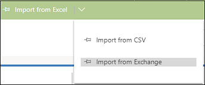

# Import data from Exchange in [!INCLUDE[pn-sales-business-doc-name](../includes/pn-sales-business-doc-name.md)]

[!INCLUDE[cc-applies-to-update-9-0-0](../includes/cc-applies-to-update-9-0-0.md)]

[!INCLUDE[Pre-release disclaimer](../includes/cc-beta-prerelease-disclaimer.md)]

If you’ve been keeping track of all your contacts in Microsoft Exchange, you can quickly get all your contacts in [!INCLUDE[pn-sales-business-doc-name](../includes/pn-sales-business-doc-name.md)] so you have all your data in one place.

## Prerequisites

To be able to import from Exchange:

-  You must have a valid Exchange subscription and license.
-  Your mailbox must be tested and enabled. Talk to your administrator if you receive an error.

## Import from Exchange

1.  If you’re a user with a sales person or sales manager role, go to the list of contacts, then on the command bar, select **Import
from Excel** > **Import from Exchange**.

  
 
  -OR-
 
  If you’re a user with a System Administrator role, go to **Advanced Settings** > **Import Data**. Then, in the **Import Entity** drop-  down list, select **Contacts**, and in the **From** drop-down list, select **Exchange**, and select **Start Import**.
 
  The Track data from Exchange dialog box opens.
 
  

2.  Select **Track**.
 
 All the contacts from your Exchange will start importing to [!INCLUDE[pn-sales-business-doc-name](../includes/pn-sales-business-doc-name.md)]. Any changes that you make to the contact in your Exchange mailbox will be automatically updated in the contact record in [!INCLUDE[pn-sales-business-doc-name](../includes/pn-sales-business-doc-name.md)].

> [!Important]

> You won’t be able to remove or untrack a contact from Dynamics 365 for Sales. Use the Dynamics 365 App for Outlook for the same.

### See Also
[Import contacts, accounts, or leads into [!INCLUDE[pn-sales-business-doc-name](../includes/pn-sales-business-doc-name.md)]](import-data.md)  
[User's guide for Dynamics 365 for Sales, Preview](user-guide-dynamics-365-sales.md)
