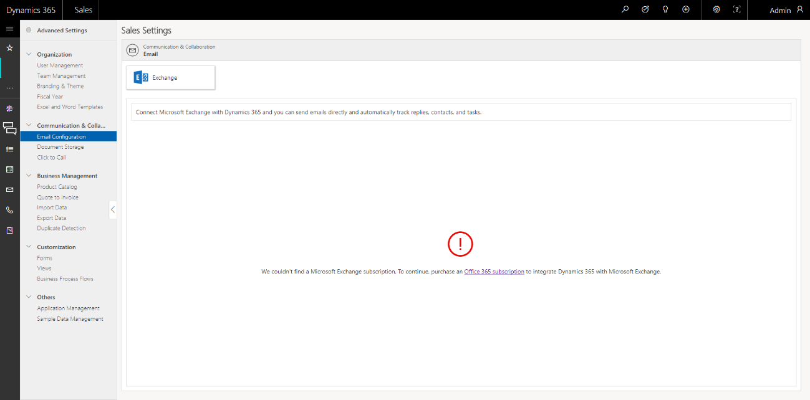
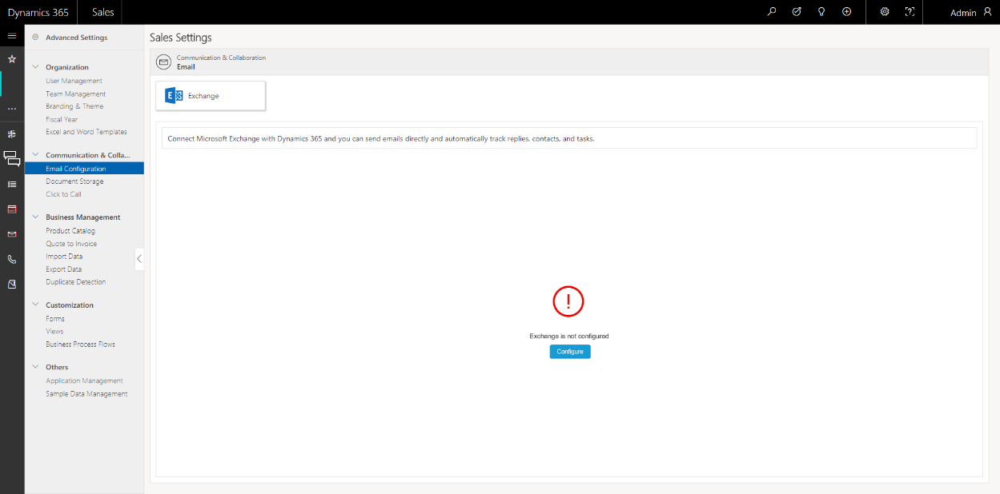

# Configure email in [!INCLUDE[pn-sales-business-doc-name](../includes/pn-sales-business-doc-name.md)], Preview by integrating with Exchange 

[!INCLUDE[cc-applies-to-update-9-0-0](../includes/cc-applies-to-update-9-0-0.md)]

[!INCLUDE[Pre-release disclaimer](../includes/cc-beta-prerelease-disclaimer.md)]

To store email and other messaging records in [!INCLUDE[pn-sales-business-doc-name](../includes/pn-sales-business-doc-name.md)], Preview, you need to synchronize it with your email system.

[!INCLUDE[pn-sales-business-doc-name](../includes/pn-sales-business-doc-name.md)], Preview uses server-side synchronization to synchronize your email system with [!INCLUDE[pn-sales-business-doc-name](../includes/pn-sales-business-doc-name.md)].

## What is Server Side Synchronization?

Using server-side synchronization makes messaging data available to a web browser, tablet, or smartphone that is running [!INCLUDE[pn-sales-business-doc-name](../includes/pn-sales-business-doc-name.md)].

Server-side synchronization provides direct [!INCLUDE[pn-sales-business-doc-name](../includes/pn-sales-business-doc-name.md)]-to-email server synchronization. When you use Exchange, you can synchronize email, contacts, tasks, and appointments.

Some features offered by server-side synchronization include the following:
 -   Email folder tracking. You can simply drag email to a folder to track it. Folder tracking works on any mobile device that supports [!INCLUDE[cc-microsoft](../includes/cc-microsoft.md)] Exchange, which means you can track email from just about any device.

 -   Support for [!INCLUDE[pn-crm-shortest](../includes/pn-crm-shortest.md)] App for Outlook. You can track incoming email with the new [!INCLUDE[pn-crm-shortest](../includes/pn-crm-shortest.md)] App for Outlook. [!INCLUDE[pn-crm-shortest](../includes/pn-crm-shortest.md)] App for Outlook works with Outlook on the web. So, all you need is a browser to track incoming email.

## Prerequisite for Exchange integration

To configure Exchange, you must have: 

-   Sales Administrator or Sales Manager - Business role

-   [!INCLUDE[pn-office-365](../includes/pn-office-365.md)] subscription. 

-   Exchange Online subscription 

For more information about managing subscriptions, see [Manage Microsoft Dynamics 365 (online) instances](https://go.microsoft.com/fwlink/?linkid=730725).

## Exchange Integration 

Exchange integration can be done from the Quick Setup or Advanced Setup.

1.  Initiate Exchange integration from Quick Setup.

    1.  When you log on to [!INCLUDE[pn-sales-business-doc-name](../includes/pn-sales-business-doc-name.md)] for the first time, a Welcome page appears.

    2.  Select the **Go to the Quick Setup** tile.

    3.  In the Quick Setup wizard, select the **Email Configuration** icon.

         -OR-

2.  Initiate Exchange integration from Advanced Settings.

    1.  Select the Site Map icon . A navigation pane opens on the left side.

    2.  Select **Advanced Settings**.

    3.  Select **Email Configuration**.

3.  If your organization has an Exchange subscription, skip to Step 6.
  
4.  If you don’t have an [!INCLUDE[pn-office-365](../includes/pn-office-365.md)] subscription, you’ll be prompted to purchase an [!INCLUDE[pn-office-365](../includes/pn-office-365.md)] subscription. Select the link to purchase an [!INCLUDE[pn-office-365](../includes/pn-office-365.md)] subscription.

    

5.  After you purchase a subscription, go to **Email Configuration** in the **Quick Setup** or **Advanced Setup**. This time, Exchange will be automatically detected.

6.  If an Exchange subscription is detected but Exchange isn’t configured, you’ll get an option to configure Exchange.

   > [!Important]      
   
   > If Exchange is already configured for any user in your organization, instead of the Configure button, the user’s mailbox will appear. To configure mailboxes for other users, you must add the users in **Advanced Settings** > **User Management**. When you do this,
their mailboxes will automatically appear here, which you can test and enable later.

    

7.  Select **Configure**. A consent dialog box opens.
   
8.  In the consent dialog box, select **I Agree**.

   > [!Note]
   
   > The integration won’t work unless you agree.

9.  When you select **I Agree**, the following happens:

    1. Server-side synchronization is automatically enabled and configured at the system (organization) level.

     - The email server profile is set to Exchange Online (automatically created when a new [!INCLUDE[pn-crm-shortest](../includes/pn-crm-shortest.md)] instance is provisioned). The email server profile stores settings that are used by server-side synchronization to connect to an email server and process email for the associated mailboxes.
      - Incoming Email, Outgoing Email, and Appointment, Contacts, and Tasks are all set to use Server-side synchronization

    2.  When Exchange is configured, the following happens:

       - Existing user mailboxes that have valid Exchange licenses are automatically approved. Approval of mailboxes is required for the mailbox can process email. The incoming and outgoing email configuration of the selected mailboxes is tested, and mailboxes are then enabled for processing email.
       
          > [!Important]
         
          > User mailboxes are automatically approved and enabled only when the primary email of the user is equal to the user's UPN (User Principal Name attribute). 
       
       - For newly added users, you must manually test and enable the mailboxes.

    3.  All these user mailboxes are automatically approved. A mailbox needs to be approved before it can process email.

    4.  The incoming and outgoing email configuration of the selected mailboxes is tested, and mailboxes are then enabled for processing email.

       > [!Note]
       
       > If an error occurs in a mailbox, an alert is sent to the user of the mailbox. You can also see the alert when you open the mailbox record. The **Test Run Status** column is set to Failure for the mailbox. You must select all such mailboxes, and test and enable them. [!INCLUDE[proc-more-information](../includes/proc-more-information.md)] [Test and enable mailboxes](#test-and-enable-mailboxes).  

        To see the mailboxes, go to **Advanced Settings** &gt; **Email Configuration.**

    5.  [!INCLUDE[pn-crm-shortest](../includes/pn-crm-shortest.md)] App for Outlook is automatically enabled for all the users.

## Test and enable mailboxes

The Test Run column shows the status of the test performed on the mailboxes. If an error occurs while testing any of the mailbox, it’s status is set to Failed and the user of the mailbox is sent an alert.

As an administrator, you must select all such mailboxes, select the **More Commands** icon, and then select **Test and Enable**.

The error must automatically resolve now. If the error persists, please contact Support.

### See Also
[Overview of Dynamics 365 for Sales, Preview](overview-dynamics-365-for-sales.md)  
[Quick Setup & Advanced Settings overview](quick-setup-advanced-settings-overview.md)
