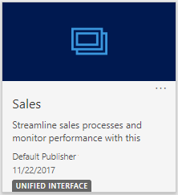
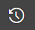

# Learn the basics of [!INCLUDE[pn-sales-business-doc-name](../includes/pn-sales-business-doc-name.md)], Preview

[!INCLUDE[cc-applies-to-update-9-0-0](../includes/cc-applies-to-update-9-0-0.md)]

[!INCLUDE[Pre-release disclaimer](../includes/cc-beta-prerelease-disclaimer.md)]

Start here to onboard quickly and learn about the Sales app and its user interface.

## Go to the Sales app

1.  Sign in to [!INCLUDE[pn-office-365](../includes/pn-office-365.md)], select the [!INCLUDE[pn-office-365](../includes/pn-office-365.md)] app launcher, and then select the icon for **[!INCLUDE[pn-crm-shortest](../includes/pn-crm-shortest.md)]**.

    

 > [!Note]

 > The apps available to you in the app launcher depend on your subscription.

2.  In the [!INCLUDE[pn-crm-shortest](../includes/pn-crm-shortest.md)] Home page, select the tile for **Sales** (Unified Interface).

  

## Understand the sitemap navigation
  
-  In the Sales app, select the Site Map icon , and then select an entity.  

   When you select an entity, for example, Lead or Opportunity, you’ll see the list of records in the respective entity grid. You can also select the down-arrow given next to each entity to view the recently opened records.

-  Select the Site Map icon , and then select **Training** to go to **Help Center** and the **Learning Path Content Library**. 

-  Select the Site Map icon , and then select **Favorites and Recent** button   to see recently viewed records, or to see views that have been pinned as favorites.

## Understand the data in the app

Every day, you’ll work with different customer records and record types as you move customers through your business processes, collecting the data you need to fill in the fields for their records—and ultimately to win their business.

-   What’s a record? In [!INCLUDE[pn-crm-shortest](../includes/pn-crm-shortest.md)], a **record** is a complete unit of information such as all the information about a single contact. You can think of it as a row in a table. For example, each time you add a new account to the app, you’re creating a new record in the Sales app.

-   What’s a record type? Each record you add to the system belongs to a certain **record type**, such as an account, contact, lead, or opportunity.

## Quick create – Enter new records fast

The Quick Create command makes it fast and easy to enter almost any type of information into the system. The command is on the navigation bar (also referred to as the nav bar), so it’s always available whenever you need to enter new info into the system.

With Quick Create, you need to complete only a few fields. Later, when you have more time or more information, you can fill in more details.

1.  On the nav bar, select the **New** button , and then select the item you want.  

2.  Fill in the fields, and then select **Save**.

## Business processes in [!INCLUDE[pn-sales-business-doc-name](../includes/pn-sales-business-doc-name.md)]

Business processes help everyone follow best practices, even when handling situations that don’t occur very often. You complete a step by entering data or marking the step completed in the process bar at the top of the screen. When all the steps are done, you can move on to the next stage.

There are three ready-to-use business processes that you can use as you move your leads through a sales process:

-   Lead to invoice. This business process flow is available on:

    -   All leads

    -   On opportunities created from leads

    -   On quotes created from opportunities that are created from leads

    -   On invoices created from quotes created from opportunities created from leads

-   Opportunity to invoice. This business process flow is available on:

    -   All directly created opportunities (not originating from lead) forms

    -   On quotes created from direct opportunities

    -   On invoices created from quotes created from direct opportunities

-   Quote to invoice. This business process flow is available on:

    -   On directly created quotes

    -   On invoices created from directly created quotes

### See Also
[Overview of Dynamics 365 for Sales, Preview](overview-dynamics-365-for-sales.md)
