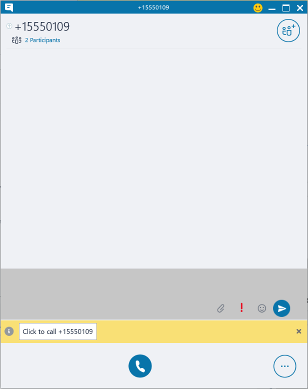
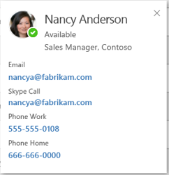

# Make calls or send instant messages in [!INCLUDE[pn-sales-business-doc-name](../includes/pn-sales-business-doc-name.md)], Preview

[!INCLUDE[cc-applies-to-update-9-0-0](../includes/cc-applies-to-update-9-0-0.md)]

[!INCLUDE[Pre-release disclaimer](../includes/cc-beta-prerelease-disclaimer.md)]

If your organization is set up to use Skype or Skype for Business, you can select a phone number to call your contacts from within [!INCLUDE[pn-sales-business-doc-name](../includes/pn-sales-business-doc-name.md)], Preview. This capability is called “click-to-call.”

If your organization is set up to use Skype for Business, you can also send instant messages to other users in your organization.

**Prerequisites**

-   You either need to [install Skype](http://go.microsoft.com/fwlink/p/?LinkID=246141); or you need to check with your system administrator for steps to install Skype for Business.  

-   You must be signed in to the client.

## Call a phone number using Skype or Skype for Business

When you have Skype or Skype for Business integrated, the phone numbers appear as links in [!INCLUDE[pn-crm-shortest](../includes/pn-crm-shortest.md)]. To make a call, hover over a phone number, and then select the phone icon. Based on the telephony provider your organization users, Skype or Skype for Business opens.

In Skype for Business, select **Click to Call**.

  

## Make a Skype Call

You can start a Skype call from the Skype contact card in [!INCLUDE[pn-sales-business-doc-name](../includes/pn-sales-business-doc-name.md)]. Select the Skype address under the Skype section to make a Skype call.

A Skype contact card is shown for all the [!INCLUDE[pn-crm-shortest](../includes/pn-crm-shortest.md)] users. A contact card appears when you move your mouse over the name of a user or their presence status.

  

## See the presence of users 

In [!INCLUDE[pn-crm-shortest](../includes/pn-crm-shortest.md)], you’ll be able to see the presence/availability status of other [!INCLUDE[pn-sales-business-doc-name](../includes/pn-sales-business-doc-name.md)] users as they appear in different forms, views, grids and subgrids. Here’s where you’ll be able to see their presence:

-   Sales team grid in Opportunity form

-   Owner field

-   User form

-   User grid

If your administrator has enabled Skype for Business, you will automatically be signed in to Skype for Business service. You’ll also be able to see the presence or availability status of other CRM users as they appear in different forms, views, grids and subgrids.

## Send an IM using Skype for Business

You can start an IM conversation from the Skype contact card in [!INCLUDE[pn-sales-business-doc-name](../includes/pn-sales-business-doc-name.md)].

To start a conversation with a user, select on the IM address in the contact card for the user.

### See Also
[Overview of Dynamics 365 for Sales, Preview](overview-dynamics-365-for-sales.md)  
[Set up click-to-call in [!INCLUDE[pn-sales-business-doc-name](../includes/pn-sales-business-doc-name.md)], Preview](configure-click-to-call.md)
