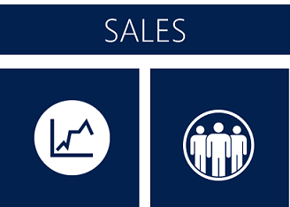
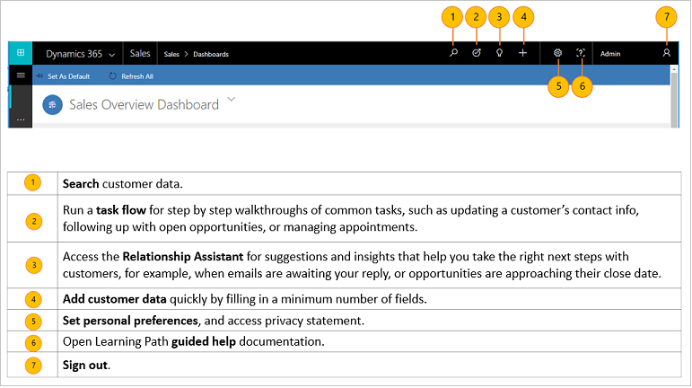
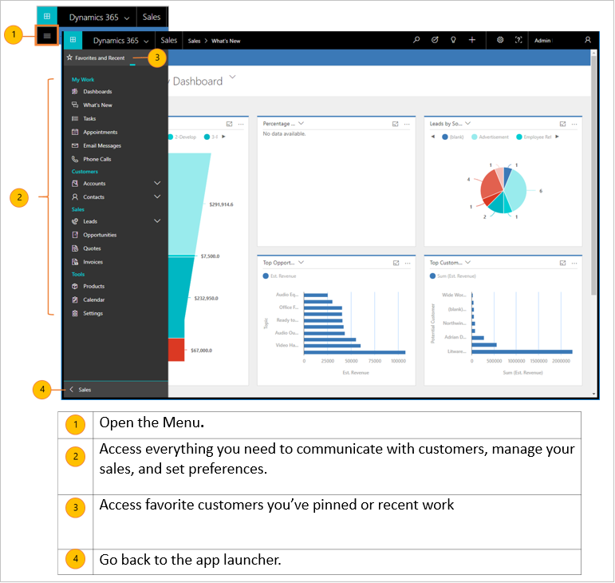
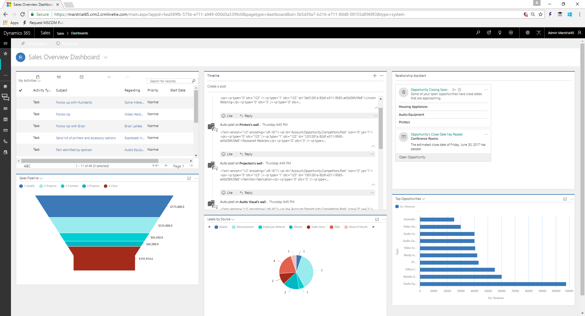
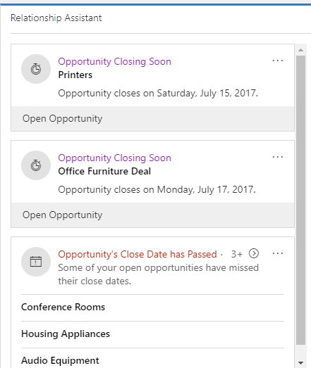
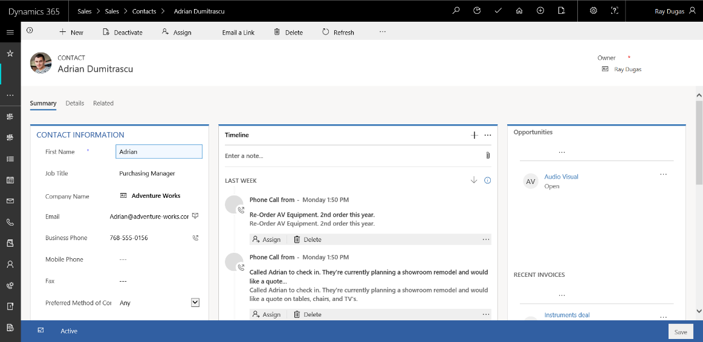
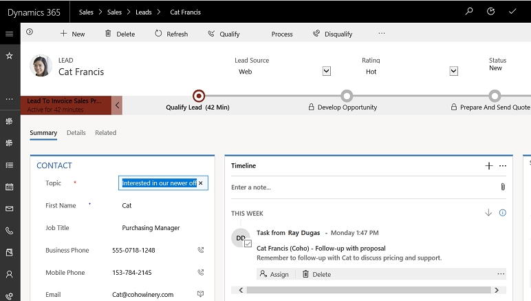
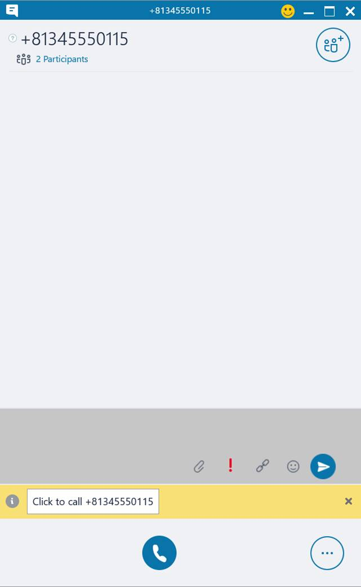
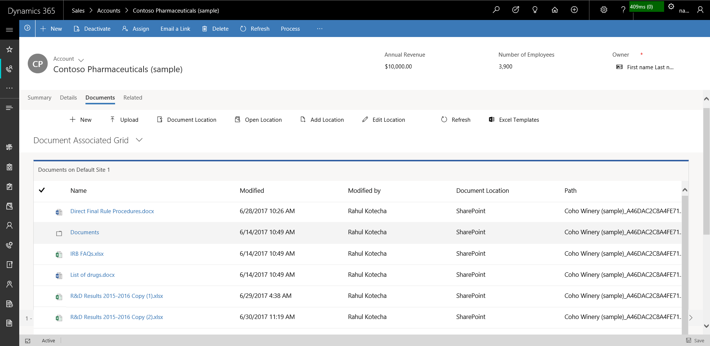

# Overview of Dynamics 365 for Sales, Preview

[!INCLUDE[cc-applies-to-update-9-0-0](../includes/cc-applies-to-update-9-0-0.md)]

[!INCLUDE[Pre-release disclaimer](../includes/cc-beta-prerelease-disclaimer.md)]

> [!IMPORTANT]
> [Learn about the usage and extensibility restrictions for Dynamics 365 for Sales, Preview](https://go.microsoft.com/fwlink/p/?linkid=850959).

Welcome to [!INCLUDE[pn-sales-business-doc-name](../includes/pn-sales-business-doc-name.md)], Preview. If you don't need a full-fledged enterprise app for your organization, the new [!INCLUDE[pn-sales-business-doc-name](../includes/pn-sales-business-doc-name.md)], Preview app is for you. 

This offering, available online-only and built on the new Unified Interface framework, contains a targeted set of sales capabilities to get your organization up and running quickly.

It is designed from the ground up with accessibility in mind, and uses responsive web design principles to provide an optimal viewing and interaction experience for any screen size, device, or orientation. For example, subgrids morph into lists for smaller screen sizes.

[!INCLUDE[pn-sales-business-doc-name](../includes/pn-sales-business-doc-name.md)], Preview comes with a wizard that simplifies the setup process, including connecting email, sharing documents,
and importing data.

Plus, sellers will find a streamlined lead to cash process, easier account, contact, and opportunity management, and dashboards that make it faster to visualize useful information at a glance.

## Get productive quickly

The app is designed to make getting up to speed simple and painless, whether you’re handling your day-to-day sales transactions or setting up the app for your team.  

What’s the fastest way to get productive? 

Here are a couple options:

-  **Dive in and try out the sample data.** If you learn best through your own hands-on exploration, the app comes with sample
data to help you see how data is presented and organized, and to give you something to experiment with as you get oriented. 

 Start clicking, take the guided tours, and play around with the sample data until you’re ready to work with your real customer data.

-  **Do a quick read that covers the basics.** The user guide contains all the essentials you need to know to navigate the app, find and enter customer data, glean actionable insights from interactive dashboards, and more. And it’s short. (We know you’re busy.)

No matter how you decide to get started, soon you’ll be up and running – working your deals and building profitable relationships along the way, as you turn your customers into lifelong fans of your products.

Ready to get started? 
First, we’ll cover basic navigation.

##  Find your way around the app

The Sales app is designed so that you can access the tools and customer data you need quickly when you need them.

###  Nav bar at the top

The nav bar at the top of every screen includes buttons for common tasks like searching for customer data or entering records. The nav bar also includes access to tools that help you manage your deals, such as a guided task flow that walks you through common sales tasks, or the Relationship Assistant that offers suggestions for the next steps to take with your customers.
Here’s a quick run-down of what you’ll find on the nav bar.

###  Menu on the side

Select the Site map icon to see a list of all your options in one place, including access to communication tools like email and Skype calling, customer records, your calendar, and settings. 
You’ll also find quick access to any favorite customers you’ve pinned and your recent work, so you don’t have to waste time backtracking.

##  Feature highlights

Here are some highlights of [!INCLUDE[pn-sales-business-doc-name](../includes/pn-sales-business-doc-name.md)], Preview

-   **Visual insights.** The out-of-the-box dashboards and charts have almost everything that you would need to get insight into your business. 

 [!INCLUDE[proc_more_information](../includes/proc-more-information.md)] [Gain insights with dashboards in [!INCLUDE[pn-sales-business-doc-name](../includes/pn-sales-business-doc-name.md)]](gain-insights-dashboards.md)

 

-  **Relationship Assistant.** With the new Sales app, you get actionable insights and suggestions based on how you work in the Sales app. You have an opportunity closing next week, fret not. The relationship assistant will give you a reminder to connect with your customer.
 
 
  
-  **Customer 360 view.** Once in the app, quickly get an overview of what’s happening with a customer, such as, see all the communications with the customer, progress of individual deals, and much more all in one place. 

 
 
-  **Business process flow.** The guided process flows on the Lead and Opportunity form tell you exactly what to do next. You can quickly find out the steps you must take to increase the likelihood of a successful sale, and thus increase the sales count. The process bar can be docked to the right side of the screen for an omnipresent experience while you work on the opportunity. 
 
 
 
-  **Activities timeline.** All the appointments you schedule while you work on an opportunity, the emails that you send or the phone calls you make are available in one place, giving you all the context you need to do your job. 
 
 
 
-  **Click-to-call.** Anytime while working on an opportunity, just select the customer’s phone number to launch a phone call. When you’re done with the call, a phone call form automatically opens so you can capture details about your conversation in the app. And all of this, in context of the opportunity you’re working on. 

 [!INCLUDE[proc_more_information](../includes/proc-more-information.md)] [Make calls or send instant messages in [!INCLUDE[pn-sales-business-doc-name](../includes/pn-sales-business-doc-name.md)]](make-calls-send-instant-messages.md)

 

-  **Store and view documents in context of records.** Do you have presentations or documents for an opportunity all over the place? Store them all in one place, so anyone who’s working on the opportunity can view them! 

 [!INCLUDE[proc_more_information](../includes/proc-more-information.md)] [Manage your SharePoint documents and document locations in Dynamics 365 for Sales](create-manage-documents.md)

 

-  **Simplified opportunity to invoice process.** It is easy to move a customer through the Sales funnel. Just generate a quote right from the opportunity you’re working on, and activate it. Use the same quote to quickly generate an invoice and mark the deal as won. You can also email the quotes and invoices to your customer in just one click. 

 [!INCLUDE[proc_more_information](../includes/proc-more-information.md)] [Develop sales from lead to cash in [!INCLUDE[pn-sales-business-doc-name](../includes/pn-sales-business-doc-name.md)]](create-manage-documents.md)

 

-  **Word templates.** The out-of-the-box templates ensure that the documents that you’re sending out to your customers align with you company’s brand. 

 [!INCLUDE[proc_more_information](../includes/proc-more-information.md)] [Create standardized documents with document templates in [!INCLUDE[pn-sales-business-doc-name](../includes/pn-sales-business-doc-name.md)]](use-document-templates-create-standardized-documents.md)

 

-  **Sales data anywhere and everywhere.** Get all your customer and sales data right on your mobile or tablet. Whether you are visiting a customer or are on the road, you can quickly pull out your device to update the opportunity with information. What’s more—you get the same, consistent experience regardless of the device you use.
 
 
### See Also
[Learn the basics](learn-basics.md)  
[Quick Setup & Advanced Settings Overview](quick-setup-advanced-settings-overview.md)
