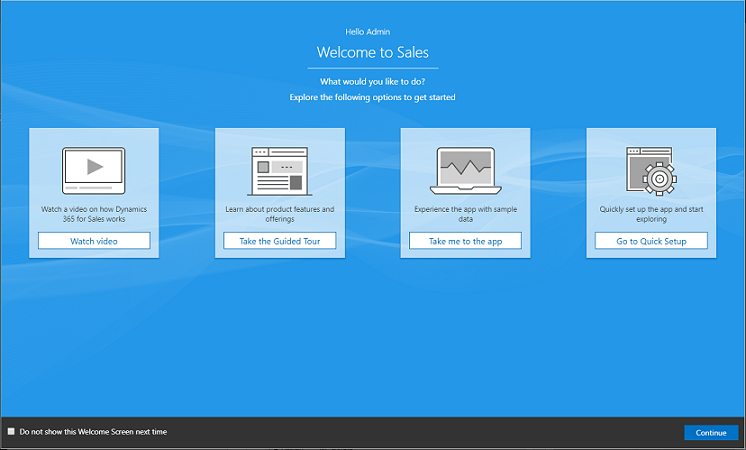
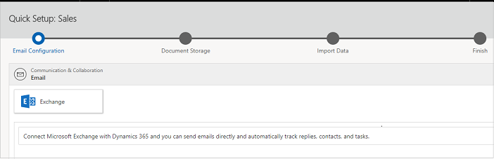
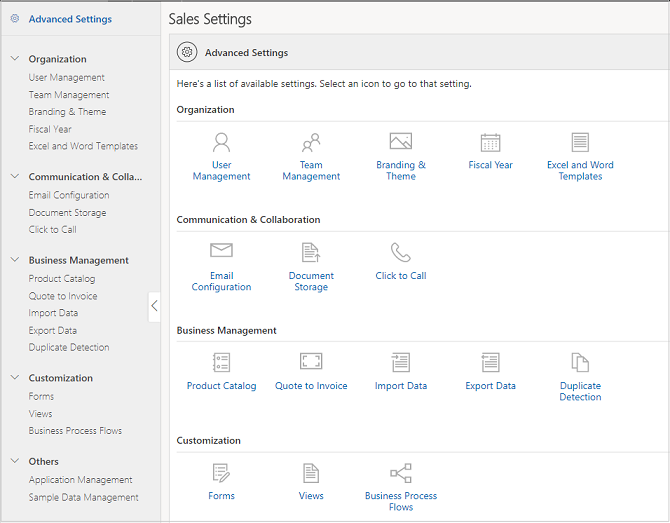
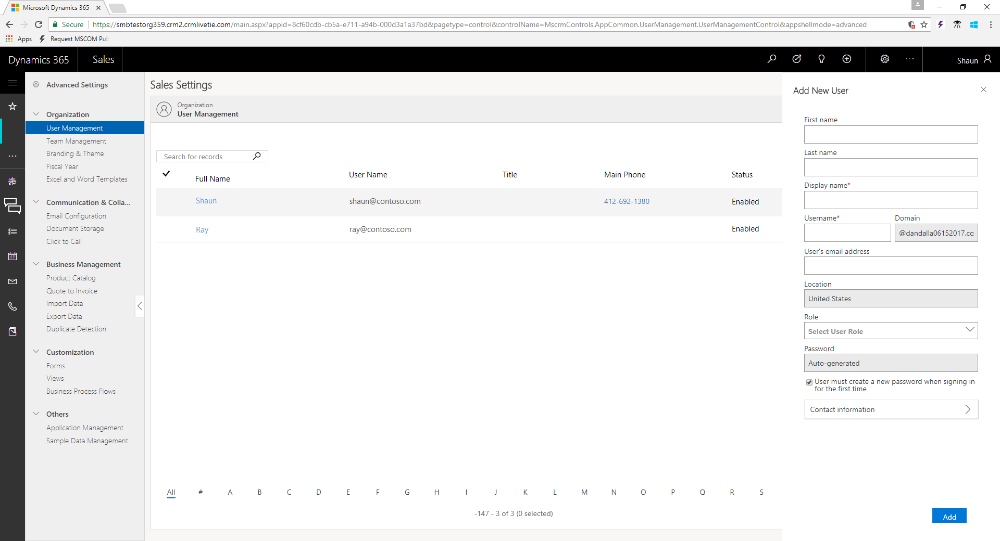
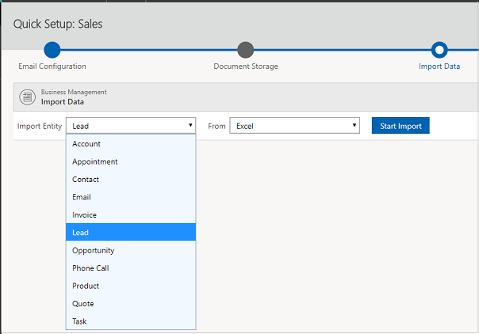
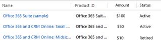
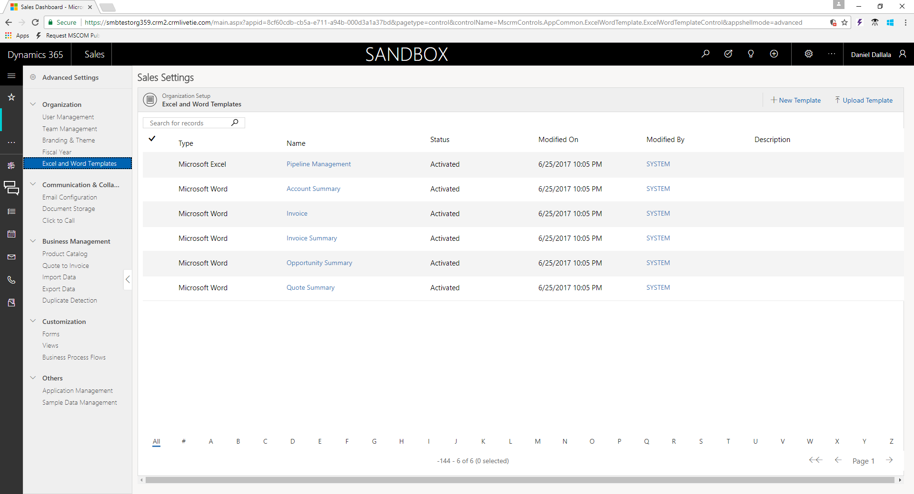
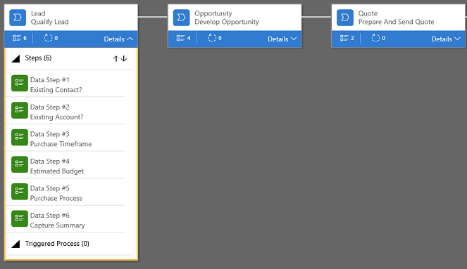

# Quick Setup & Advanced Settings overview 

[!INCLUDE[cc-applies-to-update-9-0-0](../includes/cc-applies-to-update-9-0-0.md)]

[!INCLUDE[Pre-release disclaimer](../includes/cc-beta-prerelease-disclaimer.md)]

Are you the person responsible for getting your sales team onboard?

Here’s some good news.

[!INCLUDE[pn-sales-business-doc-name](../includes/pn-sales-business-doc-name.md)], Preview comes with a simple and straightforward setup experience, so anybody can put things together and get their team rolling quickly.

## Welcome page

The Welcome page has resources to get you started. Watch a video to get an overview of the app, take a self-guided tour of the app, go to **Quick Setup** to start setting things up, or go directly to the app and start working.

 

## Onboarding wizard

 The Quick Setup provides an intuitive and guided experience of setting up the most important things with fewer clicks. With just one click, Exchange and SharePoint are automatically configured for you, and your users are ready to send out emails or share documents on SharePoint. The quick setup also lets you quickly import data, so your users have it ready in the app to start their work.

   

## All settings in one place 

 When you want to do more advanced-level settings to configure the app, or customize it to meet your organization’s requirements, **Advanced Settings** is your one-stop shop. You can find the settings for managing users, team, importing data, maintaining a product catalog all under one roof. The configurations are simple—you’ll be done with these in just fewer clicks.

   

- **Users and teams**. Got new people in your team? Add them as users in the Sales app and get them hit the ground running. It is very easy to create a user account in Dynamics 365 for Sales without having to go to Office 365.

  To have a group of people focus on selling a certain product, divide users into teams. 
  
  [!INCLUDE[proc_more_information](../includes/proc-more-information.md)] [Add or manage manage users in [!INCLUDE[pn-sales-business-doc-name](../includes/pn-sales-business-doc-name.md)]](add-edit-users.md)

   

- **Onboard your users**. When the users have their account set up, jumpstart training for them with these resources:

    -   User’s guide for [!INCLUDE[pn-sales-business-doc-name](../includes/pn-sales-business-doc-name.md)]

    -   Learning Path guided tasks in the app

        At the same time, give them some sample data to play with as they try and learn the Sales app to get them quickly onboarded.

- **Bring in real data**. When your team is ready, get your accounts, contacts, leads and products data into the app so they can start selling right away.

  [!INCLUDE[proc_more_information](../includes/proc-more-information.md)] [Import contacts, accounts, or leads into [!INCLUDE[pn-sales-business-doc-name](../includes/pn-sales-business-doc-name.md)]](import-data.md)

   

- **Product catalog management**. Help your team sell efficiently by creating and maintaining an up-to-date product inventory, so your team has an updated list of products your organization sells. You can add products manually, or import them in bulk through import.

  [!INCLUDE[proc_more_information](../includes/proc-more-information.md)] [Create a product catalog in [!INCLUDE[pn-sales-business-doc-name](../includes/pn-sales-business-doc-name.md)]](create-product-catalog.md)

   

- **Word and Excel Templates**. It is important that all documents that go out to your customers are consistent in look, and align with your organization’s branding. Save your team’s time and efforts by creating templates that they can use.

  [!INCLUDE[proc_more_information](../includes/proc-more-information.md)] [Create and manage Word templates in [!INCLUDE[pn-sales-business-doc-name](../includes/pn-sales-business-doc-name.md)]](create-manage-word-templates.md)

 

- **Customization**. If the Sales app does not entirely fit your business requirement, use the drag-and-drop designers to quickly make changes to the app to reflect the specific information that your company needs. For example, change the pipeline phases to match your organization’s business flows or add new fields to capture data relevant to your business—all of this without writing a single line of code.

   

### See Also
[Overview of Dynamics 365 for Sales, Preview](overview-dynamics-365-for-sales.md)  
[Learn the basics](learn-basics.md)  
