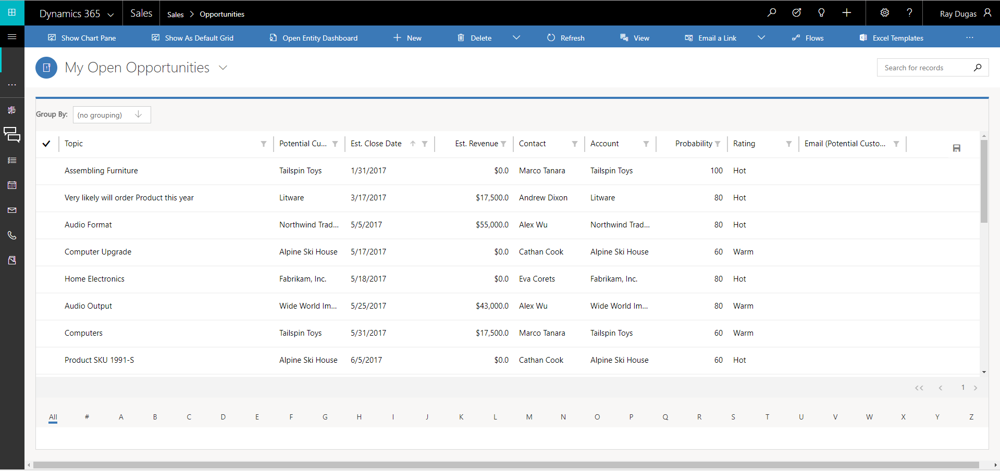

# Use document templates in [!INCLUDE[pn-ms-dyn-365-for-sales](../includes/pn-ms-dyn-365-for-sales.md)], Business edition to create standardized documents

[!INCLUDE[Pre-release disclaimer](../includes/cc-beta-prerelease-disclaimer.md)]

You can use both Word and [!INCLUDE[pn-excel-short](../includes/pn-excel-short.md)] templates in [!INCLUDE[pn-ms-dyn-365-for-sales](../includes/pn-ms-dyn-365-for-sales.md)] to create standardized documents for your customers.

## Generate a document from the Word template

To use the Word template you’ve created, do the following:

1.  Open a record with information you want to create a document. For example, open an account record.

2.  On the command bar, click **Word Templates**, and then under **Word Templates** select the template you created.

  If the template you created is not visible, there are two possibilities:

3.  Only templates built for the selected record type (entity) will be displayed. For example, if you open an opportunity record, you will not see a template you created with the Account entity.

4.  You need to refresh the page to see the template. Either refresh your browser or close and reopen [!INCLUDE[pn-ms-dyn-365-for-sales](../includes/pn-ms-dyn-365-for-sales.md)].

  After you select your Word template, [!INCLUDE[pn-ms-dyn-365-for-sales](../includes/pn-ms-dyn-365-for-sales.md)] creates a Word document from the record you selected.

### Try out the sample Word templates

There are five ready-to-use Word templates included with [!INCLUDE[pn-ms-dyn-365-for-sales](../includes/pn-ms-dyn-365-for-sales.md)].

] templates](media/excel-word-templates.png "Document template list showing all Word and [!INCLUDE[pn-excel-short](../includes/pn-excel-short.md)] templates")  

The sample Word templates were created with a specific record type (entity). You’ll only be able to apply the template to records of the same record type.

| **Name**            | **Entity**  |
|---------------------|-------------|
| Account Summary     | Account     |
| Invoice             | Invoice     |
| Invoice Summary     | Invoice     |
| Opportunity Summary | Opportunity |
| Quote Summary       | Quote       |

To apply a sample Word template

1.  Open a record with information with the entity type that matches the sample template. For example, open a customer account record in Sales to apply the Account Summary template.

2.  Click **More** (**…**) **&gt; Word Templates**, and then under **Word Templates** select the sample template and then open the newly-created template.

  > [!Note]

  > Templates that are included in [!INCLUDE[pn-ms-dyn-365-for-sales](../includes/pn-ms-dyn-365-for-sales.md)] are read-only and cannot be changed.

## Export and analyze data using the [!INCLUDE[pn-excel-short](../includes/pn-excel-short.md)] template 

The process for using an [!INCLUDE[pn-excel-short](../includes/pn-excel-short.md)] template looks like this.

] template](media/steps-to-use-excel-template.png "Steps to use an [!INCLUDE[pn-excel-short](../includes/pn-excel-short.md)] template")  

### Step 1: Select an entity to analyze

In [!INCLUDE[pn-ms-dyn-365-for-sales](../includes/pn-ms-dyn-365-for-sales.md)], select a record type (entity) to analyze with the [!INCLUDE[pn-excel-short](../includes/pn-excel-short.md)] template you created.

For example, go to **Sales** &gt; **Opportunities** &gt; **My Open Opportunities**.

  

### Step 2: Export [!INCLUDE[pn-ms-dyn-365-for-sales](../includes/pn-ms-dyn-365-for-sales.md)] data using your new [!INCLUDE[pn-excel-short](../includes/pn-excel-short.md)] template

Choose the [!INCLUDE[pn-excel-short](../includes/pn-excel-short.md)] template you created. Click **[!INCLUDE[pn-excel-short](../includes/pn-excel-short.md)] Templates** &gt; &lt;template name&gt;.

] template on opportunity record](media/choose-excel-template-option-on-opportunity.png "Choose the Pipeline Management [!INCLUDE[pn-excel-short](../includes/pn-excel-short.md)] template on opportunity record")  

### Step 3: Analyze your [!INCLUDE[pn-ms-dyn-365-for-sales](../includes/pn-ms-dyn-365-for-sales.md)] data in [!INCLUDE[pn-excel-short](../includes/pn-excel-short.md)]

What you see in the [!INCLUDE[pn-excel-short](../includes/pn-excel-short.md)] spreadsheet is based on two things:

- **Rows**. The view you choose to export from determines what records or rows you see in the exported [!INCLUDE[pn-excel-short](../includes/pn-excel-short.md)] file. For example, if you selected Closed Opportunities, you’ll see those records even if you used the template created with My Open Opportunities.

- **Columns**. The columns correspond to the fields in a record. The template you used determines what columns appear in the table in the exported [!INCLUDE[pn-excel-short](../includes/pn-excel-short.md)] file. For example, the Closed Opportunities view has these columns: Potential Customer, Status, Actual Revenue, and Actual Close Date. But if the template you used was based on My Open Opportunities, you’d see columns associated with that view and any column filtering done when you created the template.

### Step 4: Share the results with others

Save a copy either online or to your computer. Send the file to others for their review and input.

### Try out the sample [!INCLUDE[pn-excel-short](../includes/pn-excel-short.md)] template

There’s a ready-to-use [!INCLUDE[pn-excel-short](../includes/pn-excel-short.md)] template included with [!INCLUDE[pn-ms-dyn-365-for-sales](../includes/pn-ms-dyn-365-for-sales.md)].

] templates](media/excel-word-templates.png "Document template list showing all Word and [!INCLUDE[pn-excel-short](../includes/pn-excel-short.md)] templates")  

The sample [!INCLUDE[pn-excel-short](../includes/pn-excel-short.md)] template is created specifically for the opportunity records. You’ll only be able to apply the template to opportunity records.

To apply a sample [!INCLUDE[pn-excel-short](../includes/pn-excel-short.md)] template

1.  Go to list of opportunities.

2.  On the command bar, click **[!INCLUDE[pn-excel-short](../includes/pn-excel-short.md)] Templates**, and then under **[!INCLUDE[pn-excel-short](../includes/pn-excel-short.md)] Templates**, select the sample template.

3.  Download the template or open it in place in [!INCLUDE[pn-excel-short](../includes/pn-excel-short.md)].

> [!Tip]

> You can export the templates that are included in [!INCLUDE[pn-ms-dyn-365-for-sales](../includes/pn-ms-dyn-365-for-sales.md)], modify them, and then reimport them as new templates. This can give you a running start on creating your own custom [!INCLUDE[pn-excel-short](../includes/pn-excel-short.md)] templates.

### See Also
[Manage Excel templates in [!INCLUDE[pn-ms-dyn-365-for-sales](../includes/pn-ms-dyn-365-for-sales.md)]](create-manage-excel-templates.md)  
[Manage Word templates in [!INCLUDE[pn-ms-dyn-365-for-sales](../includes/pn-ms-dyn-365-for-sales.md)]](create-manage-word-templates.md)  [Meet the Sales app for small to medium-sized business](introduction-dynamics-365-for-sales-business-edition.md)  
