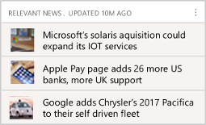
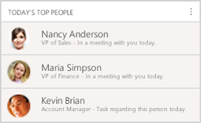

# Action cards reference

Applies to Dynamics 365 (online), version 9.0.2 

*Action cards* help keep you up to date with your work in [!INCLUDE[pn_dynamics_crm](../includes/pn-dynamics-crm.md)], letting you know when you need to follow up on an email, attend a meeting,  and much more. They are displayed throughout the application to provide relevant information for the context you are working in at the moment. They are generated by the relationship assistant based on data stored in [!INCLUDE[pn_dynamics_crm](../includes/pn-dynamics-crm.md)] and your [!INCLUDE[pn_Exchange](../includes/pn-exchange.md)] inbox and calendar ([!INCLUDE[proc_more_information](../includes/proc-more-information.md)] [ Relationship assistant](../sales-enterprise/relationship-assistant.md)). This topic lists each of the available cards and provides details about what each card does, how it gets generated, and how you can use it.  
  
 The administrator must enable the relationship assistant before you can try it out. For complete details about prerequisites, how to enable the feature, and how to set it up, see [Configure and enable embedded intelligence](../sales-enterprise/embedded-intelligence.md).  
  

## Base cards  

Base cards relate to the core features of [!INCLUDE[pn_microsoftcrm](../includes/pn-microsoftcrm.md)].   

> [!NOTE]
> - These cards are always available, regardless of which email server you are using.
> - These cards are for both online and on-premises versions of [!INCLUDE[pn_microsoftcrm](../includes/pn-microsoftcrm.md)]. 
> - These are the only action cards that are available for [!INCLUDE[pn_crm_op_edition](../includes/pn-crm-onprem.md)].
> - These cards use [!INCLUDE[pn_microsoftcrm](../includes/pn-microsoftcrm.md)] data.
  
|||  
|-|-|  
|**Close date coming soon**    |- **Description**      Tells you that an open opportunity will soon reach its estimated close date. When you are viewing a dashboard, you'll only see these cards for opportunities that are assigned to you, but when you view a specific opportunity you'll see this card even if that opportunity is assigned to somebody else. - **Configuration options**      Set how many days before the close date to start showing the card. The default value is set by your administrator. - **Features**      Identifies the opportunity.      Tells how far away the close date is.      Provides text explaining why the card was generated. - **Actions**      Open the opportunity.|  
|**{Activity} due today**    |- **Description**      Tells you that an activity assigned to you is due today. Activity types include: email, fax, letter, phone call, task, service appointment, and custom. - **Features**      Indicates the type of activity (email, fax, letter, phone call, task, service appointment, or custom).      Shows the time the activity is due or scheduled.      Shows the name of the activity record (click to open the record).      Shows the activity description (shortened for space if needed). - **Actions**      Mark the activity complete.      Close the activity.|  
|**Meeting today**    |- **Description**      Tells that you have a meeting scheduled for today.      There is also an "upcoming meeting" card, which first appears 30 minutes before your meeting, provides more features, and is given a higher priority. [!INCLUDE[proc_more_information](../includes/proc-more-information.md)] [Productivity cards](#ProductivityCards) - **Features**      Shows the meeting title, with a link to the meeting record.      Shows the meeting description (shortened for space if needed).      Open the detailed view to see a collection of closely related action cards, including relevant people, companies, opportunities, news, stocks, and more. - **Actions**      Open the appointment|  
|**Missed close date**    |- **Description**      Tells you that an open opportunity has passed its close date. When you are viewing a dashboard, you'll only see these cards for opportunities that are assigned to you, but when viewing a specific opportunity you'll see this card even if that opportunity is assigned to somebody else. - **Features**      Identifies the opportunity.      Provides text explaining why the card was generated. - **Actions**      Open the opportunity.|  
|**Post-meeting follow-up**    |- **Description**      Tells you that a meeting that you organized (where you are the record owner) has recently ended, giving you an easy opportunity to document the meeting in [!INCLUDE[pn_crm_shortest](../includes/pn-crm-shortest.md)]. - **Features**      Identifies the meeting.      Provides text explaining why the card was generated. - **Actions**      Add notes to the meeting record.      Open the meeting record.|  
  
   

## Email cards from Exchange  
 These action cards are generated based on an analysis of email messages in your [!INCLUDE[pn_Microsoft_Exchange](../includes/pn-microsoft-exchange.md)] inbox.  
  
 When you receive an email, [!INCLUDE[pn_Exchange](../includes/pn-exchange.md)] and [!INCLUDE[pn_crm_shortest](../includes/pn-crm-shortest.md)] work together to scan the body of the email looking for certain words or phrases that suggest that the email is related to your [!INCLUDE[pn_crm_shortest](../includes/pn-crm-shortest.md)] work.  
  
 When the system finds relevant text, it generates an action card  to notify you of a possible action for you to take. Each signal type has its own card, which provides the information and action links best suited for that signal type.  

> [!IMPORTANT]
> - These cards only available if you are using [!INCLUDE[pn_dynamics_crm_online](../includes/pn-dynamics-crm-online.md)] with [!INCLUDE[pn_Microsoft_Exchange_Online](../includes/pn-microsoft-exchange-online.md)] as your email server. 
> - You will need to [set up server-side-sync](../admin/set-up-server-side-synchronization-of-email-appointments-contacts-and-tasks.md).  
  
|||  
|-|-|  
|**Competitor mentioned**    |- **Description**      A tracked email that is set as regarding a [!INCLUDE[pn_crm_shortest](../includes/pn-crm-shortest.md)] opportunity appears to refer to a company that is listed as a competitor in your system. - **Configuration options**      Set this feature to add the competitor automatically rather than showing the card. - **Features**      Shows the name of the competitor      Tells you that a competitor was mentioned in an email.      Click the card to open the opportunity that the email is set to be regarding. - **Actions**      Choose **Add as Competitor** to add the competitor to the regarding opportunity.      Choose **Always Do This** to add competitors automatically instead of showing more cards like this. This is the same as the configuration setting available for this card type, and you can reset it by going to your **Relationship Assistant** settings ([!INCLUDE[proc_more_information](../includes/proc-more-information.md)] [Relationship assistant](../sales-enterprise/relationship-assistant.md)).|  
|**Customer question**    |- **Description**      An email from a known contact in your inbox appears to be asking a  question. - **Features**      Shows the name of the contact.      Tells you that a question has arrived.      Displays the sentence from the email that appears to be asking a simple question. - **Actions**      Open the email.|  
|**File requested**    |- **Description**      An email from a known contact in your inbox appears to include a request for a file. - **Features**      Shows the name of the contact.      Tells you that a request for a file has arrived.      Displays the sentence from the email that appears to be asking for a file. - **Actions**      Open the email.|  
|**Important email**    |- **Description**      An email from a known contact in your inbox appears to include an important or complex question. - **Features**      Shows the name of the contact.      Tells you that an important email has arrived.      Displays the sentence from the email that appears to be asking an important or complex question. - **Actions**      Open the email.|  
|**Issue detected**    |- **Description**      An email from a known contact in your inbox appears to include a support request. - **Features**      Shows the name of the contact.      Tells you that an email that appears to include a support request has arrived.      Displays the sentence from the email that appears to be asking for help. - **Actions**      Create a new case.      Open the email.|  
|**Meeting requested**    |- **Description**      An email from a known contact in your inbox appears to include a meeting request. - **Features**      Shows the name of the contact.      Tells you that a meeting request has arrived.      Displays the sentence from the email that appears to be asking for a meeting. - **Actions**      Create a new meeting.      Open the email.|  
|**New lead/upsell opportunity**    |- **Description**      An email from a known or unknown contact appears to be asking for more information about a product. For known contacts, this may be an upsell opportunity. For unknown contacts, this could be a new lead. - **Features**      Shows the name of the sender.      Tells you that an email has arrived that may represent an upsell or new-lead opportunity.      Displays the sentence from the email that appears to be asking for product information. - **Actions**      Open the email.|  
|**Stakeholder recommendation**    |- **Description**      An email regarding an open opportunity has arrived, and it includes an extra recipient that is not yet listed as a stakeholder for that opportunity. - **Configuration options**      You can choose to add the stakeholder automatically rather than show the card. - **Features**      Shows the name of the potential stakeholder      Tells you that this person might be a stakeholder in an open opportunity      Displays a short description that includes the name of the opportunity. - **Actions**      Add the contact as a stakeholder for the related opportunity.      Choose **Always Do This** to add stakeholders automatically instead of showing more cards like this. This is the same as the configuration setting available for this card type, and you can reset it by going to your **Relationship Assistant** settings ([!INCLUDE[proc_more_information](../includes/proc-more-information.md)] [Relationship assistant](../sales-enterprise/relationship-assistant.md)).|  
  
   

## Relationship analytics cards  
 These action cards provide reminders when it looks like one of your business relationships needs nurturing due to a lack of recent activity. 

> [!NOTE]
> - These cards are only available for [!INCLUDE[pn_dynamics_crm_online](../includes/pn-dynamics-crm-online.md)]. 
> - These cards use [!INCLUDE[pn_microsoftcrm](../includes/pn-microsoftcrm.md)] data.
 
|||  
|-|-|  
|**No activity with {record type}**    |- **Description**      Lets you know that a record that you own has been inactive for some time. Applies to contact, opportunity, lead, account, and case records. - **Configuration options**      Set the number of days of inactivity that must pass before a card is generated. You can set a different value for each type of supported record (contact, opportunity, lead, account, and case). - **Features**  Identifies the type and name of the relevant record.      Explains why the card was generated. - **Actions**      Open the record.      Create an email addressed to the primary contact for the record.|  
  
   

## Email engagement cards  
 These cards are generated by the email engagement feature (provided it's supported by your server configuration and enabled for your site). 
  
> [!NOTE]
> - These cards are only available for [!INCLUDE[pn_dynamics_crm_online](../includes/pn-dynamics-crm-online.md)]. 
> - These cards are only available if email engagement is enabled. [!INCLUDE[proc_more_information](../includes/proc-more-information.md)] [Email engagement](../sales-enterprise/email-engagement.md)
 

|||  
|-|-|  
|**Email opened**    |- **Description**      A followed email was opened by its recipient. - **Features**      Names the contact you sent the email to.      Provides descriptive text that shows the subject of the email, the time it was opened, and the approximate location where it was opened. - **Actions**      Call the contact      Open the contact record|  
|**Email reminder**    |- **Description**      You set a followup reminder for an email you recently sent, and its trigger conditions have just been met. Trigger conditions always include a date, but may also include conditionals such as whether the email wasn't opened or replied to by that date. - **Features**      Names the contact that you sent the email to.      Tells you that you set a followup reminder for this email.      Provides a description that summarizes the trigger conditions. - **Actions**      Open the contact record      Call the contact|  
  
   

## Productivity cards  
 Productivity cards provide information that is relevant to your location and upcoming plans, plus additional information related to those. 

> [!NOTE]
> - These cards are only available for [!INCLUDE[pn_dynamics_crm_online](../includes/pn-dynamics-crm-online.md)]. 
> - These cards are only displayed on mobile devices.  
> - These cards are not available for the [Microsoft Cloud Germany datacenter](../admin/datacenter/about-microsoft-cloud-germany.md).
 
|||  
|-|-|  
|**Nearby Customers**    |- **Description**      The card finds customers that are located nearby the meeting location. It's  shown in the card details view when you tap a meeting card from the relationship assistant feed. - **Features**      Shows the name of the nearest city.      Shows basic information about each company.|  
|**Relevant News**    |- **Description**      The card displays new headlines related to companies that are participating at the meeting. It's  shown in the card details view when you tap a meeting card from the relationship assistant feed. - **Features**      Shows the date when the news was last updated.      Thumbnail image and headline for each found article.      Click to view the full article.|  
|**Stock Updates**    |- **Description**      The card displays stock information for companies that are participating at the meeting. It's  shown in the card details view when you tap a meeting card from the relationship assistant feed. - **Features**      Shows the date and time the prices were last updated.      For each company, shows a logo, stock symbol, price, and trend.|  
|**Upcoming Flight**    |- **Description**      This card is generated when your [!INCLUDE[pn_Exchange](../includes/pn-exchange.md)] inbox includes an email message that contains a flight confirmation. The system then matches the flight dates to upcoming meetings and finds other information related to the location that you are flying to, such as other nearby customers.  **Note:**      This card doesn't show live or updated flight information, just information from the flight confirmation email message that triggered the card. - **Features**      Flight company and flight number, with a link to the flight record.      Departure and arrival times, with airport codes.      Related meeting record, with link. Up to three meetings may be listed here.      List of customer offices near the destination airport, with links. - **Actions**      Open a related email message with flight details (if available).|  
|**Upcoming Meeting**    |- **Description**      Tells that you have a meeting scheduled to start in 30 minutes or less. When available, this card is given highest priority and appears at the top of the stack. That way, you'll have all of your   important meeting information available.      The "meeting today" card is similar, but it's shown all day, provides fewer features, and is given lower priority. [!INCLUDE[proc_more_information](../includes/proc-more-information.md)] [Base cards](#BaseCards) - **Features**      Shows the meeting title, with a link to the meeting record.      Shows the meeting description (shortened for space if needed).      Shows the regarding record (with link).      Shows a list of attendees (with link to the full list if there's more than four).      Displays a map of  the location (if relevant and available; not for online meetings).      Open the detailed view to see a collection of closely related action cards, including relevant people, companies, opportunities, news, stocks, and more. - **Actions**      Open the appointment that triggered the card.|  
  
   

## "Today" cards  
 "Today" cards capture information that is related to your plans for today. 

> [!NOTE]
> - These cards are only available for [!INCLUDE[pn_dynamics_crm_online](../includes/pn-dynamics-crm-online.md)]. 
> - These cards use [!INCLUDE[pn_microsoftcrm](../includes/pn-microsoftcrm.md)] data.
  
|||  
|-|-|  
|**Recent meeting**    |- **Description**      Tells you that a meeting that you organized (where you are the record owner) has recently ended, giving you an easy opportunity to document the meeting in [!INCLUDE[pn_crm_shortest](../includes/pn-crm-shortest.md)]. The card is displayed for 30 minutes after the scheduled end of the meeting, and then removed. - **Features**      Identifies the meeting.  Provides text explaining why the card was generated. - **Actions**      Add notes to the meeting record.      Open the meeting record.|  
|**Today's Top People**    |- **Description**      This card is only displayed on mobile devices.      The system analyzes your appointments, tasks, and other work for the day and generates this card to show the contacts you're most likely to interact with today. - **Features**      Shows each contact's  name and portrait.      Shows each contact's title and any business they have with you today (such as a meeting, task, or phone call).      Click to view full contact details.|  
|**Today's Top Records**     |- **Description**      This card is only displayed on mobile devices.      The system analyzes all of the [!INCLUDE[pn_crm_shortest](../includes/pn-crm-shortest.md)] records that are related to you and lists the records that you are most likely to be working with today based on your recent activities and date information (such as a due date or appointment)   in each record. - **Features**      Shows a thumbnail image and a summary of each found record.      Click to view the full record.|  
 
## Insufficient permissions
If you see an alert about having insufficient permissions to use an action card, take these steps:

1. Go to **Settings** > **Security** > **Security Roles**.
2. Choose the user role viewing the action cards.
3. Choose the **Core Records** tab.
4. Set the privileges to Read and Write access for **Action Card** and **Action Card User Settings**.

 
   

## Privacy notice  
[!INCLUDE[cc_privacy_relationship_insights_relationship_assistant](../includes/cc-privacy-relationship-insights-relationship-assistant.md)]

### See also

[Use relationship assistant to guide customer communications](../sales-enterprise/relationship-assistant.md)
