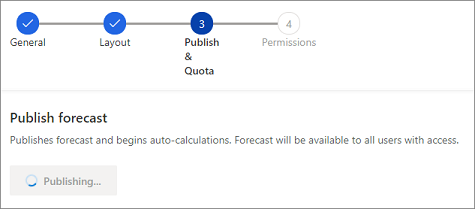
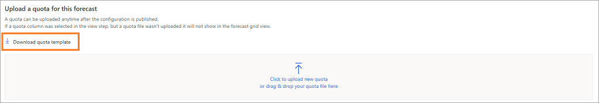

# Activate and upload simple columns data

Use the **Activate & add quotas** step to activate the forecast and make it available for users. After the forecast is active, you can download a template (Excel workbook) and upload it back with data, such as quotas and sample column types for all users who are defined in the forecast hierarchy.

> [!IMPORTANT]
> At a time, you can have only six active forecasts in your organization.

1. In the **Activate forecast** section, select **Activate forecast**. The configured forecast starts calculating the values for forecast and becomes available for users in your organization. The activation might take a few minutes.
    
   > [!div class="mx-imgBorder"]
   > 
    
   After a forecast is activated, a confirmation message is displayed and the option to download the quota template becomes available.

    > [!NOTE]
    > Forecast auto-recalculation works only when the forecast is active. If the last period of the forecast has just lapsed, the forecast will continue auto-recalculating for 30 more days and then will stop.

2. In the **Upload quota and other static data for this forecast** section, select **Download simple data column template**. A template (Excel workbook) showing users in the hierarchy is downloaded to your local computer.
 
   > [!div class="mx-imgBorder"]
   > 

   The naming convention of the downloaded workbook is  ***forecastname*_Simple.xlsx**. For example, if you've created a forecast with the name **Kenny's Org FY 2020 Forecast**, the name of the downloaded workbook is **Kenny's Org FY 2020 Forecast_Simple.xlsx**.

3. Open the downloaded Excel workbook.

    The workbook is divided into groups of two tabs, **Direct** and **Parent**. The groups depend on the simple columns you've configured for the forecast. Each tab consists of the following columns: **Record Id**, **Hierarchy** field (and any hierarchy-related columns), and each forecast period (depends on the number of periods you've selected for the forecast). 

    For example, if you've configured a forecast by using two **Simple** columns&mdash;**Quota** and **Committed**&mdash;and specified the number of periods as **4** in 2020, the downloaded workbook will consist of four tabs: **Quota (Direct)**, **Quota (Parent)**, **Committed (Direct)**, and **Committed (Parent)**. Each tab consists of six columns – **Record Id**, **User**, **FY2020 Q1**, **FY2020 Q2**, **FY2020 Q3**, and **FY2020 Q4**.

    > [!div class="mx-imgBorder"]
    > 

    - ***Column* (Direct)** tab: This tab shows all the sales reps or territories (also called leaf nodes) in the forecasting hierarchy. Enter the forecast values. After you upload the workbook, the values will be displayed under their respective columns in the forecast grid. The values you enter for managers or parent territories on the **Direct** tab won't affect the values that you enter on the **Parent** tab (a manager or parent territory can also be working on opportunities and will have certain values as an individual).

    - ***Column* (Parent)** tab: This tab shows anyone who has direct reports in the selected hierarchy. A manager or parent territory has at least one direct report. Enter the values you want, and when the workbook is uploaded, the values will be shown under their respective columns in the forecast grid for managers or parent territories (a level above individuals).

    > [!IMPORTANT]
    > Don't change the **Record Id** values in the workbook. If they're changed, the forecast will display inaccurate values.

4. Save and close the workbook.

5. In the **Upload quota and other static data for this forecast** section, select the option to browse and upload, or drag the workbook to the upload area. You can verify the status at the bottom of the upload area.

6. After the workbook is uploaded, select **Finish**.

You're directed to the **Forecast configuration** home page, where your organization's forecasts are listed.

>[!NOTE]
>You can also upload data to simple columns using the **msdyn_ForecastApi** action. To learn more, see [msdyn_ForecastApi](../sales-enterprise/developer/reference/custom-actions/msdyn_ForecastApi.md).

<table>
<tr><td>

> [!div class="nextstepaction"] 
> [Previous step: Choose layout and columns](choose-layout-and-columns-forecast.md)
</td></tr>
</table>

### See also

[Configure forecasts in your organization](configure-forecast.md)

[msdyn_ForecastApi](../sales-enterprise/developer/reference/custom-actions/msdyn_ForecastApi.md)
