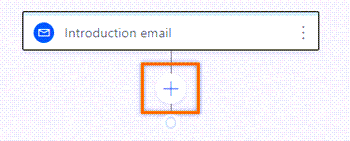
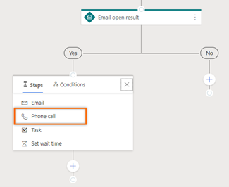
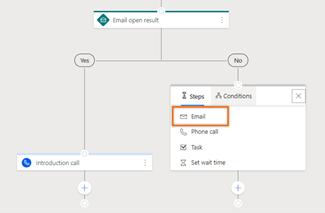
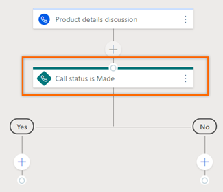
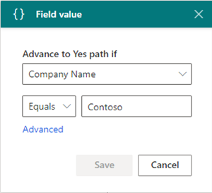
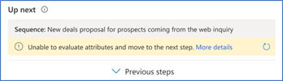
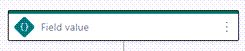
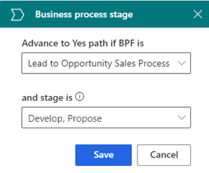

# Adaptive sequences

Use *adaptive sequences* to define conditions for the steps in a sequence. These conditions determine the course of action the sequence will take after the condition is either met or not. After the result of a condition is determined&mdash;for example, whether a user opened an email (**Yes**) or didn't (**No**)&mdash;the sequence proceeds as you designed it. Conditions are available for the following activities:

- [Email](#define-conditions-for-email-activity)
- [Phone call](#define-conditions-for-phone-call-activity)
- [Field value](#define-conditions-for-field-values)
- [Business process stage](#define-conditions-for-business-process-stage)

## Prerequisite

Conditions in the adaptive sequences work as defined only when **Adaptive Sequence Timeout Flow** process is enabled. To enable the process, follow these steps:     
1. Go to [Power Automate](https://flow.microsoft.com) and change the environment to your organization.   
2. Select **Solutions** and then select the view as **All** and search for **Sequence**.   
    >[!div class="mx-imgBorder"]
    >    

3. Open the **Sequence** solution page and select **Adaptive Sequence Timeout Flow** process.   
4. On the **Adaptive Sequence Timeout Flow** page, select **Turn on**.   
    >[!div class="mx-imgBorder"]
    >    

    The process is enabled.

## Define conditions for an email activity

When you add an email activity to a sequence and select **Add** (**+**), the activity selection box displays the **Conditions** tab, where you determine the next course of action in the sequence.

When the seller skips an email activity that includes a condition, the flow follows the **No** path.

>[!IMPORTANT]
>- You need to [configure the email engagement feature](configure-email-engagement.md) in your organization before you start using conditions for the email activity. The interactions that customers have with emails are displayed in the condition list.
>- [Enable linking sequence steps and activities](personalize-sales-accelerator.md#enable-linking-sequence-steps-and-activities) to create conditions for email activities.

The following table lists the interactions that are available in email conditions.

| Interaction | Description |
|-------------|-------------|
| Email open | If a customer opens the email, the flow follows the **Yes** path. If not, the **No** path is followed. |
| Recipient reply | If a customer replies to the email, the flow follows the **Yes** path. If not, the **No** path is followed. |
| Link opened | If a customer opens a link that's included in the email, the flow follows the **Yes** path. If not, the **No** path is followed. |
| Attachment downloaded | If a customer downloads an attachment that's linked to your email, the flow follows the **Yes** path. If not, the **No** path is followed. |

Let's define a flow so that if a customer opens your email, the next step is to schedule a phone call, and if the customer doesn't open your email, the next step is to send a reminder email.

1.	Select **Add** (**+**) after the email activity.   
    >[!div class="mx-imgBorder"]
    >    
2.	In the activity selection box, select the **Conditions** tab.
    A list of interactions that are defined in the email engagement feature is displayed.      
    >[!div class="mx-imgBorder"]
    >    
3.	Select **Email open**.     
4.	On the **Email open result** step, configure the time limit for satisfying the condition before proceeding to the next step. 
    In the following example, we configure the wait time as one day. This establishes the following:     
    - If the customer opens the email within the day, the **Yes** path is initiated and the sequence moves to the next step after a day has passed.   
    If you don't want to wait a day to move to the next step in the **Yes** path, select the **If the action is completed within the time limit, the sequence will move to the yes path** checkbox.
    - If the customer doesn't open the email within the time limit, the **No** path is executed.   
    >[!div class="mx-imgBorder"]
    >     
5.	Select **Save**. The condition is created.     
    >[!div class="mx-imgBorder"]
    >      
6.	To schedule a phone call activity in the **Yes** path to talk with the customer, do the following:    
    1.	Select **Add** (**+**), and then under **Steps**, select **Phone call**.     
        >[!div class="mx-imgBorder"]
        >     
    2.	Create the phone call activity, and then save the step.     
        >[!div class="mx-imgBorder"]
        >      
7.	To send a follow-up email in the **No** path when the customer doesn't respond within the time limit of one day, do the following:     
    1.	Select **Add** (**+**), and then under **Steps**, select **Email**.    
        >[!div class="mx-imgBorder"]
        >     
    2.	Create the email activity, and then save the step.     
        >[!div class="mx-imgBorder"]
        >     

>[!NOTE]
>You can't delete a step that's followed by a condition. To delete such a step, remove the condition and then delete the step. 

## Define conditions for a phone call activity

When you add phone call activity to the sequence and select **Add** (**+**), the activity selection box displays the **Conditions** tab, where you define the next course of action in the sequence. The actions that can be performed on a phone call activity are displayed in the condition list. However, these actions vary from organization to organization depending on their requirements, and are added by the administrator.

When the seller skips a phone call activity that includes a condition, the flow follows the **No** path.

>[!NOTE]
>To learn about adding custom status for your organization, see [Define status reason transitions for the Case or custom tables](/powerapps/maker/data-platform/define-status-reason-transitions).

Let's define a flow so that when a seller makes a call to discuss product details with a customer and changes the status of the phone call to **Made**, an email must be sent with more details about the product for the customer to proceed further with the deal. If the call status is other than **Made**, an email must be sent to request an appointment.    
 
1.	Select **Add** (**+**) after the phone call activity.    
    >[!div class="mx-imgBorder"]
    >     
2.	In the activity selection box, select the **Conditions** tab.
    A list of actions that are defined for the phone call status is displayed.    
    >[!div class="mx-imgBorder"]
    >     
3.	Select **Made**.   
    The **Call status is made** step is created, along with **Yes** and **No** paths.   
    >[!div class="mx-imgBorder"]
    >      
4.	To create an email activity in the **Yes** path to send more details about the product to the customer, do the following:    
    1.	Select **Add** (**+**), and then under **Steps**, select **Email**.     
        >[!div class="mx-imgBorder"]
        >     
    2.	Create the email activity with all necessary details, and then save the step.     
        >[!div class="mx-imgBorder"]
        >       
5.	To create an email activity in the **No** path to request an appointment with the customer, do the following:     
    1.	Select **Add** (**+**), and then under **Steps**, select **Email**.     
        >[!div class="mx-imgBorder"]
        >     
    2.	Create the email activity with all necessary details, and then save the step.     
        >[!div class="mx-imgBorder"]
        >     

## Define conditions based on a field value

When you add a condition based on a field value, you determine the next course of action for the sequence according to the value given in the field. The available field values&mdash;including related entities&mdash;are based on the type of record you've selected for the sequence.

In the activity selection box, go to the **Conditions** tab, choose a field, and create a condition. The sequence follows the **Yes** path when the condition is true and the **No** path when the condition is false.

In the following example, let's set the sequence to follow the **Yes** path when a lead's company name is **Contoso**.

1.	In the activity selection box, select the **Conditions** tab.

    >[!div class="mx-imgBorder"]
    >
 
2.	Select **Field value**.
 
    >[!div class="mx-imgBorder"]
    >    
  
3.	In the **Advance to Yes path if** box, select **Company Name**, and then set the condition as **Equals** to **Contoso**.

    >[!div class="mx-imgBorder"]
    >    
        
    >[!NOTE]
    >- When you select **Advanced**, the **Field values** pane opens on the right to define more conditions for the step. You can define conditions based on row, group, and related entities.    
    >- Lookup type fields such as **Created by** and **Owner** are only displayed when you select **Advanced**.
    >- If the connected record doesn't include the configured field, an error is displayed in the **Up next** widget. The following image shows an example of the error: 
    >    

4.	Select **Save**.

    >[!div class="mx-imgBorder"]
    >    
 
The field value condition step is created.

## Define conditions based on a business process stage

When you add a condition based on the stage of a business process, you determine the path of a sequence based on which stage the business process is in. The business process flows are listed based on the type of record you've selected for the sequence.

In the activity selection box, go to the **Conditions** tab, choose a **Business process stage**, and create a condition.  The sequence follows the **Yes** path when the condition is true and the **No** path when the condition is false.

>[!NOTE]
>Verify that business process flows are defined for the record type you've selected in the sequence.

In the following example, let's set the sequence to the **Yes** path when the **Lead to Opportunity Sales Process** flow is in either the **Propose** or **Develop** stage.

1.	In the activity selection box, select the **Conditions** tab.   

    >[!div class="mx-imgBorder"]
    >
 
2.	Select **Business process stage**.

    >[!div class="mx-imgBorder"]
    >
 
3.	In the **Advance to Yes path if BPF is** box, select **Lead to Opportunity Sales Process**. In the **and stage is** box, select **Propose** and **Develop**.

    >[!div class="mx-imgBorder"]
    >    

4.	Select **Save**.

    >[!div class="mx-imgBorder"]
    > 

The business process flow condition step is created.

### See also

[Create and activate a sequence](create-and-activate-a-sequence.md)

[!INCLUDE[footer-include](../includes/footer-banner.md)]
