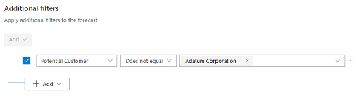
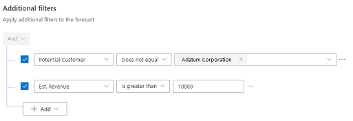

# Apply additional filters

Using additional filters, you can filter the opportunities that participate in calculating the forecast values. To filter the opportunities, you create filters based on conditions by using the attributes that belong to the Opportunity entity, including related entity attributes.

For example, you know that opportunities related to **Adatum Corporation** and revenue more than or equal to **$10,000** can't be closed for the current quarter. To filter such opportunities in the forecast, follow these steps to create a query for this condition.

1.	In the **Additional filters** section, select **+ Add filters**.
 
2.	Select **+ Add** > **Add row**. 

    > [!div class="mx-imgBorder"]
    > 
 
3.	In the selection boxes, select the attribute as **Potential Customer**, the condition as **Does Not Equals**, and the company to be considered as **Adatum Corporation**.
 
    > [!div class="mx-imgBorder"]
    > 

    With this condition, the opportunities related to **Adatum Corporation** will be removed from the forecast. In the next step, you'll add a condition to filter revenue that's more than or equal to **$10,000**.

4.	Select **+ Add** > **Add row**.

5.	In the selection boxes, select the attribute as **Est. Revenue**, the condition as **Is greater than**, and revenue to be considered as **10000**.

    > [!div class="mx-imgBorder"]
    > 
 
    Now the conditions are created for the query. When the forecast is activated, the query will be executed to filter the forecast for the added conditions.

<table>
<tr><td>

> [!div class="nextstepaction"] 
> [Previous step: Choose layout and columns](choose-layout-and-columns-forecast.md)
</td><td>

> [!div class="nextstepaction"] 
> [Next step: Configure and manage drill-down entities](configure-manage-drill-downs.md)
</td></tr>
</table>

### See also

[Configure forecasts in your organization](configure-forecast.md) 
[View a forecast](view-forecasts.md)

[!INCLUDE[footer-include](../includes/footer-banner.md)]