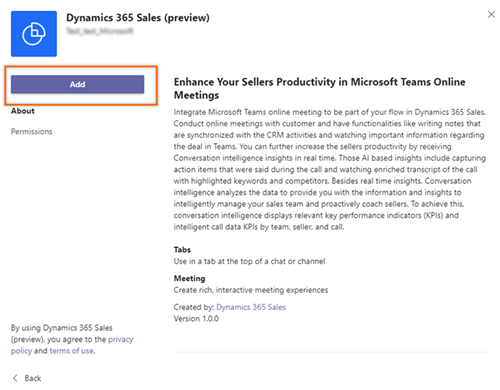
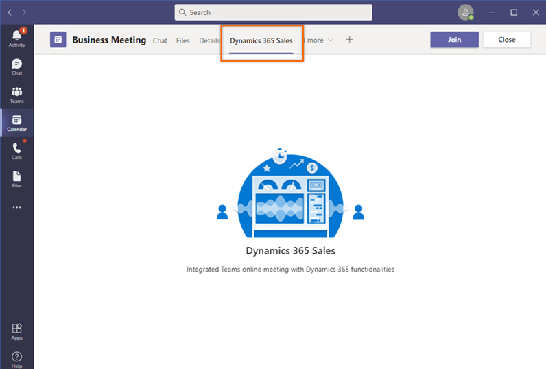

# Add a conversation intelligence tab to a Microsoft Teams meeting 

> [!IMPORTANT]
> - The enhanced experience of adding a conversation intelligence tab to Microsoft Teams is a preview feature. [!INCLUDE[cc-preview-features-definition](../includes/cc-preview-features-definition.md)]
> - [!INCLUDE[cc-preview-features-expect-changes](../includes/cc-preview-features-expect-changes.md)]
> - [!INCLUDE[cc-preview-features-no-ms-support](../includes/cc-preview-features-no-ms-support.md)]   

You can use the Dynamics 365 Sales app on Microsoft Teams to enrich your remote selling experience by conducting valuable and meaningful customer conversations&mdash;which translate into revenue&mdash;by adding conversation intelligence as an integral part of any Teams meeting.

As a seller, you don't want to move between apps to take notes and identify action items; this takes your attention off the business. Use the Sales app during a Teams meeting to get a real-time transcript, with highlighted points of interest and captured action items. You can also take notes yourself, when necessary.

**Prerequisites**

Before you start using the Dynamics 365 Sales app, be sure you've met the following prerequisites:

- Conversation intelligence is enabled in your organization. More information: [Microsoft Teams for conversation intelligence](fre-setup-sales-insight-app.md#microsoft-teams-for-conversation-intelligence)
- You've purchased a Sales Insights license or Dynamics 365 Sales Premium license.

**To add the conversation intelligence tab**

1.	In Microsoft Teams, go to **Calendar**.
2.	Open the meeting, and select **+** (add tab).  
    > [!div class="mx-imgBorder"]	
    >  

3.	In the **Add a tab** dialog, search for and then open the **Dynamics 365 Sales (preview)** extension.
    > [!div class="mx-imgBorder"]	
    >  
 
4.	On the **Dynamics 365 Sales (preview)** page, select **Add**.   
    > [!div class="mx-imgBorder"]	
    >  
 
5.	In the confirmation dialog, select **Save**.   
    > [!div class="mx-imgBorder"]	
    >   
    
The **Dynamics 365 Sales** tab now appears on the meeting page. Select the tab to view a real-time meeting transcript, with highlights.

> [!div class="mx-imgBorder"]	
>  

### See also

[First-run set up experience](../sales-enterprise/fre-setup-sales-insight-app.md)

[!INCLUDE[footer-include](../includes/footer-banner.md)]
