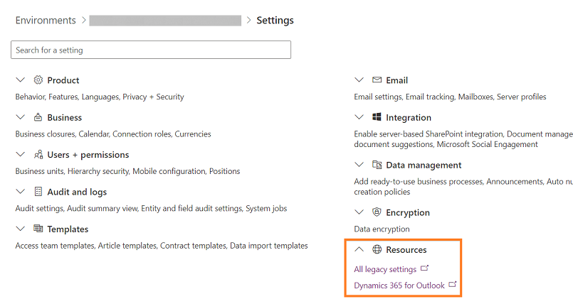

# Add the Kanban control to Opportunity or Activity entities

[!INCLUDE [cc-early-access-2020w1](../includes/cc-early-access-2020w1.md)]  

[!INCLUDE [cc-beta-prerelease-disclaimer](../includes/cc-beta-prerelease-disclaimer.md)]

Kanban views help salespeople to manage their opportunities and activities effectively. Add the Kanban control to the Opportunity and Activity entity so salespeople can use the Kanban views.

To add the control:
1.	In your app, select the **Settings** icon, and then select **Advanced Settings**.

    > [!div class="mx-imgBorder"]  
    > 

    The Settings page opens in Power Platform Admin center.

2.  Expand the **Resources** section, and select **All legacy settings**. 

    > [!div class="mx-imgBorder"]
    > 
    
    The Business Management page appears.

3.	On the navigation bar, select **Settings** and then under **Customization**, select **Customizations**.

4.	Select **Customize the System**.

5.	Under **Components** in the solution explorer, expand **Entities** and then select **Opportunity** or **Activity**.

6.	Go to the **Controls** tab and select **Add Control**.

    > [!div class="mx-imgBorder"]  
    > 

7.	In the **Add Control** dialog box, select **Kanban** and then select **Add**.

    > [!div class="mx-imgBorder"]  
    > 

    The Kanban control is added to the list of controls.

8.	The Read-only grid is the default option, so when users select **Opportunities** from the site map, they see a read-only grid of opportunities. To make the Kanban view the default view instead, select the radio button for the Kanban control for the corresponding options.  

    > [!div class="mx-imgBorder"]  
    >  

9.	Select **Save** to save your changes.

10.	To publish the changes you’ve made, select **Publish**.

### See also

[Work with opportunities in the Kanban view](opportunity-kanban-view.md)  

[Work with activities in the Kanban view](activity-kanban-view.md)
