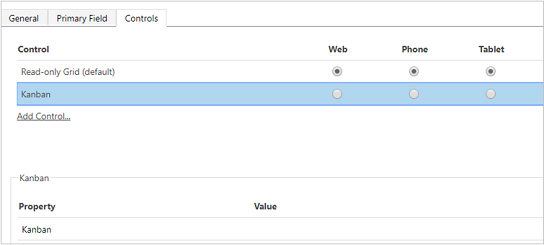

# Add the Kanban control to Opportunity or Activity entities

Kanban views help salespeople to manage their opportunities and activities effectively. Add the Kanban control to the Opportunity and Activity entity so salespeople can use the Kanban views. Similar to other custom controls, Kanban control is supported on all views.

> [!IMPORTANT]
> - The Kanban control works only on the Opportunity and Activity entities.
> - The Kanban control is supported only on the main grid. It isn't currently supported on subgrids.
> - The Kanban control is not supported in the **Dynamics 365 for Phones** mobile app.

To add the control:
1. In your app, select the **Settings** icon, and then select **Advanced Settings**.

    > [!div class="mx-imgBorder"]  
    > 

    The **Business Management settings** page opens in a new browser tab.

2. On the navigation bar, select **Settings** and then under **Customization**, select **Customizations**.

3. Select **Customize the System**.

4. Under **Components** in the solution explorer, expand **Entities** and then select **Opportunity** or **Activity**.

5. Go to the **Controls** tab and select **Add Control**.

    > [!div class="mx-imgBorder"]  
    > 

6. In the **Add Control** dialog box, select **Kanban** and then select **Add**.

    > [!div class="mx-imgBorder"]  
    > 

    The Kanban control is added to the list of controls.

7. The Read-only grid is the default option, so when users select **Opportunities** from the site map, they see a read-only grid of opportunities. To make the Kanban view the default view instead, select the radio button for the Kanban control for the corresponding options.  

    > [!div class="mx-imgBorder"]  
    >  

8. Select **Save** to save your changes.

9. To publish the changes you've made, select **Publish**.

## What you can't customize?

There are a few customization restrictions that you should be aware of:

- You can't add or remove fields from the cards in the Kanban view swim lanes.
- It isn't possible to have a role-based Kanban view.
- The Activity Kanban view is only available for the Status field. You can't configure the Activity Kanban view for an option set field other than 'Status'.
- For Opportunity Kanban view:

    - While you can customize the out-of-the-box 'Opportunity Sales Process' business process flow, you can't customize the Kanban view to use a business process flow other than the Opportunity Sales Process. 
    - The Status-based Opportunity Kanban view is only available for the Status field. You can't configure this Kanban view for an option set field other than 'Status'.
    - In the Opportunity Kanban view, aggregation is supported only for the Estimated Revenue field of the Opportunity entity. You can't configure the Kanban view to have aggregation done on other fields.
    
### See also

[Work with opportunities in the Kanban view](opportunity-kanban-view.md)  

[Work with activities in the Kanban view](activity-kanban-view.md)

[!INCLUDE[footer-include](../includes/footer-banner.md)]