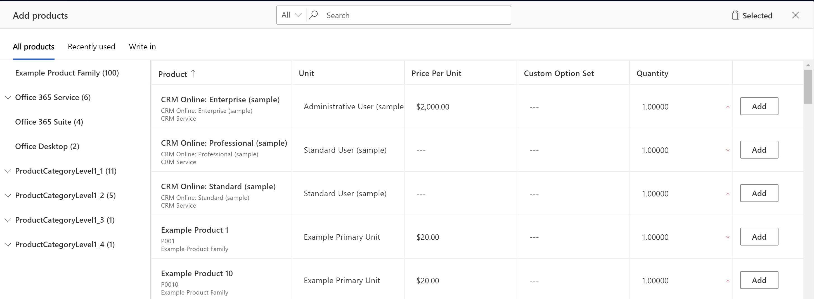

# Preview: Add products to an opportunity by using the enhanced experience

[!INCLUDE [cc-beta-prerelease-disclaimer](../includes/cc-beta-prerelease-disclaimer.md)]

As a salesperson, you want to be able to easily identify and add products from the catalog that best fits the opportunity at hand. With the enhanced experience of adding products, you can:

-   Quickly find products from the catalog based on free-text search

-   See matching products as you type in the search field.

-   Pick products from the categorized list of product families.

-   See the most-recently-used list of products while adding multiple products.

-   View product details inline and compare products before selecting any, which helps them find the right product.

-   Select and add multiple products at one go.

-   Add write-in products by using as few clicks as possible.

-   Specify price, quantity, and any other required information as configured by your system administrator.

> [!IMPORTANT]
> - The enhanced experience for adding products is a preview feature. [!INCLUDE[cc-preview-features-definition](../includes/cc-preview-features-definition.md)]
> - [!INCLUDE[cc-preview-features-expect-changes](../includes/cc-preview-features-expect-changes.md)]
> - [!INCLUDE[cc-preview-features-no-ms-support](../includes/cc-preview-features-no-ms-support.md)]

**To add a product using the enhanced experience**

1.  Open the opportunity to which you want to add products.
2.  Go to the **Products** tab.
3.  Select a **Price List**. 
    The price list determines the cost of the product and the products you can select.
    > [!NOTE] 
    > By default, you must select a price list to be able to add products to
    > an opportunity; however, your administrator can change the product
    > catalog settings to make the **Price List** field optional.
4.  If you want the estimated revenue of the opportunity to be calculated based on all the products added to the opportunity,
    set **Revenue** to **System Calculated**. If you want to use a custom estimated revenue, set it to **User Provided**.
5.  In the **Products** grid, click **Add products**.
    The **Add products** pop-out dialog opens.
    

    > [!NOTE]
    > The enhanced experience for adding products is only available if your system administrator has enabled the preview. If you see the form interface instead of a pop-out dialog, contact your system administrator to enable the preview. The above screenshot shows the default columns in the dialog. Your administrator can customize the dialog to add more columns depending on the needs of your organization. The information displayed in the Product column and the columns in the grid are customizable. So, if you need additional columns to populate data or need more information to identify the product better, contact your system administrator. 

6.  Search for the product or use the product family filter in the left pane to identify products that suits the opportunity. 
    As you select products, you will see the count of selected products in the **Selected** tab.

    > [!NOTE] 
    > The products and the product families displayed depend on the price list that you have chosen. So, if you do not see a product, ensure that the product is associated with the selected price list.
    
7. Optionally, click the **Write in** tab to add products or services that are not in the catalog and are very specific to an opportunity.  

7.  Specify the Price per unit if the product does not have an associated price list. If the product has a default price list associated with it, the Price per unit is populated in accordance with the associated price list. 

    > [!TIP] 
    > If you want to override the default price of a product, request the
    administrator to add the **Price Overridden** column to the grid. After
    the **Price Overridden** column has been added, turn it on.

8.  Enter the quantity and click **Add**.

9.  Repeat the process for all products you want to add. When you are done, click **Save to opportunity**.

## Delete or remove products from an opportunity

Remove products if you have selected them inadvertently or if they are
no longer relevant for the opportunity. You can remove products at two
instances:

-   While adding products to the opportunity - in the Add products dialog
-   After adding products to the opportunity - in the Products tab of the Opportunity

**To remove a product from the Add products dialog:**

1.  Click the Selected button in the Add products dialog.
    You see the list of products that you have selected.

2.  Click **Remove** to remove a selected product. Click the back arrow to continue with the selection or click **Save to opportunity** to add the selected products to the opportunity.

**To remove a product from the Products tab**

1.  Navigate to the **Products** tab of the opportunity.
    You will see the list of products that you have added to the
    opportunity.

2.  Select the products that you want to remove and click **Delete Opportunity Product**.
    The selected products are removed from the opportunity after you confirm the deletion.

### See also
[Enable the enhanced experience of adding products](enable-enhanced-add-product-experience.md)  
[Customize the Add products dialog box](customize-add-products-dialog-box.md)

[!INCLUDE[footer-include](../includes/footer-banner.md)]
