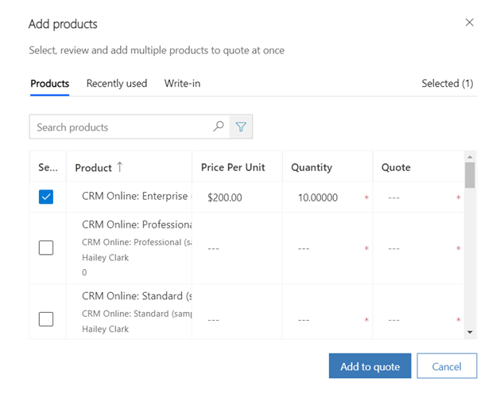
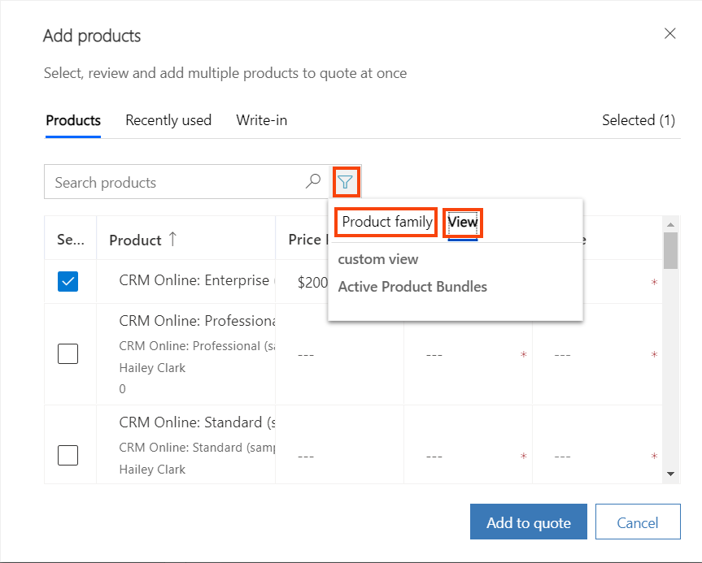
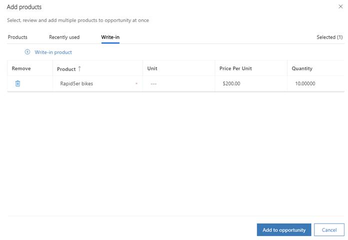
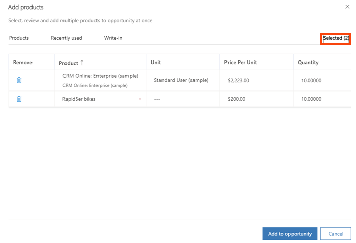
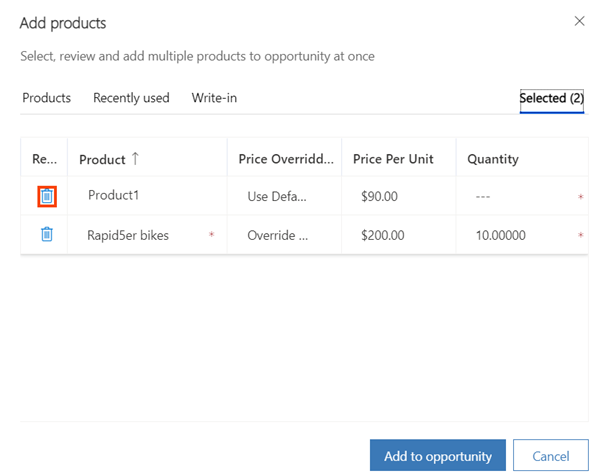

# Preview: Add products to quotes, orders, or invoices (Sales Hub)

[!INCLUDE [cc-beta-prerelease-disclaimer](../includes/cc-beta-prerelease-disclaimer.md)]

You can add products or product bundles to a quote, order, or invoice record. The product can be an existing product in the [!INCLUDE[pn-dyn-365-sales](../includes/pn-dyn-365-sales.md)] product catalog or one that you add as a write-in product.

With the enhanced experience of adding products, salespeople can:

-  Quickly find products from the catalog based on free-text search, or filter products based on the product family or views.

-  See the most-recently-used list of products while adding multiple products.

-  View product details inline and compare products before selecting any, which helps them find the right product.

-  Select and add multiple products in one go.

-  Add write-in products in just a few clicks.

-  Specify price, quantity, and any other required information as configured by your system administrator.

> [!IMPORTANT]
> - The enhanced experience for adding products is a preview feature. [!INCLUDE[cc-preview-features-definition](../includes/cc-preview-features-definition.md)]
> - [!INCLUDE[cc-preview-features-expect-changes](../includes/cc-preview-features-expect-changes.md)]
> - [!INCLUDE[cc-preview-features-no-ms-support](../includes/cc-preview-features-no-ms-support.md)]

If you've created a quote from an opportunity, the products added to the opportunity are automatically added to the quote. You can add more products or remove the existing ones.

> [!NOTE]
> The process for adding a product to a quote record is the same as adding a product to an order or an invoice. This topic explains how to add products to a quote record.

1. From the list of quotes, open the record to which you want to add the product.

2. On the **Summary** tab, in the **Products** section, select the **More commands** icon , and then select **Add products**.

    The **Add products** dialog box opens.

    > [!div class="mx-imgBorder"]  
    > 

    You can use this dialog box to edit line item details (product details) inline and also select multiple products at once. It has four tabs:

    - **Products**: This tab lists all the products and product bundles that are in the **Active** or **Revised** state. Along with entering the product name, you can also enter the price per unit and quantity. By default, 25 products are shown. On this tab, you can search and filter the list of products and select the one you want to add.

      If you've selected a price list for the quote, the product list is filtered to show only those product records that have the same price list associated.

      > [!IMPORTANT]
      > The columns that you see in the dialog box are based on the columns defined in the **Quote products Add products** view. Your system administrator can customize this view to add the columns that are most useful for your business. For order products or invoice products, the columns are defined in the **Order products Add products** or **Invoice products Add products** views, respectively.
    
    - **Recently used**: This tab lists the last 15 products that the currently signed-in user has added to the quote.
    
    - **Write-in**: On this tab, you can create and add a write-in product.
    
    - **Selected**: This tab shows the count of the products selected to be added to the quote. Use this tab to verify or modify the final list of the items you've selected.

3.  Search for and select the products you want to add, and then select **Add to quote**. When adding a product to an order or invoice, the button is named **Add to order** or **Add to invoice**, respectively.

## Search for products

On the **Products** tab, enter the keyword in the **Search** field, and then select the **Search** icon or the **Enter** key. The products matching the search criteria are shown.

> [!div class="mx-imgBorder"]  
> 

The search capability searches for the keyword in the product names or the fields of **Single Line of Text** or **Multiple Lines of Text** in the **Quick Find View** of the product table (entity). The search is performed by using the **Contains** search operator. This means that search results will show all the products that contain the keyword in one of the supported fields.

Here's how the search results are ranked:

- The records that have values that exactly match the keywords are shown first.

- The records that broadly match the keywords are shown next. For example, if you enter **Windows 8.1** as the search keyword, product records that contain either **Windows** or **8.1** in the name or other supported fields are shown.

## Filter products

The following filters are available to enable you to further narrow your search:

- **Product family**: Use this filter to see products in a specific product family. All product families in the **Active** or **Under revision** state are shown.
- **Views**: Use this filter to see products in a specific saved view or user view. You can create a new view for the product table (entity).

> [!div class="mx-imgBorder"]  
> 

> [!NOTE]
> Search and filters work in conjunction. For example, if you've searched for a keyword and 50 results are showing, you can use a filter on top of this to further narrow your search.

## See product details (applies both to Products and Recently used tabs)

Additional details of the product&mdash;like product name and ID&mdash;are shown inline below the product name. These additional details help salespeople identify the correct product. The data shown here is based on the columns (fields) added in the **Product Lookup view** of the product table (entity). Your system administrator or system customizer can customize this view to add other fields that are relevant for your business.

> [!div class="mx-imgBorder"]  
> 

## Select products to add

**To select an existing product**

1. Go to the **Products** tab or the **Recently used** tab.
1. Select the check box next to the product that you want to add, and then enter the quantity of product. If you edit a row&mdash;for example, by entering a quantity for a product&mdash;that product is automatically selected.

   > [!div class="mx-imgBorder"]  
   > 

1. Do one of the following:

    - If the product has a default price list associated with it, the **Price per unit** is populated in accordance with the associated price list. Enter the quantity.

       > [!NOTE]
       > To be able to override the default price of a product, the administrator must add the **Price Overridden** column (field) to the grid. After the **Price Overridden** column has been added, select **Override Price**.

    - If the product doesn't have an associated price list, enter the price per unit and quantity.

**To add a write-in product**

1. Go to the **Write-in** tab.

2. Select **Write-in product**, and then enter the details in the **Product Name**, **Price Per Unit**, and **Quantity** columns.

   > [!div class="mx-imgBorder"]  
   > 

## Review selected products

When you select a product to add, a count is added to the **Selected** tab at the top of the screen. The count represents the number of products selected. On the **Products** tab or the **Recently used** tab, a check mark is shown for all the products that you've selected.

> [!div class="mx-imgBorder"]  
> 

> [!NOTE]
> On the **Selected** tab, you can also change the details of the selected products.  

## Remove selected products

You can easily remove products that you selected earlier but don't need anymore.

To remove a product from the selection, go to the **Selected** tab. For the product that you want to remove, select the **Delete product** icon.

> [!div class="mx-imgBorder"]  
> 

### See also

[Add products to quotes, orders, or invoices](add-product-quote-order-invoice.md)  
[Enable the enhanced experience of adding products](enable-enhanced-add-product-experience.md)  
[Customize the Add Products dialog box](customize-add-products-dialog-box.md)
