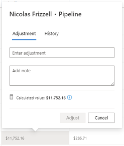
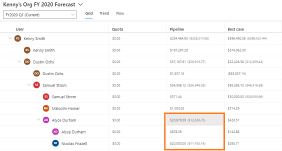

# Adjust values in a forecast

An adjustment provides sales managers or sellers the ability to estimate the final amount that they expect for a forecast's opportunities to bring in at the close of the forecast period. Sales managers have the ability to adjust their own or a direct report's forecast. For example, if the sales manager thinks that one of their direct report's best-case opportunities might have more value than the proposed value, they can increase the value in the forecast. On saving the adjustment, the changes will be rolled up to the parent record and up the hierarchy. 

To make adjustments, a forecast column must be set as editable. While configuring a forecast, the forecast owner must identify and set the editable columns through the **Allow adjustments** option. To learn more, see [configure columns](choose-layout-and-columns-forecast.md#configure-columns). 

You can also view the history of the adjustments that are made on a forecast, and you can get more information about the following types of adjustments:

-	**Direct Adjustment**: Specifies that a user directly modified the value in the current cell. A direct adjustment can be reverted.

-	**Indirect Adjustment**: Specifies that a user made an adjustment to another value somewhere in the grid, and that adjustment was propagated through the forecast.

-	**Calculated value**: Shows the system-calculated value if no direct or indirect adjustments are made.

> [!NOTE]
> You can't adjust values for users or territories above your level in the hierarchy, even if you've been given access through your security role.

**To adjust a value in a forecast**

1.	Hover over the field, and select the pencil icon that appears.

    > [!div class="mx-imgBorder"]
    > 

    The following dialog box is displayed.

    > [!div class="mx-imgBorder"]
    > 

2.	On the **Adjustment** tab, enter the value and add a note for the adjustment. In this example, the **Pipeline** column is configured as editable and you know that Nicolas Frizzell has a pipeline revenue of $20,000 instead of the existing value, $11,752.16. Enter the value as **20000**. You can see that the actual system-calculated value for the forecast, based on existing data, is $10,000.

    > [!div class="mx-imgBorder"]
    > 

3.	Select **Adjust**. The old value is struck off and a new value is added to the **Pipeline** column for Nicolas Frizzell. You can see the indirect adjustment of values has been added to the top of the hierarchy from Nicolas's manager, Alyce Durham.
 
    > [!div class="mx-imgBorder"]
    > 

4.	You can roll back the value if you think it was inappropriately adjusted from the system-calculated value. Open the adjustment dialog box, and then select **Reset**.

    > [!div class="mx-imgBorder"]
    > 

    The following dialog box is displayed so you can enter a note to explain the reason for the rollback. 
 
    > [!div class="mx-imgBorder"]
    > 

5.	Enter a note, and then select **Reset**. 

    The note is added to the history of adjustments for reference for other users and the value is rolled back to the system-calculated value. The indirect adjustment values that are added to the top of the hierarchy are also rolled back.
 
6.	To view the history of the adjustable forecast, open the adjustment dialog box and select the **History** tab. In this example, you can see the history of changes that were made for Nicolas Frizzell's pipeline forecast.

    > [!div class="mx-imgBorder"]
    > 
 
### See also

[Project accurate revenue with sales forecasting](project-accurate-revenue-sales-forecasting.md) 
[View a forecast](view-forecasts.md)

[!INCLUDE[footer-include](../includes/footer-banner.md)]