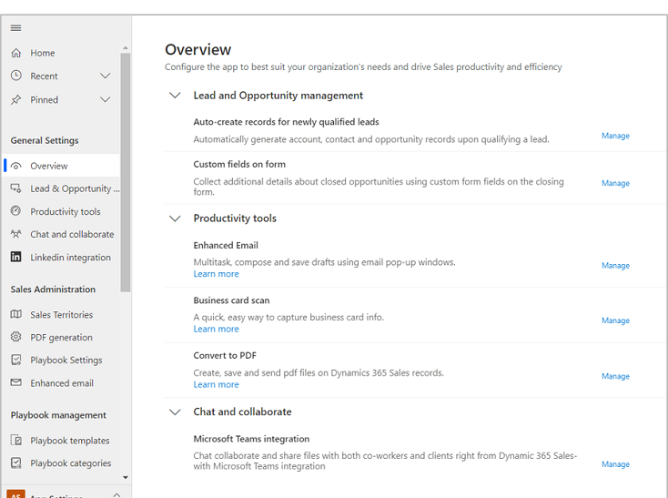

# Overview of admin settings 

System administrators in Dynamics 365 Sales are the users who have the System Administrator role or equivalent permissions assigned. Dynamics 365 Sales offers an organized and unified experience to administrators so they can quickly and easily configure their sales app from a single place.

To go to this new area of app settings, at the bottom of the site map, select the **Change area**  icon, and then select **App Settings**.

The Overview page opens. The Overview page is a landing page that consolidates all the sales settings in one place. You can go to individual feature settings right from here. The site map is also logically arranged so it is easier to find the settings in the site map.  

> [!NOTE]
> These settings are also available in the legacy web client but have been consolidated in one place in the Sales Hub app for ease of use. 

> [!TIP]
> By default, this new unified settings experience is available only in the Sales Hub app. To learn how to enable this experience in custom applications, see **Leverage the unified settings experience in a custom sales application** in the [Simplified system configuration in Dynamics 365 Sales](https://cloudblogs.microsoft.com/dynamics365/it/2020/03/30/simplified-system-configuration-in-dynamics-365-sales/) blog.  

### See also

[Define lead qualification experience](define-lead-qualification-experience.md)  
[Enable customization of the Opportunity Close form](enable-opportunity-close-customization.md)  
[Set up enhanced email](set-up-enhanced-email.md)  
[Enable or disable saving of business card image](retain-business-card-image-after-scanning.md)  
[Enable or disable PDF generation from sales records](enable-pdf-generation-quote.md)

[!INCLUDE[footer-include](../includes/footer-banner.md)]
